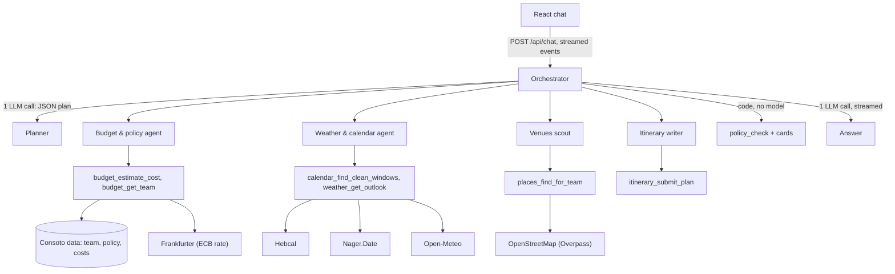

# Consoto Offsite Assistant

A chat assistant that plans team offsites for Consoto, a 150-person software company in Tel Aviv. It answers from Consoto's own data (team, policy, costs) and from live public APIs (holidays, weather, exchange rates, places). An orchestrator sends each message to specialist agents, and the chat shows every agent, tool call and result while the answer streams.

Built for the U-BTech Multi-Agent Chat Challenge.

## Run it in 5 minutes

You need Node.js 22 or newer and a free OpenRouter key from https://openrouter.ai/keys.

```bash
git clone <this repo> consoto-offsite-assistant
cd consoto-offsite-assistant
cp .env.example .env          # then paste your key into OPENROUTER_API_KEY (Windows cmd: copy .env.example .env)
npm install
npm start                     # builds the UI and serves everything on http://localhost:3000
```

Open http://localhost:3000 and click the first demo message.

- Free OpenRouter models allow 20 requests per minute. An account that never bought credits gets 50 free requests per day; one that bought $10 or more gets 1,000. One chat message uses about 5 to 8 requests. The header shows how many are left today.
- `npm run warm-cache` fetches the demo's public data ahead of time. The OpenStreetMap servers are often busy, and cached data keeps the demo smooth. No key needed.
- `npm run check-models` sends one tool call to each configured model and prints how long it took.
- `npm run dev` runs the server and the Vite dev server with hot reload on http://localhost:5173.

## How it works



### One message, step by step

1. **Plan (LLM).** The planner reads the message, the trip so far and the agent catalog, and must call `submit_plan` with: what changed in the trip, which agents to run with what task, and one sentence of reasoning. The chat shows that sentence. It returns meanings ("second half of March"), never computed dates.
2. **Trip facts (code).** Code turns the plan into facts: 2027-03-16 to 2027-03-31, 3 days and 2 nights, Lisbon. Results that depended on a changed fact are dropped.
3. **Agents (LLM + code tools).** Independent agents run in parallel. The itinerary writer runs after the venue search it depends on. Each agent is a small tool loop (at most 3 rounds) over its own 1 to 3 tools.
4. **Policy (code).** The orchestrator runs `policy_check` itself after every turn that has a city, so the model can never skip the policy.
5. **Cards (code).** Tables and totals are built from tool data, so every number on screen comes from code.
6. **Answer (LLM, streamed).** The final call writes a short reply from the agents' data and may only quote numbers that are in it.

### The agents

| Agent | Tools | Data |
| --- | --- | --- |
| Budget & policy | `budget_estimate_cost`, `budget_get_team` | Consoto team, policy and costs; Frankfurter ECB rate |
| Weather & calendar | `calendar_find_clean_windows`, `weather_get_outlook` | Hebcal (Israel), Nager.Date (destination), Open-Meteo |
| Venues scout | `places_find_for_team` | OpenStreetMap through Overpass |
| Itinerary writer | `itinerary_submit_plan` | Only the venues the scout found; code checks every draft |

### Why more than one agent

- **Focus.** Each agent sees 1 to 3 tools and a short prompt about one domain. Free models pick tools much more reliably from a small set than from seven at once.
- **Speed.** Cost and weather for five cities run at the same time.
- **Isolation.** If OpenStreetMap is down, the venues agent says so, and the cost and policy answers still arrive.
- **Ownership.** Each agent maps to one data owner, so each can be tested and changed on its own.

### What the model does and what code does

- **Code:** every number, date and rule. That includes the cost formula, the EUR to ILS conversion at the ECB rate, holiday windows, climate averages, venue matching, the itinerary check, the six policy rules and their fixes.
- **Model:** which agents and tools to use with which arguments, the wording, and the recommendation.

### Tools

Every tool is one file in `server/src/tools/` with a zod input schema, a description written for the model (with an example), and an `execute` function. It returns either `{ ok: true, summary, data, sources, gaps }` or `{ ok: false, error: { code, message, hint } }`.

- **Invalid input** comes back as an error with a hint, so the model can fix its call.
- **A failing data source** becomes `source_unavailable` and the answer says so.
- **Missing data** (a city with no cost data, a team we do not know, an OSM tag that is not there) becomes a `gap` that the answer has to mention.

### Trust

- **Visible work.** Every step streams into the chat: which agent, which tool, the input, the output, the gaps, and the sources with their fetch time and cache status.
- **Honest weather.** March is past the 16-day forecast, so code decides to use a 10-year climate average and labels it "not a forecast".
- **Honest venues.** A missing OpenStreetMap tag is shown as "unknown". The itinerary may only use venues that were actually found, and code checks every meal against every diet.

### Failures

- **Rate limits.** We cap ourselves at 15 LLM requests per minute, under OpenRouter's 20. On a 429, the next model in `OPENROUTER_MODELS` takes over at once (except OpenRouter's free daily cap, which stops the turn with a clear message, since no other model can help). A reply cut off by the token limit also counts as a failed attempt and falls to the next model. When every model is busy, we wait (the `Retry-After` value, or 2 s) and try once more, then report it. Every attempt shows in the chat.
- **Account problems.** A bad key or missing credits stops at once with a message that says what to fix.
- **Broken answers.** A stream that breaks after text arrived keeps the partial text and offers "Try again".
- **Public APIs.** One shared HTTP helper handles all of them:
  - per-API timeouts and a disk cache;
  - identical requests share one call;
  - retries only on 429, 5xx and timeouts;
  - stale data, labeled with its date, when an API is down.
  - Overpass runs one query at a time, as its usage policy asks.
- **Changing her mind.** "What about Prague?" or "make it 4 days" re-runs only what depended on the changed fact, and the policy check is code that runs again. A new message stops the running turn, and so does Stop or closing the tab.

### API

| Route | What it does |
| --- | --- |
| `POST /api/chat` | `{ conversationId?, message }` in; a `text/event-stream` of typed events out (`plan`, `agent_start`, `tool_start`, `tool_end`, `llm_call`, `llm_wait`, `card`, `answer_delta`, `turn_end`) |
| `GET /api/conversations/:id` | The turns and events of a conversation, for reloading |
| `GET /api/health` | Key status, free requests left today, configured models (uses no LLM requests) |
| `GET /api/agents` | The agent catalog shown in "How it works" |

Conversation state lives in server memory: the messages, the trip facts, and the latest result from each agent. One turn runs per conversation at a time.

## Assumptions

- **Cost formula.** "Cost per person = return flight + hotel per night + meals and activities per day" is read as flight + 2 hotel nights + 3 days of meals and activities, matching the 3-day, 2-night policy.
- **Dates.**
  - A month without a year means its next occurrence (from October 2026, March is March 2027).
  - Every Hebcal holiday (major, minor, modern, Israel schedule) blocks a date; minor fast days do not.
  - Public holidays at the destination count, including regional ones for the city (for example Easter Monday in Catalonia).
  - There is no weekend rule; windows that include Friday or Saturday are labeled.
- **Defaults.** If no dates are chosen, the earliest clean window is assumed, and the answer says so.
- **Places.** Places are searched within 3 km of the city center.
- **Internal data.** Consoto's internal data is the appendix of the brief, as JSON files read through one module (`server/src/data/consoto-data.ts`).

## Tests and evals

- `npm test`: unit tests for every rule, number and parser, plus agent, turn and API tests with a scripted model. No network, no LLM.
- `npm run eval`: the three demo messages and the likely curveballs ("make it 4 days", "what about Prague?", "what about Rome?", an unknown team) against the real model, graded by code. Use `-- --scenario demo` for one scenario, `--trials 3` for repeat runs. Transcripts are saved in `evals/runs/`. A full run uses about 50 to 55 LLM requests, so an account limited to 50 free requests per day cannot afford one (use `-- --scenario demo` instead).

## Adding a tool

1. Create `server/src/tools/<agent>-<what>.ts` with `defineTool({ name, description, input, execute })`. Return `ok(...)` or `fail(...)`, and add `sources` and `gaps`.
2. Add it to one agent's `tools` list in `server/src/agents/registry.ts`. If it needs a new agent, add the agent there too; the planner and "How it works" read the registry.
3. If the tool needs a new public API, add a client in `server/src/clients/` that calls `http.getJson` (cache, timeouts, retries and User-Agent come with it), add a method for it in `server/src/clients/data-sources.ts`, and add a fake to `server/test/helpers/fake-data.ts`. Never call `fetch` directly.
4. Add a unit test next to the others in `server/test/`, using `makeCtx()` and `fakeData()`.

## Trade-offs

- **Files, not an API, for Consoto's data.** The brief leaves access open. One module is the only reader, so a real customer system (a REST API or an MCP server) replaces that module and nothing else.
- **A planner plus code, not agents-as-tools.** One LLM call decides the routing, and code runs it. That gives fewer LLM calls, predictable parallelism, and a routing decision that is easy to show and test. It is less free-form than letting the orchestrator call agents in a loop.
- **Our own fallback loop, not OpenRouter's `models` parameter.** It costs a little more code, but every rate limit and fallback is visible in the chat.
- **In-memory state.** Fine for one user and a demo, but lost on restart.
- **OpenStreetMap tags.** Coverage is uneven (Lisbon has one kosher-tagged place), so gaps are reported rather than hidden.

## What I would do next

- Serve Consoto's data through an MCP server, so other assistants can use it too.
- Persist conversations (SQLite or Postgres) and add sign-in.
- Export traces to OpenTelemetry or Langfuse, plus a trace view for engineers.
- Add CI (GitHub Actions) for type checks and unit tests, and run the evals nightly.
- Support more teams and cities, and real flight and hotel prices.

## Data and attribution

Consoto data is fictional, from the challenge brief. Public data comes from:
- Holidays: Hebcal.com (CC BY 4.0) and Nager.Date.
- Weather: Open-Meteo.com (CC BY 4.0).
- Exchange rates: the European Central Bank, via Frankfurter.
- Places: OpenStreetMap contributors (ODbL).
