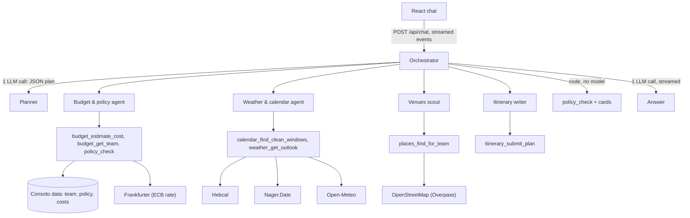

# Consoto Offsite Assistant Implementation Plan

> **For agentic workers:** REQUIRED SUB-SKILL: Use superpowers:subagent-driven-development (recommended) or superpowers:executing-plans to implement this plan task-by-task. Steps use checkbox (`- [ ]`) syntax for tracking.

**Goal:** Build a local chat app where an orchestrator and four specialist agents plan Consoto's team offsites from Consoto's internal data and live public APIs, streaming every step to a React chat.

**Architecture:** One Node.js + TypeScript process (Express, run with `tsx`) serves the API and the built React app. Each chat turn is: a planner LLM call returns a JSON plan, code updates the trip state and runs the chosen agents (each a small LLM tool loop over code tools), code always runs the policy check, code builds result cards, and a final LLM call streams the answer. All numbers, dates and rules live in pure, unit-tested functions.

**Tech Stack:** Node.js 22+, TypeScript, Express 5, `openai` npm client pointed at OpenRouter (free models), zod 4, Vitest, React + Vite, react-markdown.

**Spec:** `docs/superpowers/specs/2026-10-06-consoto-offsite-assistant-design.md`. Also read `docs/api-guide.md` (how each external API behaves).

## Global Constraints

- Node.js 22 or newer; every package is ESM (`"type": "module"`); server code runs with `tsx` (no build step for the server).
- LLM: OpenRouter `:free` models only. No other LLM provider, no paid service.
- No Docker. `npm install && npm start` must work on Windows, macOS and Linux; no shell-specific scripts.
- Never use em dashes or en dashes anywhere (code, UI strings, docs, commit messages). Use a hyphen.
- Commit messages are plain, with no `Co-Authored-By` trailer.
- Money, exchange rates, totals, dates and policy rules are computed in code (`server/src/domain/`), never by the model.
- Allowed dependencies: `express`, `openai`, `zod` (v4), `tsx`, `react`, `react-dom`, `react-markdown`, `vite`, `@vitejs/plugin-react`, `typescript`, `vitest`, `concurrently`, `@types/node`, `@types/express`, `@types/react`, `@types/react-dom`. Anything else needs a written reason in the task.
- Shared types live in `shared/` at the repo root, contain types only, and are imported with `import type`.
- Every public API request sends `User-Agent: ConsotoOffsiteAssistant/1.0 (local demo)`.
- Secrets only in `.env` (gitignored). `.env.example` is committed.
- All repo files are in English.
- Defaults: `OPENROUTER_MODELS=google/gemma-4-31b-it:free,nvidia/nemotron-3-super-120b-a12b:free,openrouter/free`, `PORT=3000`, `LLM_REQUESTS_PER_MINUTE=15`.
- Policy numbers come from `policy.json`: max 3 days and 2 nights, 4,000 ILS per person, CFO approval above it.

## Review Focus

The spec implies these inputs, but no task's main tests exercise them. Each one gets an extra test in the task that owns the code:

1. **Overpass is down during a live turn with nothing cached.** The venues step must end as a visible error, the answer must say map data is unavailable, and no venue may be invented. Test: Task 18, "reports an Overpass outage instead of inventing venues".
2. **A second message arrives while the first turn is still streaming.** The first turn must end as `stopped` and the second must run normally on the same conversation. Test: Task 19, "a new message stops the running turn".
3. **The browser disconnects mid-turn (reload or closed tab).** The server must abort the turn and store it as `stopped`, not leave it `running`. Test: Task 19, "a client disconnect stores the turn as stopped".
4. **The first message asks for an itinerary before any city or dates exist.** No crash: the itinerary tool reports what is missing and the answer says so. Test: Task 18, "handles an itinerary request with no city or dates".
5. **The answer stream breaks after some text arrived.** The partial answer must be kept, the turn must end with `error`, and the UI must offer "Try again". Tests: Task 13, "fails as interrupted after text arrived"; Task 18, "keeps the partial answer when the stream breaks"; Task 21, the footer renders "Try again" on `error`.

---

### Task 1: Scaffold the repo, shared types, config and a model check

**Files:**

- Create: `package.json`, `.gitattributes`, `.env.example`, `tsconfig.base.json`
- Create: `server/package.json`, `server/tsconfig.json`
- Create: `shared/domain.ts`, `shared/events.ts`
- Create: `server/src/config.ts`, `server/src/lib/sleep.ts`, `server/src/scripts/check-models.ts`
- Test: `server/test/config.test.ts`

**Interfaces:**

- Consumes: nothing.
- Produces:
  - `shared/domain.ts`: `AgentId`, `DietNeed`, `Wheelchair`, `Trip`, `Source`, `HolidayItem`, `DateWindow`, `ClimateStats`, `ForecastDay`, `WeatherOutlook`, `CostBreakdownEur`, `CityCost`, `Place`, `VenuesResult`, `ItinerarySlot`, `ItineraryItem`, `ItineraryPlan`, `ItineraryCheck`, `RuleStatus`, `PolicyRuleResult`, `PolicyVerdict`.
  - `shared/events.ts`: `ComparisonRow`, `Card`, `StepOwner`, `LlmCaller`, `StreamEvent`, `Emit`, `HealthInfo`, `AgentsInfo`.
  - `server/src/config.ts`: `ROOT_DIR: string`, `USER_AGENT: string`, `OPENROUTER_BASE_URL: string`, `DEFAULT_MODELS: string`, `type Config = { apiKey: string; models: string[]; port: number; llmRequestsPerMinute: number; cacheDir: string }`, `loadDotEnv(file?: string): void`, `loadConfig(env?: Record<string, string | undefined>): Config`, `cacheDirFromEnv(env?): string`.
  - `server/src/lib/sleep.ts`: `sleepMs(ms: number, signal?: AbortSignal): Promise<void>`.

- [ ] **Step 1: Create the root files**

`package.json`:

```json
{
  "name": "consoto-offsite-assistant",
  "private": true,
  "type": "module",
  "workspaces": ["server"],
  "engines": { "node": ">=22" },
  "scripts": {
    "start": "npm run start -w server",
    "test": "npm test -w server",
    "typecheck": "npm run typecheck -w server",
    "check-models": "npm run check-models -w server"
  }
}
```

`.gitattributes`:

```text
* text=auto eol=lf
```

`.env.example`:

```text
# Required. Create a key at https://openrouter.ai/keys
OPENROUTER_API_KEY=

# Free models that support tool calling, in fallback order (comma-separated).
OPENROUTER_MODELS=google/gemma-4-31b-it:free,nvidia/nemotron-3-super-120b-a12b:free,openrouter/free

# Port for the app (API and UI).
PORT=3000

# Our own cap on LLM requests per minute. OpenRouter allows 20 for free models.
LLM_REQUESTS_PER_MINUTE=15
```

`tsconfig.base.json`:

```json
{
  "compilerOptions": {
    "target": "ES2023",
    "module": "ESNext",
    "moduleResolution": "Bundler",
    "strict": true,
    "esModuleInterop": true,
    "skipLibCheck": true,
    "resolveJsonModule": true,
    "isolatedModules": true,
    "noEmit": true
  }
}
```

- [ ] **Step 2: Create the server workspace and install dependencies**

`server/package.json`:

```json
{
  "name": "server",
  "private": true,
  "type": "module",
  "scripts": {
    "start": "tsx src/index.ts",
    "dev": "tsx watch src/index.ts",
    "test": "vitest run",
    "typecheck": "tsc -p tsconfig.json",
    "check-models": "tsx src/scripts/check-models.ts"
  }
}
```

`server/tsconfig.json`:

```json
{
  "extends": "../tsconfig.base.json",
  "compilerOptions": { "types": ["node"] },
  "include": ["src", "test", "../shared"]
}
```

Run:

```bash
npm install -w server express@^5 openai zod@^4 tsx
npm install -w server -D typescript vitest @types/node @types/express
```

Expected: both commands finish without errors, and `server/package.json` now lists the packages.

- [ ] **Step 3: Write the shared types**

`shared/domain.ts`:

```ts
// Types shared by the server and the web app. Types only: no runtime code.

export type AgentId = "budget_policy" | "weather_calendar" | "venues" | "itinerary";
export type DietNeed = "vegan" | "kosher" | "gluten_free";
export type Wheelchair = "yes" | "limited" | "no" | "unknown";

export type Trip = {
  team: string | null;
  region: string | null;
  searchWindow: { from: string; to: string } | null;
  candidateCities: string[];
  city: string | null;
  start: { date: string; source: "user" | "assumed" } | null;
  days: number;
  nights: number;
};

export type Source = { name: string; url: string; fetchedAt: string; cached: boolean };

export type HolidayItem = {
  date: string;
  name: string;
  side: "israel" | "destination";
  country: string;
  source: string;
};

export type DateWindow = {
  start: string;
  end: string;
  weekdays: string[];
  clean: boolean;
  clashes: HolidayItem[];
  israeliWeekendDays: string[];
};

export type ClimateStats = {
  avgHighC: number;
  avgLowC: number;
  rainyDayShare: number;
  avgRainMm: number;
  years: number[];
};

export type ForecastDay = { date: string; highC: number; lowC: number; rainChancePct: number | null };

export type WeatherOutlook =
  | { kind: "forecast"; from: string; to: string; days: ForecastDay[] }
  | { kind: "climate_average"; from: string; to: string; stats: ClimateStats; reason: string };

export type CostBreakdownEur = { flight: number; hotel: number; meals: number; activities: number };

export type CityCost = {
  city: string;
  days: number;
  nights: number;
  breakdownEur: CostBreakdownEur;
  perPersonEur: number;
  perPersonIls: number;
  teamSize: number;
  teamTotalIls: number;
  rate: { value: number; date: string };
  budgetIlsPerPerson: number;
  withinBudget: boolean;
  headroomIls: number;
};

export type Place = {
  id: string;
  name: string;
  kind: "food" | "sight";
  diets: DietNeed[];
  wheelchair: Wheelchair;
  lat: number;
  lon: number;
  osmUrl: string;
  cuisine: string | null;
};

export type VenuesResult = {
  city: string;
  radiusM: number;
  needs: DietNeed[];
  byNeed: Partial<Record<DietNeed, Place[]>>;
  bestFood: Place[];
  sights: Place[];
  counts: {
    food: number;
    sights: number;
    byNeed: Partial<Record<DietNeed, number>>;
    wheelchairUnknown: number;
  };
  gaps: string[];
};

export type ItinerarySlot = "morning" | "lunch" | "afternoon" | "dinner";

export type ItineraryItem = {
  slot: ItinerarySlot;
  kind: "activity" | "meal";
  venueIds: string[];
  catering: DietNeed[];
  note: string;
};

export type ItineraryPlan = { days: { date: string; items: ItineraryItem[] }[] };

export type ItineraryCheck = {
  accepted: boolean;
  problems: string[];
  notes: string[];
  uncoveredMeals: string[];
  mealsCoveredByCatering: string[];
  inaccessible: string[];
  accessToConfirm: string[];
};

export type RuleStatus = "pass" | "fail" | "needs_action" | "unknown";

export type PolicyRuleResult = {
  id: number;
  rule: string;
  status: RuleStatus;
  detail: string;
  fix: string | null;
};

export type PolicyVerdict = {
  overall: "within_policy" | "within_policy_if_actions" | "outside_policy" | "not_enough_data";
  rules: PolicyRuleResult[];
};
```

`shared/events.ts`:

```ts
// Stream events and API payloads shared by the server and the web app. Types only.
import type {
  AgentId,
  CityCost,
  DateWindow,
  HolidayItem,
  ItineraryCheck,
  ItineraryPlan,
  PolicyVerdict,
  Source,
  Trip,
  VenuesResult,
  WeatherOutlook,
} from "./domain";

export type ComparisonRow = {
  city: string;
  perPersonIls: number | null;
  teamTotalIls: number | null;
  withinBudget: boolean | null;
  cleanWindows: number | null;
  avgHighC: number | null;
  rainyDayShare: number | null;
};

export type Card =
  | { kind: "comparison"; days: number; nights: number; rate: { value: number; date: string } | null; rows: ComparisonRow[] }
  | { kind: "cost"; estimate: CityCost }
  | { kind: "dates"; city: string; from: string; to: string; holidays: HolidayItem[]; windows: DateWindow[] }
  | { kind: "weather"; city: string; outlook: WeatherOutlook }
  | { kind: "venues"; result: VenuesResult }
  | { kind: "itinerary"; city: string; plan: ItineraryPlan; check: ItineraryCheck; placeNames: Record<string, string> }
  | { kind: "policy"; city: string; verdict: PolicyVerdict };

export type StepOwner = AgentId | "orchestrator";
export type LlmCaller = "planner" | "answer" | AgentId;

export type StreamEvent =
  | { type: "turn_start"; conversationId: string; turnId: string }
  | { type: "plan"; agents: { agent: AgentId; task: string }[]; reason: string; trip: Trip; clarify: string | null }
  | { type: "agent_start"; agent: AgentId; task: string }
  | { type: "agent_end"; agent: AgentId; status: "ok" | "error" | "timeout"; summary: string }
  | { type: "tool_start"; callId: string; owner: StepOwner; tool: string; input: unknown }
  | {
      type: "tool_end";
      callId: string;
      ok: boolean;
      summary: string;
      data: unknown;
      sources: Source[];
      gaps: string[];
      cached: boolean;
      ms: number;
    }
  | {
      type: "llm_call";
      who: LlmCaller;
      model: string;
      attempt: number;
      status: "ok" | "rate_limited" | "error" | "empty";
      ms: number;
      detail: string | null;
      tokens: { prompt: number; completion: number } | null;
    }
  | { type: "llm_wait"; who: LlmCaller; waitMs: number; reason: "local_limit" | "retry_after" }
  | { type: "card"; card: Card }
  | { type: "answer_delta"; text: string }
  | { type: "turn_end"; status: "done" | "stopped" | "error"; llmCalls: number; ms: number; error: string | null };

export type Emit = (event: StreamEvent) => void;

export type HealthInfo = {
  keyValid: boolean | null;
  freeRequestsLeft: number | null;
  freeRequestsLimit: number | null;
  isFreeTier: boolean | null;
  models: { id: string; available: boolean | null }[];
  checkedAt: string;
};

export type AgentsInfo = {
  routing: string;
  codeVsModel: string;
  agents: { id: AgentId; name: string; purpose: string; tools: { name: string; description: string }[] }[];
};
```

- [ ] **Step 4: Write the failing config test**

`server/test/config.test.ts`:

```ts
import { describe, expect, it } from "vitest";
import path from "node:path";
import { DEFAULT_MODELS, ROOT_DIR, loadConfig } from "../src/config";

describe("loadConfig", () => {
  it("reads the key, splits the model list and applies defaults", () => {
    const config = loadConfig({ OPENROUTER_API_KEY: "key", OPENROUTER_MODELS: "a:free, b:free ,,openrouter/free" });
    expect(config.apiKey).toBe("key");
    expect(config.models).toEqual(["a:free", "b:free", "openrouter/free"]);
    expect(config.port).toBe(3000);
    expect(config.llmRequestsPerMinute).toBe(15);
    expect(config.cacheDir).toBe(path.join(ROOT_DIR, ".cache"));
  });

  it("uses the default model list when none is set", () => {
    const config = loadConfig({ OPENROUTER_API_KEY: "key" });
    expect(config.models).toEqual(DEFAULT_MODELS.split(","));
  });

  it("fails with a readable message when the key is missing", () => {
    expect(() => loadConfig({})).toThrow(/OPENROUTER_API_KEY is missing/);
    expect(() => loadConfig({ OPENROUTER_API_KEY: "  " })).toThrow(/OPENROUTER_API_KEY is missing/);
  });

  it("rejects a port that is not a positive whole number", () => {
    expect(() => loadConfig({ OPENROUTER_API_KEY: "key", PORT: "abc" })).toThrow(/PORT must be a positive whole number/);
  });
});
```

- [ ] **Step 5: Run the test to verify it fails**

Run: `npm test -w server`
Expected: FAIL, because `../src/config` does not exist.

- [ ] **Step 6: Write the config module and the sleep helper**

`server/src/config.ts`:

```ts
import { existsSync } from "node:fs";
import path from "node:path";
import { fileURLToPath } from "node:url";

// server/src/config.ts -> repo root is two folders up.
export const ROOT_DIR = path.resolve(path.dirname(fileURLToPath(import.meta.url)), "../..");
export const USER_AGENT = "ConsotoOffsiteAssistant/1.0 (local demo)";
export const OPENROUTER_BASE_URL = "https://openrouter.ai/api/v1";
export const DEFAULT_MODELS =
  "google/gemma-4-31b-it:free,nvidia/nemotron-3-super-120b-a12b:free,openrouter/free";

export type Config = {
  apiKey: string;
  models: string[];
  port: number;
  llmRequestsPerMinute: number;
  cacheDir: string;
};

type Env = Record<string, string | undefined>;

export function loadDotEnv(file = path.join(ROOT_DIR, ".env")): void {
  if (existsSync(file)) process.loadEnvFile(file);
}

export function loadConfig(env: Env = process.env): Config {
  const apiKey = env.OPENROUTER_API_KEY?.trim();
  if (!apiKey) {
    throw new Error("OPENROUTER_API_KEY is missing. Copy .env.example to .env and add your OpenRouter key.");
  }
  const models = (env.OPENROUTER_MODELS ?? DEFAULT_MODELS)
    .split(",")
    .map((model) => model.trim())
    .filter(Boolean);
  if (models.length === 0) {
    throw new Error("OPENROUTER_MODELS is empty. List at least one free model that supports tool calling.");
  }
  return {
    apiKey,
    models,
    port: positiveInt(env.PORT, 3000, "PORT"),
    llmRequestsPerMinute: positiveInt(env.LLM_REQUESTS_PER_MINUTE, 15, "LLM_REQUESTS_PER_MINUTE"),
    cacheDir: cacheDirFromEnv(env),
  };
}

export function cacheDirFromEnv(env: Env = process.env): string {
  return path.resolve(ROOT_DIR, env.CACHE_DIR ?? ".cache");
}

function positiveInt(raw: string | undefined, fallback: number, name: string): number {
  if (raw === undefined || raw.trim() === "") return fallback;
  const value = Number(raw);
  if (!Number.isInteger(value) || value <= 0) {
    throw new Error(`${name} must be a positive whole number, got "${raw}".`);
  }
  return value;
}
```

`server/src/lib/sleep.ts`:

```ts
// Waits `ms` milliseconds; rejects at once if the signal aborts.
export function sleepMs(ms: number, signal?: AbortSignal): Promise<void> {
  return new Promise((resolve, reject) => {
    if (signal?.aborted) {
      reject(signal.reason);
      return;
    }
    const onAbort = () => {
      clearTimeout(timer);
      reject(signal?.reason);
    };
    const timer = setTimeout(() => {
      signal?.removeEventListener("abort", onAbort);
      resolve();
    }, ms);
    signal?.addEventListener("abort", onAbort, { once: true });
  });
}
```

- [ ] **Step 7: Run the tests and the type check**

Run: `npm test -w server`
Expected: PASS, 4 tests.

Run: `npm run typecheck`
Expected: no errors.

- [ ] **Step 8: Write the model check script**

This de-risks the model list before any agent code exists. It sends one forced tool call to each configured model and prints the latency.

`server/src/scripts/check-models.ts`:

```ts
// Checks that each configured model answers a forced tool call, and how fast.
// Usage: npm run check-models (needs OPENROUTER_API_KEY in .env)
import OpenAI from "openai";
import { OPENROUTER_BASE_URL, loadConfig, loadDotEnv } from "../config";

loadDotEnv();
const config = loadConfig();
const client = new OpenAI({ apiKey: config.apiKey, baseURL: OPENROUTER_BASE_URL, maxRetries: 0 });

const keyResponse = await fetch(`${OPENROUTER_BASE_URL}/key`, {
  headers: { Authorization: `Bearer ${config.apiKey}` },
});
const keyInfo = (await keyResponse.json()) as { data?: { free_model_daily_requests?: unknown } };
console.log("Free model requests today:", JSON.stringify(keyInfo.data?.free_model_daily_requests ?? "unknown"));

const tool = {
  type: "function" as const,
  function: {
    name: "get_weather",
    description: "Get the weather for a city.",
    parameters: { type: "object", properties: { city: { type: "string" } }, required: ["city"] },
  },
};

for (const model of config.models) {
  const started = Date.now();
  try {
    const response = await client.chat.completions.create({
      model,
      messages: [{ role: "user", content: "What is the weather in Lisbon? Use the tool." }],
      tools: [tool],
      tool_choice: { type: "function", function: { name: "get_weather" } },
      max_tokens: 2000,
    });
    const call = response.choices[0]?.message.tool_calls?.[0];
    const ok = call?.type === "function" && call.function.name === "get_weather";
    console.log(`${model}: ${ok ? "tool call ok" : "NO tool call"} in ${Date.now() - started} ms (served by ${response.model})`);
  } catch (error) {
    console.log(`${model}: FAILED after ${Date.now() - started} ms: ${(error as Error).message}`);
  }
}
```

- [ ] **Step 9: Create `.env` and run the model check**

Ask Offir to copy `.env.example` to `.env` and paste his OpenRouter key. Then run: `npm run check-models`

Expected: one line per model, ideally all "tool call ok". If a model fails or takes more than about 15 s, move it later in `OPENROUTER_MODELS` in `.env.example` (and `DEFAULT_MODELS` in `config.ts`, keeping the config test in sync) and note the result in the commit message. If `.env` is not available yet, skip this step and come back to it before Task 13.

- [ ] **Step 10: Commit**

```bash
git add package.json package-lock.json .gitattributes .env.example tsconfig.base.json shared server/package.json server/tsconfig.json server/src server/test
git commit -m "Scaffold the server workspace, shared types and config"
```

---

### Task 2: Consoto internal data and its access module

**Files:**

- Create: `server/src/data/consoto/team.json`, `server/src/data/consoto/policy.json`, `server/src/data/consoto/costs.json`
- Create: `server/src/data/reference/destinations.json`
- Create: `server/src/data/consoto-data.ts`
- Test: `server/test/consoto-data.test.ts`

**Interfaces:**

- Consumes: `DietNeed` from `shared/domain.ts`.
- Produces (`server/src/data/consoto-data.ts`):
  - Types: `Member`, `Team = { id: string; name: string; members: Member[] }`, `Policy`, `CityCosts = { returnFlight: number; hotelPerNight: number; mealsPerDay: number; activitiesPerDay: number }`, `Destination = { city: string; countryCode: string; country: string; subdivisionCode: string | null; region: string }`, `TeamNeeds = { diets: DietNeed[]; dietCounts: Partial<Record<DietNeed, number>>; wheelchairUsers: number }`.
  - Functions: `normalizeTeamId(input: string): string`, `getTeam(id: string): Team | null`, `listTeams(): string[]`, `teamNeeds(team: Team): TeamNeeds`, `getPolicy(): Policy`, `matchCity(name: string): string | null`, `getCityCosts(city: string): CityCosts | null`, `listCities(): string[]`, `getDestination(city: string): Destination | null`, `citiesInRegion(region: string): string[]`.

- [ ] **Step 1: Write the data files (verbatim from the appendix)**

`server/src/data/consoto/team.json`:

```json
{
  "teams": {
    "platform": {
      "name": "Platform",
      "members": [
        { "name": "Noa Levi", "role": "Team lead", "dietary": null, "accessibility": null },
        { "name": "Omer Haddad", "role": "Backend", "dietary": "vegan", "accessibility": null },
        { "name": "Dana Mizrahi", "role": "Backend", "dietary": null, "accessibility": null },
        { "name": "Yossi Ben-David", "role": "DevOps", "dietary": null, "accessibility": "wheelchair" },
        { "name": "Tamar Peretz", "role": "Frontend", "dietary": "vegan", "accessibility": null },
        { "name": "Eitan Shapiro", "role": "Backend", "dietary": "kosher", "accessibility": null },
        { "name": "Lior Avraham", "role": "QA", "dietary": null, "accessibility": null },
        { "name": "Shira Katz", "role": "Frontend", "dietary": "gluten_free", "accessibility": null },
        { "name": "Amit Friedman", "role": "DevOps", "dietary": null, "accessibility": null },
        { "name": "Rotem Biton", "role": "Data", "dietary": null, "accessibility": null },
        { "name": "Gil Azoulay", "role": "Backend", "dietary": null, "accessibility": null },
        { "name": "Yael Dahan", "role": "Product", "dietary": null, "accessibility": null }
      ]
    }
  }
}
```

`server/src/data/consoto/policy.json`:

```json
{
  "maxDays": 3,
  "maxNights": 2,
  "budgetIlsPerPerson": 4000,
  "overBudgetApprover": "CFO",
  "plannedCurrency": "EUR",
  "reportedCurrency": "ILS",
  "rateSource": "ECB",
  "rules": [
    { "id": 1, "text": "An offsite is max 3 days and 2 nights." },
    { "id": 2, "text": "The budget is up to 4,000 ILS per person, including flights, hotel, food and activities. Anything above that needs the CFO's approval." },
    { "id": 3, "text": "Don't pick dates that fall on a holiday in Israel or a public holiday in the destination country." },
    { "id": 4, "text": "Every team meal needs an option for everyone's dietary needs." },
    { "id": 5, "text": "All places and activities need to be accessible for everyone on the team." },
    { "id": 6, "text": "Costs are planned in euros and reported in shekels, using the latest ECB rate." }
  ]
}
```

`server/src/data/consoto/costs.json`:

```json
{
  "currency": "EUR",
  "cities": {
    "Lisbon": { "returnFlight": 320, "hotelPerNight": 140, "mealsPerDay": 55, "activitiesPerDay": 40 },
    "Barcelona": { "returnFlight": 300, "hotelPerNight": 160, "mealsPerDay": 60, "activitiesPerDay": 45 },
    "Athens": { "returnFlight": 180, "hotelPerNight": 110, "mealsPerDay": 45, "activitiesPerDay": 35 },
    "Prague": { "returnFlight": 260, "hotelPerNight": 100, "mealsPerDay": 40, "activitiesPerDay": 30 },
    "Budapest": { "returnFlight": 240, "hotelPerNight": 95, "mealsPerDay": 40, "activitiesPerDay": 30 }
  }
}
```

`server/src/data/reference/destinations.json` (our reference data; codes checked against Nager.Date on 2026-10-06: Catalonia's Easter Monday is listed under `ES-CT`; Nager has no Lisbon-only entries, so Lisbon has none):

```json
{
  "note": "Reference data added by us, not from the brief: country and subdivision codes for holiday lookups.",
  "cities": {
    "Lisbon": { "countryCode": "PT", "country": "Portugal", "subdivisionCode": null, "region": "Europe" },
    "Barcelona": { "countryCode": "ES", "country": "Spain", "subdivisionCode": "ES-CT", "region": "Europe" },
    "Athens": { "countryCode": "GR", "country": "Greece", "subdivisionCode": null, "region": "Europe" },
    "Prague": { "countryCode": "CZ", "country": "Czechia", "subdivisionCode": null, "region": "Europe" },
    "Budapest": { "countryCode": "HU", "country": "Hungary", "subdivisionCode": null, "region": "Europe" }
  }
}
```

- [ ] **Step 2: Write the failing test**

`server/test/consoto-data.test.ts`:

```ts
import { describe, expect, it } from "vitest";
import {
  citiesInRegion,
  getCityCosts,
  getDestination,
  getPolicy,
  getTeam,
  listCities,
  listTeams,
  matchCity,
  normalizeTeamId,
  teamNeeds,
} from "../src/data/consoto-data";

describe("Consoto data", () => {
  it("finds the Platform team by id or name", () => {
    expect(normalizeTeamId(" Platform team ")).toBe("platform");
    const team = getTeam("Platform team");
    expect(team?.id).toBe("platform");
    expect(team?.members).toHaveLength(12);
  });

  it("returns null for a team it has no data for", () => {
    expect(getTeam("Data team")).toBeNull();
    expect(listTeams()).toEqual(["platform"]);
  });

  it("summarizes the team's needs", () => {
    const needs = teamNeeds(getTeam("platform")!);
    expect(needs.diets).toEqual(["vegan", "kosher", "gluten_free"]);
    expect(needs.dietCounts).toEqual({ vegan: 2, kosher: 1, gluten_free: 1 });
    expect(needs.wheelchairUsers).toBe(1);
  });

  it("reads the policy parameters", () => {
    const policy = getPolicy();
    expect(policy.maxDays).toBe(3);
    expect(policy.maxNights).toBe(2);
    expect(policy.budgetIlsPerPerson).toBe(4000);
    expect(policy.rules).toHaveLength(6);
  });

  it("matches cities case-insensitively and knows only the five cost cities", () => {
    expect(matchCity("PRAGUE")).toBe("Prague");
    expect(matchCity("Rome")).toBeNull();
    expect(getCityCosts("lisbon")).toEqual({ returnFlight: 320, hotelPerNight: 140, mealsPerDay: 55, activitiesPerDay: 40 });
    expect(listCities()).toEqual(["Lisbon", "Barcelona", "Athens", "Prague", "Budapest"]);
  });

  it("gives country codes for holiday lookups", () => {
    expect(getDestination("barcelona")).toEqual({
      city: "Barcelona",
      countryCode: "ES",
      country: "Spain",
      subdivisionCode: "ES-CT",
      region: "Europe",
    });
    expect(getDestination("Rome")).toBeNull();
    expect(citiesInRegion("europe")).toHaveLength(5);
    expect(citiesInRegion("Asia")).toEqual([]);
  });
});
```

- [ ] **Step 3: Run the test to verify it fails**

Run: `npm test -w server -- consoto-data`
Expected: FAIL, because `consoto-data` does not exist.

- [ ] **Step 4: Write the data module**

`server/src/data/consoto-data.ts`:

```ts
// The only code that reads Consoto's internal data. The rest of the app calls these functions.
// For a real customer, this module would call their API or an MCP server instead of reading files.
import { readFileSync } from "node:fs";
import { z } from "zod";
import type { DietNeed } from "../../../shared/domain";

const Diet = z.enum(["vegan", "kosher", "gluten_free"]);
const MemberSchema = z.object({
  name: z.string(),
  role: z.string(),
  dietary: Diet.nullable(),
  accessibility: z.literal("wheelchair").nullable(),
});
const TeamFileSchema = z.object({
  teams: z.record(z.string(), z.object({ name: z.string(), members: z.array(MemberSchema).min(1) })),
});
const PolicySchema = z.object({
  maxDays: z.number().int().positive(),
  maxNights: z.number().int().nonnegative(),
  budgetIlsPerPerson: z.number().positive(),
  overBudgetApprover: z.string(),
  plannedCurrency: z.literal("EUR"),
  reportedCurrency: z.literal("ILS"),
  rateSource: z.literal("ECB"),
  rules: z.array(z.object({ id: z.number().int(), text: z.string() })).length(6),
});
const CityCostsSchema = z.object({
  returnFlight: z.number(),
  hotelPerNight: z.number(),
  mealsPerDay: z.number(),
  activitiesPerDay: z.number(),
});
const CostsFileSchema = z.object({ currency: z.literal("EUR"), cities: z.record(z.string(), CityCostsSchema) });
const DestinationSchema = z.object({
  countryCode: z.string().length(2),
  country: z.string(),
  subdivisionCode: z.string().nullable(),
  region: z.string(),
});
const DestinationsFileSchema = z.object({ note: z.string(), cities: z.record(z.string(), DestinationSchema) });

export type Member = z.infer<typeof MemberSchema>;
export type Team = { id: string; name: string; members: Member[] };
export type Policy = z.infer<typeof PolicySchema>;
export type CityCosts = z.infer<typeof CityCostsSchema>;
export type Destination = z.infer<typeof DestinationSchema> & { city: string };
export type TeamNeeds = {
  diets: DietNeed[];
  dietCounts: Partial<Record<DietNeed, number>>;
  wheelchairUsers: number;
};

function readJson<T>(relativePath: string, schema: z.ZodType<T>): T {
  const raw = readFileSync(new URL(relativePath, import.meta.url), "utf8");
  return schema.parse(JSON.parse(raw));
}

// Validated once at startup, so a broken data file fails fast with a clear zod error.
const teams = readJson("./consoto/team.json", TeamFileSchema).teams;
const policy = readJson("./consoto/policy.json", PolicySchema);
const costs = readJson("./consoto/costs.json", CostsFileSchema).cities;
const destinations = readJson("./reference/destinations.json", DestinationsFileSchema).cities;

const DIET_ORDER: DietNeed[] = ["vegan", "kosher", "gluten_free"];

export function normalizeTeamId(input: string): string {
  return input.trim().toLowerCase().replace(/\s+team$/, "");
}

export function getTeam(id: string): Team | null {
  const key = normalizeTeamId(id);
  const team = teams[key];
  return team ? { id: key, ...team } : null;
}

export function listTeams(): string[] {
  return Object.keys(teams);
}

export function teamNeeds(team: Team): TeamNeeds {
  const dietCounts: Partial<Record<DietNeed, number>> = {};
  for (const member of team.members) {
    if (member.dietary) dietCounts[member.dietary] = (dietCounts[member.dietary] ?? 0) + 1;
  }
  return {
    diets: DIET_ORDER.filter((diet) => dietCounts[diet]),
    dietCounts,
    wheelchairUsers: team.members.filter((member) => member.accessibility === "wheelchair").length,
  };
}

export function getPolicy(): Policy {
  return policy;
}

function findKey(record: Record<string, unknown>, name: string): string | null {
  const wanted = name.trim().toLowerCase();
  return Object.keys(record).find((key) => key.toLowerCase() === wanted) ?? null;
}

export function matchCity(name: string): string | null {
  return findKey(costs, name);
}

export function getCityCosts(city: string): CityCosts | null {
  const key = findKey(costs, city);
  return key ? costs[key] : null;
}

export function listCities(): string[] {
  return Object.keys(costs);
}

export function getDestination(city: string): Destination | null {
  const key = findKey(destinations, city);
  return key ? { city: key, ...destinations[key] } : null;
}

export function citiesInRegion(region: string): string[] {
  const wanted = region.trim().toLowerCase();
  return listCities().filter((city) => getDestination(city)?.region.toLowerCase() === wanted);
}
```

- [ ] **Step 5: Run the tests**

Run: `npm test -w server`
Expected: PASS (config and consoto-data tests).

- [ ] **Step 6: Commit**

```bash
git add server/src/data server/test/consoto-data.test.ts
git commit -m "Add Consoto internal data from the appendix and its access module"
```

---

### Task 3: Date logic

**Files:**

- Create: `server/src/domain/dates.ts`
- Test: `server/test/dates.test.ts`

**Interfaces:**

- Consumes: `DateWindow`, `HolidayItem` from `shared/domain.ts`.
- Produces (`server/src/domain/dates.ts`): `addDays(iso: string, n: number): string`, `daysBetween(from: string, to: string): number`, `weekday(iso: string): string` ("Mon".."Sun"), `lastDayOfMonth(year: number, month: number): number`, `type SearchPeriod = { month: number; part: "whole" | "first_half" | "second_half" }`, `resolveSearchPeriod(period: SearchPeriod, today: string): { from: string; to: string }`, `resolveStartDay(day: { month: number; day: number }, window: { from: string; to: string } | null, today: string): string | null`, `datesOf(start: string, days: number): string[]`, `describeWindow(start: string, days: number, blocking: HolidayItem[]): DateWindow`, `buildWindows(from: string, to: string, days: number, blocking: HolidayItem[]): DateWindow[]`, `nearestCleanWindows(windows: DateWindow[], target: string, limit?: number): DateWindow[]`, `forecastAvailable(to: string, today: string): boolean`.

All dates are `YYYY-MM-DD` strings handled in UTC, so the server's time zone never shifts a day.

- [ ] **Step 1: Write the failing test**

`server/test/dates.test.ts`:

```ts
import { describe, expect, it } from "vitest";
import type { HolidayItem } from "../../shared/domain";
import {
  addDays,
  buildWindows,
  daysBetween,
  describeWindow,
  forecastAvailable,
  nearestCleanWindows,
  resolveSearchPeriod,
  resolveStartDay,
  weekday,
} from "../src/domain/dates";

const HOLIDAYS: HolidayItem[] = [
  { date: "2027-03-22", name: "Erev Purim", side: "israel", country: "Israel", source: "Hebcal" },
  { date: "2027-03-23", name: "Purim", side: "israel", country: "Israel", source: "Hebcal" },
  { date: "2027-03-24", name: "Shushan Purim", side: "israel", country: "Israel", source: "Hebcal" },
  { date: "2027-03-26", name: "Good Friday", side: "destination", country: "Portugal", source: "Nager.Date" },
  { date: "2027-03-28", name: "Easter Sunday", side: "destination", country: "Portugal", source: "Nager.Date" },
];

describe("date helpers", () => {
  it("adds days across month and year ends", () => {
    expect(addDays("2027-03-31", 1)).toBe("2027-04-01");
    expect(addDays("2026-12-31", 1)).toBe("2027-01-01");
    expect(daysBetween("2026-10-06", "2027-03-16")).toBe(161);
    expect(weekday("2027-03-16")).toBe("Tue");
  });

  it("resolves 'second half of March' to the next March", () => {
    expect(resolveSearchPeriod({ month: 3, part: "second_half" }, "2026-10-06")).toEqual({
      from: "2027-03-16",
      to: "2027-03-31",
    });
  });

  it("keeps this year's period until it has passed", () => {
    expect(resolveSearchPeriod({ month: 10, part: "first_half" }, "2026-10-06")).toEqual({
      from: "2026-10-01",
      to: "2026-10-15",
    });
    expect(resolveSearchPeriod({ month: 10, part: "first_half" }, "2026-10-20")).toEqual({
      from: "2027-10-01",
      to: "2027-10-15",
    });
  });

  it("handles leap years for a whole February", () => {
    expect(resolveSearchPeriod({ month: 2, part: "whole" }, "2027-10-01")).toEqual({
      from: "2028-02-01",
      to: "2028-02-29",
    });
  });

  it("resolves a named start day inside the search window", () => {
    const window = { from: "2027-03-16", to: "2027-03-31" };
    expect(resolveStartDay({ month: 3, day: 29 }, window, "2026-10-06")).toBe("2027-03-29");
    expect(resolveStartDay({ month: 3, day: 29 }, null, "2026-10-06")).toBe("2027-03-29");
    expect(resolveStartDay({ month: 2, day: 30 }, null, "2026-10-06")).toBeNull();
  });

  it("finds the clean 3-day windows in the second half of March 2027", () => {
    const windows = buildWindows("2027-03-16", "2027-03-31", 3, HOLIDAYS);
    expect(windows).toHaveLength(14);
    expect(windows.filter((w) => w.clean).map((w) => w.start)).toEqual([
      "2027-03-16",
      "2027-03-17",
      "2027-03-18",
      "2027-03-19",
      "2027-03-29",
    ]);
  });

  it("labels Israeli weekend days without blocking them", () => {
    const window = describeWindow("2027-03-18", 3, HOLIDAYS);
    expect(window.clean).toBe(true);
    expect(window.weekdays).toEqual(["Thu", "Fri", "Sat"]);
    expect(window.israeliWeekendDays).toEqual(["2027-03-19", "2027-03-20"]);
  });

  it("lists clashes for a blocked window", () => {
    const window = describeWindow("2027-03-22", 3, HOLIDAYS);
    expect(window.clean).toBe(false);
    expect(window.clashes.map((h) => h.name)).toEqual(["Erev Purim", "Purim", "Shushan Purim"]);
  });

  it("orders clean windows by distance from a target date", () => {
    const windows = buildWindows("2027-03-16", "2027-03-31", 3, HOLIDAYS);
    expect(nearestCleanWindows(windows, "2027-03-22").map((w) => w.start)).toEqual([
      "2027-03-19",
      "2027-03-18",
      "2027-03-17",
    ]);
  });

  it("knows the 16-day forecast range", () => {
    expect(forecastAvailable("2026-10-21", "2026-10-06")).toBe(true);
    expect(forecastAvailable("2026-10-22", "2026-10-06")).toBe(false);
  });
});
```

- [ ] **Step 2: Run the test to verify it fails**

Run: `npm test -w server -- dates`
Expected: FAIL, because `../src/domain/dates` does not exist.

- [ ] **Step 3: Write the date module**

`server/src/domain/dates.ts`:

```ts
// Pure date logic. Dates are "YYYY-MM-DD" strings, handled in UTC so time zones never shift a day.
import type { DateWindow, HolidayItem } from "../../../shared/domain";

const DAY_MS = 86_400_000;
const WEEKDAYS = ["Sun", "Mon", "Tue", "Wed", "Thu", "Fri", "Sat"];
const ISRAELI_WEEKEND = ["Fri", "Sat"];

function toDate(iso: string): Date {
  return new Date(`${iso}T00:00:00Z`);
}

function toIso(date: Date): string {
  return date.toISOString().slice(0, 10);
}

function iso(year: number, month: number, day: number): string {
  return `${year}-${String(month).padStart(2, "0")}-${String(day).padStart(2, "0")}`;
}

export function addDays(date: string, n: number): string {
  return toIso(new Date(toDate(date).getTime() + n * DAY_MS));
}

export function daysBetween(from: string, to: string): number {
  return Math.round((toDate(to).getTime() - toDate(from).getTime()) / DAY_MS);
}

export function weekday(date: string): string {
  return WEEKDAYS[toDate(date).getUTCDay()];
}

export function lastDayOfMonth(year: number, month: number): number {
  return new Date(Date.UTC(year, month, 0)).getUTCDate();
}

export type SearchPeriod = { month: number; part: "whole" | "first_half" | "second_half" };

// A month with no year means its next occurrence that has not fully passed.
export function resolveSearchPeriod(period: SearchPeriod, today: string): { from: string; to: string } {
  const build = (year: number) => {
    const fromDay = period.part === "second_half" ? 16 : 1;
    const toDay = period.part === "first_half" ? 15 : lastDayOfMonth(year, period.month);
    return { from: iso(year, period.month, fromDay), to: iso(year, period.month, toDay) };
  };
  const thisYear = build(Number(today.slice(0, 4)));
  return thisYear.to >= today ? thisYear : build(Number(today.slice(0, 4)) + 1);
}

// Returns null for dates that do not exist (for example February 30).
export function resolveStartDay(
  day: { month: number; day: number },
  window: { from: string; to: string } | null,
  today: string,
): string | null {
  const exists = (year: number) => day.day <= lastDayOfMonth(year, day.month);
  if (window) {
    for (const year of [Number(window.from.slice(0, 4)), Number(window.to.slice(0, 4))]) {
      const candidate = iso(year, day.month, day.day);
      if (exists(year) && candidate >= window.from && candidate <= window.to) return candidate;
    }
  }
  const year = Number(today.slice(0, 4));
  for (const candidateYear of [year, year + 1]) {
    const candidate = iso(candidateYear, day.month, day.day);
    if (exists(candidateYear) && candidate >= today) return candidate;
  }
  return null;
}

export function datesOf(start: string, days: number): string[] {
  return Array.from({ length: days }, (_, i) => addDays(start, i));
}

export function describeWindow(start: string, days: number, blocking: HolidayItem[]): DateWindow {
  const dates = datesOf(start, days);
  const clashes = blocking.filter((holiday) => dates.includes(holiday.date));
  return {
    start,
    end: dates[dates.length - 1],
    weekdays: dates.map(weekday),
    clean: clashes.length === 0,
    clashes,
    israeliWeekendDays: dates.filter((date) => ISRAELI_WEEKEND.includes(weekday(date))),
  };
}

// Every run of `days` consecutive dates inside [from, to].
export function buildWindows(from: string, to: string, days: number, blocking: HolidayItem[]): DateWindow[] {
  const windows: DateWindow[] = [];
  for (let start = from; addDays(start, days - 1) <= to; start = addDays(start, 1)) {
    windows.push(describeWindow(start, days, blocking));
  }
  return windows;
}

export function nearestCleanWindows(windows: DateWindow[], target: string, limit = 3): DateWindow[] {
  const distance = (window: DateWindow) => Math.abs(daysBetween(target, window.start));
  return windows
    .filter((window) => window.clean)
    .sort((a, b) => distance(a) - distance(b) || a.start.localeCompare(b.start))
    .slice(0, limit);
}

// Open-Meteo forecasts reach 16 days including today.
export function forecastAvailable(to: string, today: string): boolean {
  return to <= addDays(today, 15);
}
```

- [ ] **Step 4: Run the tests**

Run: `npm test -w server`
Expected: PASS.

- [ ] **Step 5: Commit**

```bash
git add server/src/domain/dates.ts server/test/dates.test.ts
git commit -m "Add date logic: search periods, start days and clean holiday windows"
```

---

### Task 4: Cost math and number formatting

**Files:**

- Create: `server/src/domain/cost.ts`, `server/src/domain/format.ts`
- Test: `server/test/cost.test.ts`

**Interfaces:**

- Consumes: `CityCost`, `CostBreakdownEur` from `shared/domain.ts`.
- Produces:
  - `server/src/domain/cost.ts`: `type CostRates = { returnFlight: number; hotelPerNight: number; mealsPerDay: number; activitiesPerDay: number }`, `perPersonEur(rates: CostRates, days: number, nights: number): { breakdown: CostBreakdownEur; total: number }`, `estimateCityCost(args: { city: string; rates: CostRates; days: number; nights: number; teamSize: number; rate: { value: number; date: string }; budgetIlsPerPerson: number }): CityCost`.
  - `server/src/domain/format.ts`: `fmt(n: number): string` (whole number with thousands separators).

- [ ] **Step 1: Write the failing test**

`server/test/cost.test.ts`:

```ts
import { describe, expect, it } from "vitest";
import { estimateCityCost, perPersonEur } from "../src/domain/cost";
import { fmt } from "../src/domain/format";

const LISBON = { returnFlight: 320, hotelPerNight: 140, mealsPerDay: 55, activitiesPerDay: 40 };
const BARCELONA = { returnFlight: 300, hotelPerNight: 160, mealsPerDay: 60, activitiesPerDay: 45 };
const RATE = { value: 3.431, date: "2026-10-05" };

describe("cost", () => {
  it("adds flight, hotel nights and daily meals and activities", () => {
    expect(perPersonEur(LISBON, 3, 2)).toEqual({
      breakdown: { flight: 320, hotel: 280, meals: 165, activities: 120 },
      total: 885,
    });
    expect(perPersonEur(LISBON, 4, 3).total).toBe(1120);
  });

  it("converts to shekels and rounds only the final numbers", () => {
    const cost = estimateCityCost({
      city: "Lisbon",
      rates: LISBON,
      days: 3,
      nights: 2,
      teamSize: 12,
      rate: RATE,
      budgetIlsPerPerson: 4000,
    });
    expect(cost.perPersonEur).toBe(885);
    expect(cost.perPersonIls).toBe(3036); // 885 * 3.431 = 3036.435
    expect(cost.teamTotalIls).toBe(36437); // 3036.435 * 12 = 36437.22
    expect(cost.withinBudget).toBe(true);
    expect(cost.headroomIls).toBe(964);
    expect(cost.rate).toEqual(RATE);
  });

  it("flags a city over the per-person budget", () => {
    const cost = estimateCityCost({
      city: "Barcelona",
      rates: BARCELONA,
      days: 4,
      nights: 3,
      teamSize: 12,
      rate: RATE,
      budgetIlsPerPerson: 4000,
    });
    expect(cost.perPersonEur).toBe(1200);
    expect(cost.perPersonIls).toBe(4117);
    expect(cost.withinBudget).toBe(false);
    expect(cost.headroomIls).toBe(-117);
  });

  it("formats whole numbers with separators", () => {
    expect(fmt(36437.22)).toBe("36,437");
    expect(fmt(964)).toBe("964");
  });
});
```

- [ ] **Step 2: Run the test to verify it fails**

Run: `npm test -w server -- cost`
Expected: FAIL, because the modules do not exist.

- [ ] **Step 3: Write the modules**

`server/src/domain/format.ts`:

```ts
export function fmt(n: number): string {
  return Math.round(n).toLocaleString("en-US");
}
```

`server/src/domain/cost.ts`:

```ts
// The brief: "Cost per person = return flight + hotel per night + meals and activities per day."
// We read it as flight + nights * hotel + days * (meals + activities), with nights = days - 1.
import type { CityCost, CostBreakdownEur } from "../../../shared/domain";

export type CostRates = {
  returnFlight: number;
  hotelPerNight: number;
  mealsPerDay: number;
  activitiesPerDay: number;
};

export function perPersonEur(rates: CostRates, days: number, nights: number): { breakdown: CostBreakdownEur; total: number } {
  const breakdown = {
    flight: rates.returnFlight,
    hotel: rates.hotelPerNight * nights,
    meals: rates.mealsPerDay * days,
    activities: rates.activitiesPerDay * days,
  };
  return { breakdown, total: breakdown.flight + breakdown.hotel + breakdown.meals + breakdown.activities };
}

export function estimateCityCost(args: {
  city: string;
  rates: CostRates;
  days: number;
  nights: number;
  teamSize: number;
  rate: { value: number; date: string };
  budgetIlsPerPerson: number;
}): CityCost {
  const { breakdown, total } = perPersonEur(args.rates, args.days, args.nights);
  const perPersonIlsExact = total * args.rate.value;
  return {
    city: args.city,
    days: args.days,
    nights: args.nights,
    breakdownEur: breakdown,
    perPersonEur: total,
    perPersonIls: Math.round(perPersonIlsExact),
    teamSize: args.teamSize,
    teamTotalIls: Math.round(perPersonIlsExact * args.teamSize),
    rate: args.rate,
    budgetIlsPerPerson: args.budgetIlsPerPerson,
    withinBudget: perPersonIlsExact <= args.budgetIlsPerPerson,
    headroomIls: Math.round(args.budgetIlsPerPerson - perPersonIlsExact),
  };
}
```

- [ ] **Step 4: Run the tests**

Run: `npm test -w server`
Expected: PASS.

- [ ] **Step 5: Commit**

```bash
git add server/src/domain/cost.ts server/src/domain/format.ts server/test/cost.test.ts
git commit -m "Add cost math with EUR to ILS conversion and budget headroom"
```

---

### Task 5: Shared HTTP helper with cache, retries and stale fallback

**Files:**

- Create: `server/src/clients/http.ts`
- Test: `server/test/http.test.ts`

**Interfaces:**

- Consumes: `Source` from `shared/domain.ts`; `sleepMs` from `server/src/lib/sleep.ts`.
- Produces (`server/src/clients/http.ts`):
  - `type RequestSpec = { name: string; url: string; method?: "GET" | "POST"; body?: string; ttlMs: number; timeoutMs: number; retries?: number; maxConcurrency?: number; signal?: AbortSignal }`
  - `type HttpResult = { body: unknown; source: Source; stale: boolean }`
  - `class HttpError extends Error { status: number | null; retryable: boolean; retryAfterMs: number | null }`
  - `type Http = { getJson(spec: RequestSpec): Promise<HttpResult> }`
  - `createHttp(options: { cacheDir: string | null; userAgent: string; fetchImpl?: typeof fetch; now?: () => number; sleep?: (ms: number, signal?: AbortSignal) => Promise<void>; maxRetryWaitMs?: number }): Http`

Behavior (from `docs/api-guide.md`): cache first (disk, keyed by method + URL + body, per-request TTL); identical requests in flight share one fetch; per-host concurrency limit (default 4); retries only on network errors, timeouts, 429 and 5xx (default 2 retries, waits 500 ms then 1,500 ms, or `Retry-After`, total wait capped at 10 s); never retries other 4xx; serves an expired cache entry as `stale` when every attempt fails; a caller abort stops everything at once.

- [ ] **Step 1: Write the failing test**

`server/test/http.test.ts`:

```ts
import { mkdtempSync } from "node:fs";
import os from "node:os";
import path from "node:path";
import { describe, expect, it, vi } from "vitest";
import { HttpError, createHttp } from "../src/clients/http";

function json(body: unknown, status = 200, headers: Record<string, string> = {}): Response {
  return new Response(JSON.stringify(body), { status, headers: { "Content-Type": "application/json", ...headers } });
}

function setup(responses: Array<() => Response>) {
  const fetchImpl = vi.fn(async (_url: string, _init: RequestInit) => {
    const next = responses.shift();
    if (!next) throw new Error("no more responses");
    return next();
  });
  let clock = 1_000_000;
  const sleep = vi.fn(async (_ms: number) => {});
  const http = createHttp({
    cacheDir: mkdtempSync(path.join(os.tmpdir(), "http-test-")),
    userAgent: "test-agent",
    fetchImpl: fetchImpl as unknown as typeof fetch,
    now: () => clock,
    sleep,
  });
  return { http, fetchImpl, sleep, advance: (ms: number) => (clock += ms) };
}

const spec = { name: "Test API", url: "https://api.test/data", ttlMs: 60_000, timeoutMs: 1_000 };

describe("createHttp", () => {
  it("fetches, caches and serves from cache within the TTL", async () => {
    const { http, fetchImpl } = setup([() => json({ a: 1 })]);
    const first = await http.getJson(spec);
    const second = await http.getJson(spec);
    expect(first.body).toEqual({ a: 1 });
    expect(first.source).toMatchObject({ name: "Test API", url: spec.url, cached: false });
    expect(second.source.cached).toBe(true);
    expect(fetchImpl).toHaveBeenCalledTimes(1);
  });

  it("sends the User-Agent header", async () => {
    const { http, fetchImpl } = setup([() => json({})]);
    await http.getJson(spec);
    const headers = fetchImpl.mock.calls[0][1].headers as Record<string, string>;
    expect(headers["User-Agent"]).toBe("test-agent");
  });

  it("refetches after the TTL", async () => {
    const { http, fetchImpl, advance } = setup([() => json({ a: 1 }), () => json({ a: 2 })]);
    await http.getJson(spec);
    advance(60_001);
    expect((await http.getJson(spec)).body).toEqual({ a: 2 });
    expect(fetchImpl).toHaveBeenCalledTimes(2);
  });

  it("retries a 503 and then succeeds", async () => {
    const { http, fetchImpl, sleep } = setup([() => json({}, 503), () => json({ ok: true })]);
    expect((await http.getJson(spec)).body).toEqual({ ok: true });
    expect(fetchImpl).toHaveBeenCalledTimes(2);
    expect(sleep).toHaveBeenCalledWith(500, undefined);
  });

  it("waits for Retry-After on a 429", async () => {
    const { http, sleep } = setup([() => json({}, 429, { "Retry-After": "2" }), () => json({ ok: true })]);
    await http.getJson(spec);
    expect(sleep).toHaveBeenCalledWith(2000, undefined);
  });

  it("does not retry a 404", async () => {
    const { http, fetchImpl } = setup([() => json({ title: "not found" }, 404)]);
    await expect(http.getJson(spec)).rejects.toMatchObject({ status: 404, retryable: false });
    expect(fetchImpl).toHaveBeenCalledTimes(1);
  });

  it("serves the expired cache entry as stale when the API fails", async () => {
    const { http, advance } = setup([() => json({ a: 1 }), () => json({}, 503), () => json({}, 503), () => json({}, 503)]);
    await http.getJson(spec);
    advance(60_001);
    const result = await http.getJson(spec);
    expect(result).toMatchObject({ body: { a: 1 }, stale: true });
    expect(result.source.cached).toBe(true);
  });

  it("shares one fetch between identical requests in flight", async () => {
    const { http, fetchImpl } = setup([() => json({ a: 1 })]);
    const [a, b] = await Promise.all([http.getJson(spec), http.getJson(spec)]);
    expect(a.body).toEqual(b.body);
    expect(fetchImpl).toHaveBeenCalledTimes(1);
  });

  it("rejects a non-JSON 200 without retrying", async () => {
    const { http, fetchImpl } = setup([() => new Response("<html>busy</html>", { status: 200 })]);
    await expect(http.getJson(spec)).rejects.toBeInstanceOf(HttpError);
    expect(fetchImpl).toHaveBeenCalledTimes(1);
  });

  it("treats an HTML 504 as retryable and gives up after the retries", async () => {
    const { http, fetchImpl } = setup([
      () => new Response("<html>504</html>", { status: 504 }),
      () => new Response("<html>504</html>", { status: 504 }),
    ]);
    await expect(http.getJson({ ...spec, retries: 1 })).rejects.toMatchObject({ status: 504, retryable: true });
    expect(fetchImpl).toHaveBeenCalledTimes(2);
  });

  it("stops at once when the caller aborts", async () => {
    const { http, fetchImpl } = setup([() => json({ a: 1 })]);
    const controller = new AbortController();
    controller.abort();
    await expect(http.getJson({ ...spec, signal: controller.signal })).rejects.toBeDefined();
    expect(fetchImpl).not.toHaveBeenCalled();
  });
});
```

- [ ] **Step 2: Run the test to verify it fails**

Run: `npm test -w server -- http`
Expected: FAIL, because `../src/clients/http` does not exist.

- [ ] **Step 3: Write the HTTP helper**

`server/src/clients/http.ts`:

```ts
// One HTTP helper for every public API: disk cache, in-flight dedupe, per-host concurrency,
// retries only where a retry can help, and stale data (labeled) when the API is down.
import { createHash } from "node:crypto";
import { mkdir, readFile, writeFile } from "node:fs/promises";
import path from "node:path";
import type { Source } from "../../../shared/domain";
import { sleepMs } from "../lib/sleep";

export type RequestSpec = {
  name: string;
  url: string;
  method?: "GET" | "POST";
  body?: string;
  ttlMs: number;
  timeoutMs: number;
  retries?: number;
  maxConcurrency?: number;
  signal?: AbortSignal;
};

export type HttpResult = { body: unknown; source: Source; stale: boolean };

export class HttpError extends Error {
  constructor(
    message: string,
    readonly status: number | null,
    readonly retryable: boolean,
    readonly retryAfterMs: number | null = null,
  ) {
    super(message);
    this.name = "HttpError";
  }
}

export type Http = { getJson(spec: RequestSpec): Promise<HttpResult> };

type CacheEntry = { key: string; fetchedAt: number; body: unknown };

type Options = {
  cacheDir: string | null;
  userAgent: string;
  fetchImpl?: typeof fetch;
  now?: () => number;
  sleep?: (ms: number, signal?: AbortSignal) => Promise<void>;
  maxRetryWaitMs?: number;
};

class Semaphore {
  private active = 0;
  private readonly queue: Array<() => void> = [];
  constructor(private readonly limit: number) {}

  async run<T>(task: () => Promise<T>): Promise<T> {
    if (this.active < this.limit) this.active++;
    else await new Promise<void>((resolve) => this.queue.push(resolve)); // the releasing task hands over its slot
    try {
      return await task();
    } finally {
      const next = this.queue.shift();
      if (next) next();
      else this.active--;
    }
  }
}

function parseRetryAfter(raw: string | null): number | null {
  if (!raw) return null;
  const seconds = Number(raw);
  return Number.isFinite(seconds) && seconds >= 0 ? seconds * 1000 : null;
}

export function createHttp(options: Options): Http {
  const fetchImpl = options.fetchImpl ?? fetch;
  const now = options.now ?? Date.now;
  const sleep = options.sleep ?? sleepMs;
  const maxRetryWaitMs = options.maxRetryWaitMs ?? 10_000;
  const inFlight = new Map<string, Promise<HttpResult>>();
  const hosts = new Map<string, Semaphore>();

  const sourceOf = (spec: RequestSpec, fetchedAt: number, cached: boolean): Source => ({
    name: spec.name,
    url: spec.url,
    fetchedAt: new Date(fetchedAt).toISOString(),
    cached,
  });

  function cacheFile(key: string): string | null {
    if (!options.cacheDir) return null;
    const hash = createHash("sha256").update(key).digest("hex").slice(0, 32);
    return path.join(options.cacheDir, `${hash}.json`);
  }

  async function readCache(key: string): Promise<CacheEntry | null> {
    const file = cacheFile(key);
    if (!file) return null;
    try {
      const entry = JSON.parse(await readFile(file, "utf8")) as CacheEntry;
      return entry.key === key ? entry : null;
    } catch {
      return null;
    }
  }

  async function writeCache(entry: CacheEntry): Promise<void> {
    const file = cacheFile(entry.key);
    if (!file) return;
    await mkdir(path.dirname(file), { recursive: true });
    await writeFile(file, JSON.stringify(entry));
  }

  async function fetchOnce(spec: RequestSpec): Promise<unknown> {
    const timeout = AbortSignal.timeout(spec.timeoutMs);
    const signal = spec.signal ? AbortSignal.any([spec.signal, timeout]) : timeout;
    const headers: Record<string, string> = { "User-Agent": options.userAgent, Accept: "application/json" };
    if (spec.body) headers["Content-Type"] = "application/x-www-form-urlencoded";
    let response: Response;
    try {
      response = await fetchImpl(spec.url, { method: spec.method ?? "GET", body: spec.body, headers, signal });
    } catch (error) {
      if (spec.signal?.aborted) throw error;
      const reason = timeout.aborted ? `no answer within ${spec.timeoutMs} ms` : "network error";
      throw new HttpError(`${spec.name}: ${reason}`, null, true);
    }
    if (!response.ok) {
      const retryable = response.status === 429 || response.status >= 500;
      throw new HttpError(
        `${spec.name}: HTTP ${response.status}`,
        response.status,
        retryable,
        parseRetryAfter(response.headers.get("retry-after")),
      );
    }
    const text = await response.text();
    try {
      return JSON.parse(text);
    } catch {
      throw new HttpError(`${spec.name}: the response was not JSON`, response.status, false);
    }
  }

  async function fetchWithRetries(spec: RequestSpec, key: string, cached: CacheEntry | null): Promise<HttpResult> {
    const retries = spec.retries ?? 2;
    const host = new URL(spec.url).host;
    const slots = hosts.get(host) ?? new Semaphore(spec.maxConcurrency ?? 4);
    hosts.set(host, slots);
    let lastError = new HttpError(`${spec.name}: no attempt made`, null, false);
    let waited = 0;
    for (let attempt = 0; attempt <= retries; attempt++) {
      spec.signal?.throwIfAborted();
      try {
        const body = await slots.run(() => fetchOnce(spec));
        const fetchedAt = now();
        await writeCache({ key, fetchedAt, body });
        return { body, source: sourceOf(spec, fetchedAt, false), stale: false };
      } catch (error) {
        if (spec.signal?.aborted) throw error;
        lastError = error instanceof HttpError ? error : new HttpError(`${spec.name}: ${(error as Error).message}`, null, true);
        if (!lastError.retryable || attempt === retries) break;
        const wait = lastError.retryAfterMs ?? 500 * 3 ** attempt;
        if (waited + wait > maxRetryWaitMs) break;
        waited += wait;
        await sleep(wait, spec.signal);
      }
    }
    if (cached) return { body: cached.body, source: sourceOf(spec, cached.fetchedAt, true), stale: true };
    throw lastError;
  }

  async function load(spec: RequestSpec, key: string): Promise<HttpResult> {
    const cached = await readCache(key);
    if (cached && now() - cached.fetchedAt < spec.ttlMs) {
      return { body: cached.body, source: sourceOf(spec, cached.fetchedAt, true), stale: false };
    }
    return fetchWithRetries(spec, key, cached);
  }

  return {
    getJson(spec) {
      if (spec.signal?.aborted) return Promise.reject(spec.signal.reason);
      const key = `${spec.method ?? "GET"} ${spec.url} ${spec.body ?? ""}`;
      // Registered synchronously, so a second identical call always joins the first one.
      const running = inFlight.get(key);
      if (running) return running;
      const promise = load(spec, key).finally(() => inFlight.delete(key));
      inFlight.set(key, promise);
      return promise;
    },
  };
}
```

- [ ] **Step 4: Run the tests**

Run: `npm test -w server`
Expected: PASS.

- [ ] **Step 5: Commit**

```bash
git add server/src/clients/http.ts server/test/http.test.ts
git commit -m "Add the shared HTTP helper with disk cache, retries and stale fallback"
```

---

### Task 6: Exchange rate and holiday clients (Frankfurter, Nager.Date, Hebcal)

**Files:**

- Create: `server/src/clients/frankfurter.ts`, `server/src/clients/nager.ts`, `server/src/clients/hebcal.ts`
- Create: `server/test/helpers/fake-http.ts`
- Create fixtures (real responses recorded on 2026-10-06, trimmed): `server/test/fixtures/frankfurter-ecb.json`, `server/test/fixtures/nager-pt-2027.json`, `server/test/fixtures/nager-es-2027-spring.json`, `server/test/fixtures/hebcal-2027-03.json`
- Test: `server/test/frankfurter.test.ts`, `server/test/nager.test.ts`, `server/test/hebcal.test.ts`

**Interfaces:**

- Consumes: `Http`, `RequestSpec` from `server/src/clients/http.ts`; `HolidayItem`, `Source` from `shared/domain.ts`.
- Produces:
  - `frankfurter.ts`: `ECB_RATE_URL: string`, `type Rate = { value: number; date: string }`, `parseEcbRate(body: unknown): Rate`, `fetchEcbRate(http: Http, signal?: AbortSignal): Promise<{ rate: Rate; source: Source }>`.
  - `nager.ts`: `type CountryRef = { code: string; name: string; subdivisionCode: string | null }`, `nagerUrl(countryCode: string, year: number): string`, `parseNagerHolidays(body: unknown, country: CountryRef): HolidayItem[]`, `fetchCountryHolidays(http: Http, country: CountryRef, year: number, signal?: AbortSignal): Promise<{ items: HolidayItem[]; source: Source }>`.
  - `hebcal.ts`: `hebcalUrl(from: string, to: string): string`, `parseHebcal(body: unknown): HolidayItem[]`, `fetchIsraelHolidays(http: Http, from: string, to: string, signal?: AbortSignal): Promise<{ items: HolidayItem[]; source: Source }>`.
  - `test/helpers/fake-http.ts`: `fakeHttp(body: unknown): { http: Http; calls: RequestSpec[] }`.

Rules (from `docs/api-guide.md`): Frankfurter is pinned to `providers=ECB`, and the rate keeps its own date. Nager.Date keeps only `Public` holidays that are national or list the city's subdivision code. Hebcal uses the Israel schedule (`i=on`) with major, minor and modern holidays on and minor fasts off; anything still marked as a fast is dropped as well.

- [ ] **Step 1: Add the fixtures and the fake HTTP helper**

`server/test/fixtures/frankfurter-ecb.json`:

```json
[{ "date": "2026-10-05", "base": "EUR", "quote": "ILS", "rate": 3.431 }]
```

`server/test/fixtures/nager-pt-2027.json`:

```json
[
  { "date": "2027-01-01", "name": "New Year's Day", "countryCode": "PT", "nationalHoliday": true, "subdivisionCodes": null, "holidayTypes": ["Public"] },
  { "date": "2027-02-09", "name": "Carnival", "countryCode": "PT", "nationalHoliday": true, "subdivisionCodes": null, "holidayTypes": ["Optional"] },
  { "date": "2027-03-26", "name": "Good Friday", "countryCode": "PT", "nationalHoliday": true, "subdivisionCodes": null, "holidayTypes": ["Public"] },
  { "date": "2027-03-28", "name": "Easter Sunday", "countryCode": "PT", "nationalHoliday": true, "subdivisionCodes": null, "holidayTypes": ["Public"] },
  { "date": "2027-04-25", "name": "Freedom Day", "countryCode": "PT", "nationalHoliday": true, "subdivisionCodes": null, "holidayTypes": ["Public"] },
  { "date": "2027-05-01", "name": "Labour Day", "countryCode": "PT", "nationalHoliday": true, "subdivisionCodes": null, "holidayTypes": ["Public"] },
  { "date": "2027-05-27", "name": "Corpus Christi", "countryCode": "PT", "nationalHoliday": true, "subdivisionCodes": null, "holidayTypes": ["Public"] },
  { "date": "2027-06-01", "name": "Azores Day", "countryCode": "PT", "nationalHoliday": false, "subdivisionCodes": ["PT-20"], "holidayTypes": ["Public"] },
  { "date": "2027-06-10", "name": "National Day", "countryCode": "PT", "nationalHoliday": true, "subdivisionCodes": null, "holidayTypes": ["Public"] },
  { "date": "2027-07-01", "name": "Madeira Day", "countryCode": "PT", "nationalHoliday": false, "subdivisionCodes": ["PT-30"], "holidayTypes": ["Public"] },
  { "date": "2027-08-15", "name": "Assumption Day", "countryCode": "PT", "nationalHoliday": true, "subdivisionCodes": null, "holidayTypes": ["Public"] },
  { "date": "2027-10-05", "name": "Republic Day", "countryCode": "PT", "nationalHoliday": true, "subdivisionCodes": null, "holidayTypes": ["Public"] },
  { "date": "2027-11-01", "name": "All Saints Day", "countryCode": "PT", "nationalHoliday": true, "subdivisionCodes": null, "holidayTypes": ["Public"] },
  { "date": "2027-12-01", "name": "Restoration of Independence", "countryCode": "PT", "nationalHoliday": true, "subdivisionCodes": null, "holidayTypes": ["Public"] },
  { "date": "2027-12-08", "name": "Immaculate Conception", "countryCode": "PT", "nationalHoliday": true, "subdivisionCodes": null, "holidayTypes": ["Public"] },
  { "date": "2027-12-25", "name": "Christmas Day", "countryCode": "PT", "nationalHoliday": true, "subdivisionCodes": null, "holidayTypes": ["Public"] },
  { "date": "2027-12-26", "name": "St. Stephen's Day", "countryCode": "PT", "nationalHoliday": false, "subdivisionCodes": ["PT-30"], "holidayTypes": ["Public"] }
]
```

`server/test/fixtures/nager-es-2027-spring.json`:

```json
[
  { "date": "2027-01-01", "name": "New Year's Day", "countryCode": "ES", "nationalHoliday": true, "subdivisionCodes": null, "holidayTypes": ["Public"] },
  { "date": "2027-01-06", "name": "Epiphany", "countryCode": "ES", "nationalHoliday": true, "subdivisionCodes": null, "holidayTypes": ["Public"] },
  { "date": "2027-02-28", "name": "Day of Andalucía", "countryCode": "ES", "nationalHoliday": false, "subdivisionCodes": ["ES-AN"], "holidayTypes": ["Public"] },
  { "date": "2027-03-01", "name": "Day of the Balearic Islands", "countryCode": "ES", "nationalHoliday": false, "subdivisionCodes": ["ES-IB"], "holidayTypes": ["Public"] },
  { "date": "2027-03-25", "name": "Maundy Thursday", "countryCode": "ES", "nationalHoliday": false, "subdivisionCodes": ["ES-AN", "ES-AR", "ES-CL", "ES-CM", "ES-CN", "ES-EX", "ES-GA", "ES-IB", "ES-RI", "ES-MD", "ES-MC", "ES-NC", "ES-AS", "ES-PV", "ES-CB"], "holidayTypes": ["Public"] },
  { "date": "2027-03-26", "name": "Good Friday", "countryCode": "ES", "nationalHoliday": true, "subdivisionCodes": null, "holidayTypes": ["Public"] },
  { "date": "2027-03-29", "name": "Easter Monday", "countryCode": "ES", "nationalHoliday": false, "subdivisionCodes": ["ES-CT", "ES-IB", "ES-RI", "ES-NC", "ES-PV", "ES-VC"], "holidayTypes": ["Public"] },
  { "date": "2027-04-23", "name": "Castile and León Day", "countryCode": "ES", "nationalHoliday": false, "subdivisionCodes": ["ES-CL"], "holidayTypes": ["Public"] },
  { "date": "2027-04-23", "name": "Day of Aragón", "countryCode": "ES", "nationalHoliday": false, "subdivisionCodes": ["ES-AR"], "holidayTypes": ["Public"] }
]
```

`server/test/fixtures/hebcal-2027-03.json` (the fast day is included on purpose, to prove the filter drops it):

```json
{
  "title": "Hebcal Israel March 2027",
  "items": [
    { "title": "Ta'anit Esther", "date": "2027-03-22", "category": "holiday", "subcat": "fast" },
    { "title": "Erev Purim", "date": "2027-03-22", "category": "holiday", "subcat": "major" },
    { "title": "Purim", "date": "2027-03-23", "category": "holiday", "subcat": "major" },
    { "title": "Shushan Purim", "date": "2027-03-24", "category": "holiday", "subcat": "minor" }
  ]
}
```

`server/test/helpers/fake-http.ts`:

```ts
import type { Http, RequestSpec } from "../../src/clients/http";

// An Http that answers every request with `body` and records what was asked.
export function fakeHttp(body: unknown): { http: Http; calls: RequestSpec[] } {
  const calls: RequestSpec[] = [];
  const http: Http = {
    async getJson(spec) {
      calls.push(spec);
      return {
        body,
        source: { name: spec.name, url: spec.url, fetchedAt: "2026-10-06T08:00:00.000Z", cached: false },
        stale: false,
      };
    },
  };
  return { http, calls };
}
```

- [ ] **Step 2: Write the failing tests**

`server/test/frankfurter.test.ts`:

```ts
import { describe, expect, it } from "vitest";
import { ECB_RATE_URL, fetchEcbRate, parseEcbRate } from "../src/clients/frankfurter";
import fixture from "./fixtures/frankfurter-ecb.json";
import { fakeHttp } from "./helpers/fake-http";

describe("Frankfurter", () => {
  it("reads the ECB rate and keeps its own date", () => {
    expect(parseEcbRate(fixture)).toEqual({ value: 3.431, date: "2026-10-05" });
  });

  it("rejects an empty response", () => {
    expect(() => parseEcbRate([])).toThrow();
  });

  it("asks for the ECB provider only", async () => {
    const { http, calls } = fakeHttp(fixture);
    const result = await fetchEcbRate(http);
    expect(ECB_RATE_URL).toContain("providers=ECB");
    expect(calls[0].url).toBe(ECB_RATE_URL);
    expect(result.rate.value).toBe(3.431);
    expect(result.source.name).toBe("Frankfurter (ECB rate)");
  });
});
```

`server/test/nager.test.ts`:

```ts
import { describe, expect, it } from "vitest";
import { fetchCountryHolidays, nagerUrl, parseNagerHolidays } from "../src/clients/nager";
import portugal from "./fixtures/nager-pt-2027.json";
import spain from "./fixtures/nager-es-2027-spring.json";
import { fakeHttp } from "./helpers/fake-http";

describe("Nager.Date", () => {
  it("keeps national public holidays only when the city has no subdivision", () => {
    const items = parseNagerHolidays(portugal, { code: "PT", name: "Portugal", subdivisionCode: null });
    const names = items.map((h) => h.name);
    expect(names).toContain("Good Friday");
    expect(names).not.toContain("Carnival");
    expect(names).not.toContain("Azores Day");
    expect(names).not.toContain("St. Stephen's Day");
    expect(items).toHaveLength(13);
    expect(items.find((h) => h.date === "2027-03-26")).toEqual({
      date: "2027-03-26",
      name: "Good Friday",
      side: "destination",
      country: "Portugal",
      source: "Nager.Date",
    });
  });

  it("adds the regional holidays of the city's subdivision", () => {
    const items = parseNagerHolidays(spain, { code: "ES", name: "Spain", subdivisionCode: "ES-CT" });
    expect(items.map((h) => h.name)).toEqual(["New Year's Day", "Epiphany", "Good Friday", "Easter Monday"]);
  });

  it("uses the v4 endpoint on the new domain", async () => {
    const { http, calls } = fakeHttp(portugal);
    await fetchCountryHolidays(http, { code: "PT", name: "Portugal", subdivisionCode: null }, 2027);
    expect(nagerUrl("PT", 2027)).toBe("https://nagerholidays.com/api/v4/Holidays/PT/2027");
    expect(calls[0].url).toBe(nagerUrl("PT", 2027));
  });
});
```

`server/test/hebcal.test.ts`:

```ts
import { describe, expect, it } from "vitest";
import { fetchIsraelHolidays, hebcalUrl, parseHebcal } from "../src/clients/hebcal";
import fixture from "./fixtures/hebcal-2027-03.json";
import { fakeHttp } from "./helpers/fake-http";

describe("Hebcal", () => {
  it("keeps holidays and drops fast days", () => {
    const items = parseHebcal(fixture);
    expect(items.map((h) => h.name)).toEqual(["Erev Purim", "Purim", "Shushan Purim"]);
    expect(items[1]).toEqual({ date: "2027-03-23", name: "Purim", side: "israel", country: "Israel", source: "Hebcal" });
  });

  it("asks for the Israel schedule without minor fasts", async () => {
    const url = hebcalUrl("2027-03-01", "2027-03-31");
    expect(url).toContain("i=on");
    expect(url).toContain("mf=off");
    expect(url).toContain("start=2027-03-01&end=2027-03-31");
    const { http, calls } = fakeHttp(fixture);
    await fetchIsraelHolidays(http, "2027-03-01", "2027-03-31");
    expect(calls[0].url).toBe(url);
  });
});
```

- [ ] **Step 3: Run the tests to verify they fail**

Run: `npm test -w server -- frankfurter nager hebcal`
Expected: FAIL, because the client modules do not exist.

- [ ] **Step 4: Write the three clients**

`server/src/clients/frankfurter.ts`:

```ts
// EUR to ILS from Frankfurter v2, pinned to the ECB (policy rule 6: "the latest ECB rate").
import { z } from "zod";
import type { Source } from "../../../shared/domain";
import type { Http } from "./http";

export const ECB_RATE_URL = "https://api.frankfurter.dev/v2/rates?base=EUR&quotes=ILS&providers=ECB";
const HOUR = 3_600_000;

const RateRows = z
  .array(z.object({ date: z.string(), base: z.literal("EUR"), quote: z.literal("ILS"), rate: z.number().positive() }))
  .min(1);

export type Rate = { value: number; date: string };

export function parseEcbRate(body: unknown): Rate {
  const row = RateRows.parse(body)[0];
  return { value: row.rate, date: row.date };
}

export async function fetchEcbRate(http: Http, signal?: AbortSignal): Promise<{ rate: Rate; source: Source }> {
  const result = await http.getJson({ name: "Frankfurter (ECB rate)", url: ECB_RATE_URL, ttlMs: HOUR, timeoutMs: 8_000, signal });
  return { rate: parseEcbRate(result.body), source: result.source };
}
```

`server/src/clients/nager.ts`:

```ts
// Public holidays by country from Nager.Date v4 (new domain; date.nager.at/api/v4 is a 404).
import { z } from "zod";
import type { HolidayItem, Source } from "../../../shared/domain";
import type { Http } from "./http";

export type CountryRef = { code: string; name: string; subdivisionCode: string | null };

const WEEK = 7 * 86_400_000;

const NagerRows = z.array(
  z.object({
    date: z.string(),
    name: z.string(),
    nationalHoliday: z.boolean(),
    subdivisionCodes: z.array(z.string()).nullable(),
    holidayTypes: z.array(z.string()),
  }),
);

export function nagerUrl(countryCode: string, year: number): string {
  return `https://nagerholidays.com/api/v4/Holidays/${countryCode}/${year}`;
}

export function parseNagerHolidays(body: unknown, country: CountryRef): HolidayItem[] {
  return NagerRows.parse(body)
    .filter((holiday) => holiday.holidayTypes.includes("Public"))
    .filter(
      (holiday) =>
        holiday.nationalHoliday ||
        (country.subdivisionCode !== null && (holiday.subdivisionCodes ?? []).includes(country.subdivisionCode)),
    )
    .map((holiday) => ({
      date: holiday.date,
      name: holiday.name,
      side: "destination" as const,
      country: country.name,
      source: "Nager.Date",
    }));
}

export async function fetchCountryHolidays(
  http: Http,
  country: CountryRef,
  year: number,
  signal?: AbortSignal,
): Promise<{ items: HolidayItem[]; source: Source }> {
  const result = await http.getJson({
    name: `Nager.Date (${country.name} public holidays)`,
    url: nagerUrl(country.code, year),
    ttlMs: WEEK,
    timeoutMs: 8_000,
    signal,
  });
  return { items: parseNagerHolidays(result.body, country), source: result.source };
}
```

`server/src/clients/hebcal.ts`:

```ts
// Israeli holidays from Hebcal (Israel schedule). Every returned holiday blocks its date;
// minor fast days are not requested, and anything still marked as a fast is dropped.
import { z } from "zod";
import type { HolidayItem, Source } from "../../../shared/domain";
import type { Http } from "./http";

const WEEK = 7 * 86_400_000;

const HebcalBody = z.object({
  items: z.array(z.object({ title: z.string(), date: z.string(), category: z.string(), subcat: z.string().optional() })),
});

export function hebcalUrl(from: string, to: string): string {
  return (
    "https://www.hebcal.com/hebcal?v=1&cfg=json&i=on&maj=on&min=on&mod=on" +
    `&mf=off&nx=off&ss=off&s=off&c=off&start=${from}&end=${to}`
  );
}

export function parseHebcal(body: unknown): HolidayItem[] {
  return HebcalBody.parse(body)
    .items.filter((item) => item.category === "holiday" && item.subcat !== "fast")
    .map((item) => ({
      date: item.date.slice(0, 10),
      name: item.title,
      side: "israel" as const,
      country: "Israel",
      source: "Hebcal",
    }));
}

export async function fetchIsraelHolidays(
  http: Http,
  from: string,
  to: string,
  signal?: AbortSignal,
): Promise<{ items: HolidayItem[]; source: Source }> {
  const result = await http.getJson({ name: "Hebcal (Israeli holidays)", url: hebcalUrl(from, to), ttlMs: WEEK, timeoutMs: 8_000, signal });
  return { items: parseHebcal(result.body), source: result.source };
}
```

- [ ] **Step 5: Run the tests**

Run: `npm test -w server`
Expected: PASS.

- [ ] **Step 6: Commit**

```bash
git add server/src/clients/frankfurter.ts server/src/clients/nager.ts server/src/clients/hebcal.ts server/test/helpers server/test/fixtures server/test/frankfurter.test.ts server/test/nager.test.ts server/test/hebcal.test.ts
git commit -m "Add ECB rate and holiday clients with recorded fixtures"
```

---

### Task 7: Weather client (Open-Meteo) and climate statistics

**Files:**

- Create: `server/src/domain/climate.ts`, `server/src/clients/open-meteo.ts`
- Create fixtures: `server/test/fixtures/geocode-lisbon.json`, `server/test/fixtures/forecast-lisbon.json`, `server/test/fixtures/archive-lisbon-2025.json`
- Test: `server/test/climate.test.ts`, `server/test/open-meteo.test.ts`

**Interfaces:**

- Consumes: `addDays` from `server/src/domain/dates.ts`; `ClimateStats`, `ForecastDay`, `Source` from `shared/domain.ts`; `Http` from `server/src/clients/http.ts`.
- Produces:
  - `domain/climate.ts`: `type DailySeries = { dates: string[]; highC: (number | null)[]; lowC: (number | null)[]; rainMm: (number | null)[] }`, `shiftYear(iso: string, year: number): string`, `windowInYear(from: string, to: string, endYear: number): { from: string; to: string }`, `climateYears(from: string, to: string, today: string, count?: number): number[]`, `climateStats(series: DailySeries[], years: number[]): ClimateStats`.
  - `clients/open-meteo.ts`: `type Point = { lat: number; lon: number }`, `parseGeocode(body: unknown, countryCode: string | null): Point | null`, `geocodeCity(http: Http, city: string, countryCode: string | null, signal?: AbortSignal): Promise<Point & { source: Source }>`, `parseForecast(body: unknown): ForecastDay[]`, `fetchForecast(http: Http, point: Point, from: string, to: string, signal?: AbortSignal): Promise<{ days: ForecastDay[]; source: Source }>`, `parseArchive(body: unknown): DailySeries[]`, `fetchArchive(http: Http, points: Point[], from: string, to: string, signal?: AbortSignal): Promise<{ series: DailySeries[]; source: Source }>`.

The archive lags about 5 days, so a past year counts only once its copy of the window ended at least 5 days ago. One archive request covers all requested cities (comma-separated coordinates return one element per city, in order).

- [ ] **Step 1: Add the fixtures (real responses, trimmed)**

`server/test/fixtures/geocode-lisbon.json`:

```json
{
  "results": [
    { "id": 2267057, "name": "Lisbon", "latitude": 38.72509, "longitude": -9.1498, "country_code": "PT", "timezone": "Europe/Lisbon", "country": "Portugal" },
    { "id": 5160951, "name": "Lisbon", "latitude": 40.772, "longitude": -80.76813, "country_code": "US", "timezone": "America/New_York", "country": "United States" }
  ]
}
```

`server/test/fixtures/forecast-lisbon.json`:

```json
{
  "latitude": 38.746044,
  "longitude": -9.175565,
  "timezone": "Europe/Lisbon",
  "daily": {
    "time": ["2026-10-07", "2026-10-08", "2026-10-09"],
    "temperature_2m_max": [24.0, 27.5, 26.9],
    "temperature_2m_min": [17.2, 16.2, 17.5],
    "precipitation_probability_max": [0, 0, 0]
  }
}
```

`server/test/fixtures/archive-lisbon-2025.json`:

```json
{
  "latitude": 38.69947,
  "longitude": -9.196167,
  "timezone": "Europe/Lisbon",
  "daily": {
    "time": ["2025-03-16", "2025-03-17", "2025-03-18", "2025-03-19", "2025-03-20", "2025-03-21", "2025-03-22", "2025-03-23", "2025-03-24", "2025-03-25", "2025-03-26", "2025-03-27", "2025-03-28", "2025-03-29", "2025-03-30", "2025-03-31"],
    "temperature_2m_max": [15.8, 15.9, 15.8, 15.7, 15.7, 14.9, 13.7, 13.8, 15.6, 18.8, 18.5, 16.7, 21.2, 22.2, 23.3, 23.0],
    "temperature_2m_min": [8.6, 11.1, 9.6, 12.6, 10.3, 11.0, 10.0, 8.1, 8.9, 10.7, 9.1, 10.1, 10.5, 10.4, 12.1, 10.8],
    "precipitation_sum": [7.7, 6.9, 1.6, 18.9, 33.9, 7.1, 4.4, 1.4, 0.4, 0.0, 0.0, 0.0, 0.0, 0.0, 0.0, 0.0]
  }
}
```

- [ ] **Step 2: Write the failing tests**

`server/test/climate.test.ts`:

```ts
import { describe, expect, it } from "vitest";
import { climateStats, climateYears, shiftYear, windowInYear } from "../src/domain/climate";
import { parseArchive } from "../src/clients/open-meteo";
import archive from "./fixtures/archive-lisbon-2025.json";

describe("climate", () => {
  it("picks the last 10 years with complete archive data", () => {
    expect(climateYears("2027-03-16", "2027-03-31", "2026-10-06")).toEqual([
      2017, 2018, 2019, 2020, 2021, 2022, 2023, 2024, 2025, 2026,
    ]);
    // On 2026-03-30 the 2026 window has not been archived yet.
    expect(climateYears("2027-03-16", "2027-03-31", "2026-03-30")[9]).toBe(2025);
  });

  it("moves a window into another year, including across New Year and leap days", () => {
    expect(windowInYear("2027-03-16", "2027-03-31", 2019)).toEqual({ from: "2019-03-16", to: "2019-03-31" });
    expect(windowInYear("2027-12-30", "2028-01-02", 2020)).toEqual({ from: "2019-12-30", to: "2020-01-02" });
    expect(shiftYear("2028-02-29", 2027)).toBe("2027-02-28");
  });

  it("averages highs, lows and rain over every day of every year", () => {
    const stats = climateStats(parseArchive(archive), [2025]);
    expect(stats).toEqual({ avgHighC: 17.5, avgLowC: 10.2, rainyDayShare: 0.5, avgRainMm: 5.1, years: [2025] });
  });

  it("skips missing values", () => {
    const stats = climateStats(
      [{ dates: ["2025-03-16", "2025-03-17"], highC: [20, null], lowC: [10, null], rainMm: [0, null] }],
      [2025],
    );
    expect(stats.avgHighC).toBe(20);
    expect(stats.rainyDayShare).toBe(0);
  });

  it("refuses to invent numbers when there is no data", () => {
    expect(() => climateStats([{ dates: [], highC: [], lowC: [], rainMm: [] }], [2025])).toThrow(/No historical weather data/);
  });
});
```

`server/test/open-meteo.test.ts`:

```ts
import { describe, expect, it } from "vitest";
import { fetchArchive, fetchForecast, geocodeCity, parseArchive, parseForecast, parseGeocode } from "../src/clients/open-meteo";
import archive from "./fixtures/archive-lisbon-2025.json";
import forecast from "./fixtures/forecast-lisbon.json";
import geocode from "./fixtures/geocode-lisbon.json";
import { fakeHttp } from "./helpers/fake-http";

describe("Open-Meteo", () => {
  it("picks the geocoding result in the right country", () => {
    expect(parseGeocode(geocode, "PT")).toEqual({ lat: 38.72509, lon: -9.1498 });
    expect(parseGeocode(geocode, "US")).toEqual({ lat: 40.772, lon: -80.76813 });
    expect(parseGeocode(geocode, "GR")).toBeNull();
    expect(parseGeocode(geocode, null)).toEqual({ lat: 38.72509, lon: -9.1498 });
  });

  it("throws a clear error when a city cannot be found", async () => {
    const { http } = fakeHttp({ results: [] });
    await expect(geocodeCity(http, "Atlantis", "PT")).rejects.toThrow(/found no "Atlantis"/);
  });

  it("filters geocoding by country in the request", async () => {
    const { http, calls } = fakeHttp(geocode);
    const point = await geocodeCity(http, "Lisbon", "PT");
    expect(calls[0].url).toContain("name=Lisbon");
    expect(calls[0].url).toContain("countryCode=PT");
    expect(point).toMatchObject({ lat: 38.72509, lon: -9.1498 });
  });

  it("parses a daily forecast", () => {
    expect(parseForecast(forecast)).toEqual([
      { date: "2026-10-07", highC: 24, lowC: 17.2, rainChancePct: 0 },
      { date: "2026-10-08", highC: 27.5, lowC: 16.2, rainChancePct: 0 },
      { date: "2026-10-09", highC: 26.9, lowC: 17.5, rainChancePct: 0 },
    ]);
  });

  it("asks the forecast for exact dates", async () => {
    const { http, calls } = fakeHttp(forecast);
    await fetchForecast(http, { lat: 38.72509, lon: -9.1498 }, "2026-10-07", "2026-10-09");
    expect(calls[0].url).toContain("start_date=2026-10-07&end_date=2026-10-09");
  });

  it("parses one archive location or several", () => {
    expect(parseArchive(archive)).toHaveLength(1);
    expect(parseArchive(archive)[0].dates).toHaveLength(16);
    expect(parseArchive([archive, archive])).toHaveLength(2);
  });

  it("puts all cities in one archive request", async () => {
    const { http, calls } = fakeHttp([archive, archive]);
    const result = await fetchArchive(
      http,
      [{ lat: 38.72509, lon: -9.1498 }, { lat: 50.08804, lon: 14.42076 }],
      "2025-03-16",
      "2025-03-31",
    );
    expect(calls[0].url).toContain("latitude=38.72509,50.08804");
    expect(calls[0].url).toContain("longitude=-9.1498,14.42076");
    expect(result.series).toHaveLength(2);
  });
});
```

- [ ] **Step 3: Run the tests to verify they fail**

Run: `npm test -w server -- climate open-meteo`
Expected: FAIL, because the modules do not exist.

- [ ] **Step 4: Write the climate module**

`server/src/domain/climate.ts`:

```ts
// Climate averages from past years: used when the trip is too far out for a forecast.
import type { ClimateStats } from "../../../shared/domain";
import { addDays } from "./dates";

export type DailySeries = {
  dates: string[];
  highC: (number | null)[];
  lowC: (number | null)[];
  rainMm: (number | null)[];
};

const ARCHIVE_DELAY_DAYS = 5;

function isLeap(year: number): boolean {
  return (year % 4 === 0 && year % 100 !== 0) || year % 400 === 0;
}

export function shiftYear(iso: string, year: number): string {
  const monthDay = iso.slice(5);
  return monthDay === "02-29" && !isLeap(year) ? `${year}-02-28` : `${year}-${monthDay}`;
}

// The same calendar window, ending in `endYear` (handles windows that cross New Year).
export function windowInYear(from: string, to: string, endYear: number): { from: string; to: string } {
  const span = Number(to.slice(0, 4)) - Number(from.slice(0, 4));
  return { from: shiftYear(from, endYear - span), to: shiftYear(to, endYear) };
}

// The last `count` years whose copy of the window is fully in the archive.
export function climateYears(from: string, to: string, today: string, count = 10): number[] {
  const latestData = addDays(today, -ARCHIVE_DELAY_DAYS);
  let year = Number(to.slice(0, 4));
  while (windowInYear(from, to, year).to > latestData) year--;
  return Array.from({ length: count }, (_, i) => year - count + 1 + i);
}

const round = (value: number, digits: number) => Math.round(value * 10 ** digits) / 10 ** digits;
const mean = (values: number[]) => values.reduce((sum, value) => sum + value, 0) / values.length;
const present = (values: (number | null)[]) => values.filter((value): value is number => value !== null);

export function climateStats(series: DailySeries[], years: number[]): ClimateStats {
  const highs = series.flatMap((s) => present(s.highC));
  const lows = series.flatMap((s) => present(s.lowC));
  const rain = series.flatMap((s) => present(s.rainMm));
  if (highs.length === 0 || lows.length === 0 || rain.length === 0) {
    throw new Error("No historical weather data for this window");
  }
  return {
    avgHighC: round(mean(highs), 1),
    avgLowC: round(mean(lows), 1),
    rainyDayShare: round(rain.filter((mm) => mm >= 1).length / rain.length, 2),
    avgRainMm: round(mean(rain), 1),
    years,
  };
}
```

- [ ] **Step 5: Write the Open-Meteo client**

`server/src/clients/open-meteo.ts`:

```ts
// Open-Meteo: geocoding, the 16-day forecast, and the historical archive. No key needed.
import { z } from "zod";
import type { ForecastDay, Source } from "../../../shared/domain";
import type { DailySeries } from "../domain/climate";
import type { Http } from "./http";

export type Point = { lat: number; lon: number };

const DAY = 86_400_000;
const HOUR = 3_600_000;

const GeocodeBody = z.object({
  results: z
    .array(z.object({ name: z.string(), latitude: z.number(), longitude: z.number(), country_code: z.string() }))
    .optional(),
});

export function parseGeocode(body: unknown, countryCode: string | null): Point | null {
  const results = GeocodeBody.parse(body).results ?? [];
  const match = countryCode
    ? results.find((result) => result.country_code.toUpperCase() === countryCode.toUpperCase())
    : results[0];
  return match ? { lat: match.latitude, lon: match.longitude } : null;
}

export async function geocodeCity(
  http: Http,
  city: string,
  countryCode: string | null,
  signal?: AbortSignal,
): Promise<Point & { source: Source }> {
  const country = countryCode ? `&countryCode=${countryCode}` : "";
  const url = `https://geocoding-api.open-meteo.com/v1/search?name=${encodeURIComponent(city)}&count=5&language=en&format=json${country}`;
  const result = await http.getJson({ name: "Open-Meteo geocoding", url, ttlMs: 365 * DAY, timeoutMs: 8_000, signal });
  const point = parseGeocode(result.body, countryCode);
  if (!point) throw new Error(`Open-Meteo geocoding found no "${city}"${countryCode ? ` in ${countryCode}` : ""}`);
  return { ...point, source: result.source };
}

const ForecastBody = z.object({
  daily: z.object({
    time: z.array(z.string()),
    temperature_2m_max: z.array(z.number().nullable()),
    temperature_2m_min: z.array(z.number().nullable()),
    precipitation_probability_max: z.array(z.number().nullable()).optional(),
  }),
});

export function parseForecast(body: unknown): ForecastDay[] {
  const daily = ForecastBody.parse(body).daily;
  return daily.time.flatMap((date, i) => {
    const high = daily.temperature_2m_max[i];
    const low = daily.temperature_2m_min[i];
    if (high === null || high === undefined || low === null || low === undefined) return [];
    return [{ date, highC: high, lowC: low, rainChancePct: daily.precipitation_probability_max?.[i] ?? null }];
  });
}

export async function fetchForecast(
  http: Http,
  point: Point,
  from: string,
  to: string,
  signal?: AbortSignal,
): Promise<{ days: ForecastDay[]; source: Source }> {
  const url =
    `https://api.open-meteo.com/v1/forecast?latitude=${point.lat}&longitude=${point.lon}` +
    `&daily=temperature_2m_max,temperature_2m_min,precipitation_probability_max&timezone=auto` +
    `&start_date=${from}&end_date=${to}`;
  const result = await http.getJson({ name: "Open-Meteo forecast", url, ttlMs: HOUR, timeoutMs: 8_000, signal });
  return { days: parseForecast(result.body), source: result.source };
}

const ArchiveLocation = z.object({
  daily: z.object({
    time: z.array(z.string()),
    temperature_2m_max: z.array(z.number().nullable()),
    temperature_2m_min: z.array(z.number().nullable()),
    precipitation_sum: z.array(z.number().nullable()),
  }),
});

// One location returns an object; several return an array in the same order as the request.
export function parseArchive(body: unknown): DailySeries[] {
  const locations = Array.isArray(body) ? body : [body];
  return locations.map((location) => {
    const daily = ArchiveLocation.parse(location).daily;
    return {
      dates: daily.time,
      highC: daily.temperature_2m_max,
      lowC: daily.temperature_2m_min,
      rainMm: daily.precipitation_sum,
    };
  });
}

export async function fetchArchive(
  http: Http,
  points: Point[],
  from: string,
  to: string,
  signal?: AbortSignal,
): Promise<{ series: DailySeries[]; source: Source }> {
  const latitudes = points.map((point) => point.lat).join(",");
  const longitudes = points.map((point) => point.lon).join(",");
  const url =
    `https://archive-api.open-meteo.com/v1/archive?latitude=${latitudes}&longitude=${longitudes}` +
    `&start_date=${from}&end_date=${to}&daily=temperature_2m_max,temperature_2m_min,precipitation_sum&timezone=auto`;
  // Past weather never changes, so the cache can keep it for a year.
  const result = await http.getJson({ name: "Open-Meteo historical weather", url, ttlMs: 365 * DAY, timeoutMs: 15_000, signal });
  return { series: parseArchive(result.body), source: result.source };
}
```

- [ ] **Step 6: Run the tests**

Run: `npm test -w server`
Expected: PASS.

- [ ] **Step 7: Commit**

```bash
git add server/src/domain/climate.ts server/src/clients/open-meteo.ts server/test/fixtures server/test/climate.test.ts server/test/open-meteo.test.ts
git commit -m "Add the Open-Meteo client and climate averages from past years"
```

---

### Task 8: Places from OpenStreetMap (query, tag reading, ranking, gaps)

**Files:**

- Create: `server/src/domain/places.ts`, `server/src/clients/overpass.ts`
- Create fixture: `server/test/fixtures/overpass-lisbon.json` (real elements from a Lisbon query on 2026-10-06, trimmed to the tags we read)
- Test: `server/test/places.test.ts`

**Interfaces:**

- Consumes: `DietNeed`, `Place`, `VenuesResult`, `Wheelchair`, `Source` from `shared/domain.ts`; `Http` from `server/src/clients/http.ts`.
- Produces:
  - `domain/places.ts`: `DIET_TAGS: Record<DietNeed, string>`, `DIET_LABELS: Record<DietNeed, string>`, `buildPlacesQuery(point: { lat: number; lon: number }, radiusM: number, needs: DietNeed[]): string`, `readWheelchair(value: string | undefined): Wheelchair`, `toPlace(raw: unknown): Place | null`, `rankFood(places: Place[], needs: DietNeed[]): Place[]`, `summarizeVenues(city: string, radiusM: number, needs: DietNeed[], places: Place[]): VenuesResult`, `allPlaces(result: VenuesResult): Place[]`.
  - `clients/overpass.ts`: `OVERPASS_URL: string`, `fetchOverpass(http: Http, query: string, signal?: AbortSignal): Promise<{ elements: unknown[]; source: Source }>`.

Rules (from the spec): the diet tags come from the team's needs; only `yes` and `only` count; a missing wheelchair tag means `unknown`; ranking is needs covered, then wheelchair (`yes`, `limited`, `unknown`, `no`), then name; sights are deduplicated by name. Overpass runs one query at a time with no retries inside a turn (`retries: 0`, `maxConcurrency: 1`) and a 25-second server timeout.

- [ ] **Step 1: Add the fixture**

`server/test/fixtures/overpass-lisbon.json`:

```json
{
  "elements": [
    { "type": "node", "id": 1831989609, "lat": 38.72357, "lon": -9.12925, "tags": { "amenity": "restaurant", "cuisine": "portuguese", "diet:kosher": "yes", "name": "Olha que Dois" } },
    { "type": "node", "id": 6124516487, "lat": 38.71032, "lon": -9.13969, "tags": { "amenity": "restaurant", "diet:gluten_free": "yes", "diet:vegan": "only", "name": "Organi Chiado", "wheelchair": "yes" } },
    { "type": "node", "id": 10924175605, "lat": 38.71838, "lon": -9.15226, "tags": { "amenity": "cafe", "diet:gluten_free": "yes", "diet:vegan": "yes", "name": "AMUN Café", "wheelchair": "yes" } },
    { "type": "node", "id": 4256789936, "lat": 38.71024, "lon": -9.14397, "tags": { "amenity": "restaurant", "diet:gluten_free": "yes", "diet:vegan": "only", "name": "Ao 26", "wheelchair": "no" } },
    { "type": "node", "id": 2067078666, "lat": 38.73738, "lon": -9.16342, "tags": { "amenity": "restaurant", "diet:vegan": "yes", "name": "Restaurante Greenpepper" } },
    { "type": "node", "id": 1801653047, "lat": 38.71212, "lon": -9.13373, "tags": { "name": "Miradouro do Castelo de São Jorge", "tourism": "viewpoint", "wheelchair": "yes" } },
    { "type": "node", "id": 5446794769, "lat": 38.71299, "lon": -9.13421, "tags": { "name": "Miradouro do Castelo de São Jorge", "tourism": "viewpoint", "wheelchair": "yes" } },
    { "type": "node", "id": 5470684964, "lat": 38.71668, "lon": -9.14891, "tags": { "name": "Figueira-da-Austrália", "tourism": "attraction", "wheelchair": "yes" } },
    { "type": "node", "id": 4804718021, "lat": 38.70862, "lon": -9.13879, "tags": { "name": "Museu do Dinheiro", "tourism": "museum", "wheelchair": "yes" } },
    { "type": "way", "id": 99, "center": { "lat": 38.7, "lon": -9.1 }, "tags": { "amenity": "restaurant" } }
  ]
}
```

(The last element has no name, to prove unnamed places are skipped.)

- [ ] **Step 2: Write the failing test**

`server/test/places.test.ts`:

```ts
import { describe, expect, it } from "vitest";
import type { DietNeed, Place } from "../../shared/domain";
import { OVERPASS_URL, fetchOverpass } from "../src/clients/overpass";
import { allPlaces, buildPlacesQuery, readWheelchair, summarizeVenues, toPlace } from "../src/domain/places";
import overpass from "./fixtures/overpass-lisbon.json";
import { fakeHttp } from "./helpers/fake-http";

const NEEDS: DietNeed[] = ["vegan", "kosher", "gluten_free"];
const places = overpass.elements.map(toPlace).filter((place): place is Place => place !== null);

describe("places", () => {
  it("builds one query from the team's needs", () => {
    const query = buildPlacesQuery({ lat: 38.72509, lon: -9.1498 }, 3000, NEEDS);
    expect(query).toContain("[out:json][timeout:25]");
    expect(query).toContain("(around:3000,38.72509,-9.1498)");
    expect(query).toContain('nwr.food["diet:kosher"~"^(yes|only)$"]');
    expect(query).toContain(".diet out tags center 150;");
    expect(query).toContain('["wheelchair"="yes"]');
  });

  it("asks only for wheelchair-friendly restaurants when the team has no diets", () => {
    const query = buildPlacesQuery({ lat: 1, lon: 2 }, 3000, []);
    expect(query).not.toContain("diet:");
    expect(query).toContain('nwr["amenity"~"^(restaurant|cafe)$"]["wheelchair"="yes"]');
  });

  it("reads OSM elements into places and skips unnamed ones", () => {
    expect(places).toHaveLength(9);
    expect(places[1]).toEqual({
      id: "node/6124516487",
      name: "Organi Chiado",
      kind: "food",
      diets: ["vegan", "gluten_free"],
      wheelchair: "yes",
      lat: 38.71032,
      lon: -9.13969,
      osmUrl: "https://www.openstreetmap.org/node/6124516487",
      cuisine: null,
    });
    expect(places[5].kind).toBe("sight");
  });

  it("treats a missing wheelchair tag as unknown", () => {
    expect(readWheelchair(undefined)).toBe("unknown");
    expect(readWheelchair("bad value")).toBe("unknown");
    expect(readWheelchair("limited")).toBe("limited");
  });

  it("ranks food by needs covered, then wheelchair access, then name", () => {
    const result = summarizeVenues("Lisbon", 3000, NEEDS, places);
    expect(result.bestFood.map((p) => p.name)).toEqual([
      "AMUN Café",
      "Organi Chiado",
      "Ao 26",
      "Olha que Dois",
      "Restaurante Greenpepper",
    ]);
    expect(result.byNeed.kosher?.map((p) => p.name)).toEqual(["Olha que Dois"]);
    expect(result.counts.byNeed).toEqual({ vegan: 4, kosher: 1, gluten_free: 3 });
    expect(result.counts.wheelchairUnknown).toBe(2);
  });

  it("deduplicates sights by name", () => {
    const result = summarizeVenues("Lisbon", 3000, NEEDS, places);
    expect(result.sights.map((p) => p.name)).toEqual([
      "Miradouro do Castelo de São Jorge",
      "Figueira-da-Austrália",
      "Museu do Dinheiro",
    ]);
  });

  it("reports the gaps honestly", () => {
    const result = summarizeVenues("Lisbon", 3000, NEEDS, places);
    expect(result.gaps).toEqual(["No single place within 3 km is tagged for all of: vegan, kosher, gluten-free."]);
    const noKosher = summarizeVenues("Lisbon", 3000, NEEDS, places.filter((p) => !p.diets.includes("kosher")));
    expect(noKosher.gaps[0]).toBe("No places tagged kosher within 3 km in OpenStreetMap.");
  });

  it("lists every place the result shows, once", () => {
    const result = summarizeVenues("Lisbon", 3000, NEEDS, places);
    const ids = allPlaces(result).map((p) => p.id);
    expect(new Set(ids).size).toBe(ids.length);
    expect(ids).toContain("node/1831989609");
    expect(ids).toContain("node/4804718021");
  });

  it("sends Overpass queries one at a time, without retries", async () => {
    const { http, calls } = fakeHttp(overpass);
    const result = await fetchOverpass(http, "[out:json];node(1);out;");
    expect(calls[0]).toMatchObject({ url: OVERPASS_URL, method: "POST", retries: 0, maxConcurrency: 1 });
    expect(calls[0].body).toBe(`data=${encodeURIComponent("[out:json];node(1);out;")}`);
    expect(result.elements).toHaveLength(10);
  });
});
```

- [ ] **Step 3: Run the test to verify it fails**

Run: `npm test -w server -- places`
Expected: FAIL, because the modules do not exist.

- [ ] **Step 4: Write the places module and the Overpass client**

`server/src/domain/places.ts`:

```ts
// Reading OpenStreetMap places for the team's needs. A missing tag means "unknown", never "yes".
import type { DietNeed, Place, VenuesResult, Wheelchair } from "../../../shared/domain";

export const DIET_TAGS: Record<DietNeed, string> = {
  vegan: "diet:vegan",
  kosher: "diet:kosher",
  gluten_free: "diet:gluten_free",
};

export const DIET_LABELS: Record<DietNeed, string> = { vegan: "vegan", kosher: "kosher", gluten_free: "gluten-free" };

const DIET_ORDER: DietNeed[] = ["vegan", "kosher", "gluten_free"];
const WHEELCHAIR_RANK: Record<Wheelchair, number> = { yes: 0, limited: 1, unknown: 2, no: 3 };

export function buildPlacesQuery(point: { lat: number; lon: number }, radiusM: number, needs: DietNeed[]): string {
  const around = `(around:${radiusM},${point.lat},${point.lon})`;
  const food =
    needs.length > 0
      ? [
          `nwr["amenity"~"^(restaurant|cafe)$"]${around}->.food;`,
          `(${needs.map((need) => `nwr.food["${DIET_TAGS[need]}"~"^(yes|only)$"];`).join("")})->.diet;`,
          ".diet out tags center 150;",
        ].join("\n")
      : `nwr["amenity"~"^(restaurant|cafe)$"]["wheelchair"="yes"]${around};\nout tags center 60;`;
  const sights = `nwr["tourism"~"^(museum|attraction|gallery|viewpoint)$"]["wheelchair"="yes"]${around};\nout tags center 30;`;
  return `[out:json][timeout:25];\n${food}\n${sights}`;
}

export function readWheelchair(value: string | undefined): Wheelchair {
  return value === "yes" || value === "limited" || value === "no" ? value : "unknown";
}

type RawElement = {
  type: string;
  id: number;
  lat?: number;
  lon?: number;
  center?: { lat: number; lon: number };
  tags?: Record<string, string>;
};

export function toPlace(raw: unknown): Place | null {
  const element = raw as RawElement;
  const tags = element.tags ?? {};
  const lat = element.lat ?? element.center?.lat;
  const lon = element.lon ?? element.center?.lon;
  const kind = tags.amenity === "restaurant" || tags.amenity === "cafe" ? "food" : tags.tourism ? "sight" : null;
  if (!tags.name || lat === undefined || lon === undefined || !kind) return null;
  return {
    id: `${element.type}/${element.id}`,
    name: tags.name,
    kind,
    diets: DIET_ORDER.filter((need) => ["yes", "only"].includes(tags[DIET_TAGS[need]] ?? "")),
    wheelchair: readWheelchair(tags.wheelchair),
    lat,
    lon,
    osmUrl: `https://www.openstreetmap.org/${element.type}/${element.id}`,
    cuisine: tags.cuisine ?? null,
  };
}

export function rankFood(places: Place[], needs: DietNeed[]): Place[] {
  const covered = (place: Place) => place.diets.filter((diet) => needs.includes(diet)).length;
  return [...places].sort(
    (a, b) =>
      covered(b) - covered(a) ||
      WHEELCHAIR_RANK[a.wheelchair] - WHEELCHAIR_RANK[b.wheelchair] ||
      a.name.localeCompare(b.name),
  );
}

function uniqueBy(places: Place[], key: (place: Place) => string): Place[] {
  const seen = new Set<string>();
  return places.filter((place) => {
    const value = key(place);
    if (seen.has(value)) return false;
    seen.add(value);
    return true;
  });
}

export function summarizeVenues(city: string, radiusM: number, needs: DietNeed[], places: Place[]): VenuesResult {
  const food = rankFood(uniqueBy(places.filter((p) => p.kind === "food"), (p) => p.id), needs);
  const sights = uniqueBy(places.filter((p) => p.kind === "sight"), (p) => p.name.toLowerCase());
  const km = radiusM / 1000;
  const byNeed: Partial<Record<DietNeed, Place[]>> = {};
  const countsByNeed: Partial<Record<DietNeed, number>> = {};
  const gaps: string[] = [];
  for (const need of needs) {
    const matches = food.filter((place) => place.diets.includes(need));
    byNeed[need] = matches.slice(0, 5);
    countsByNeed[need] = matches.length;
    if (matches.length === 0) gaps.push(`No places tagged ${DIET_LABELS[need]} within ${km} km in OpenStreetMap.`);
  }
  if (needs.length > 1 && !food.some((place) => needs.every((need) => place.diets.includes(need)))) {
    gaps.push(`No single place within ${km} km is tagged for all of: ${needs.map((need) => DIET_LABELS[need]).join(", ")}.`);
  }
  const unknown = food.filter((place) => place.wheelchair === "unknown").length;
  if (food.length > 0 && unknown / food.length > 0.5) {
    gaps.push(`Wheelchair access is not recorded for ${unknown} of ${food.length} food places.`);
  }
  if (sights.length === 0) gaps.push(`No sights tagged wheelchair=yes within ${km} km in OpenStreetMap.`);
  return {
    city,
    radiusM,
    needs,
    byNeed,
    bestFood: food.slice(0, 5),
    sights: sights.slice(0, 8),
    counts: { food: food.length, sights: sights.length, byNeed: countsByNeed, wheelchairUnknown: unknown },
    gaps,
  };
}

// Every place the result shows (the itinerary may only use these).
export function allPlaces(result: VenuesResult): Place[] {
  const listed = [...result.bestFood, ...Object.values(result.byNeed).flatMap((list) => list ?? []), ...result.sights];
  return uniqueBy(listed, (place) => place.id);
}
```

`server/src/clients/overpass.ts`:

```ts
// OpenStreetMap places through the public Overpass server. Its policy forbids parallel queries,
// and it is often overloaded, so: one query at a time, no retries inside a turn, cache for a week.
import { z } from "zod";
import type { Source } from "../../../shared/domain";
import type { Http } from "./http";

export const OVERPASS_URL = "https://overpass-api.de/api/interpreter";
const WEEK = 7 * 86_400_000;

const OverpassBody = z.object({ elements: z.array(z.unknown()) });

export async function fetchOverpass(
  http: Http,
  query: string,
  signal?: AbortSignal,
): Promise<{ elements: unknown[]; source: Source }> {
  const result = await http.getJson({
    name: "OpenStreetMap (Overpass)",
    url: OVERPASS_URL,
    method: "POST",
    body: `data=${encodeURIComponent(query)}`,
    ttlMs: WEEK,
    timeoutMs: 30_000,
    retries: 0,
    maxConcurrency: 1,
    signal,
  });
  return { elements: OverpassBody.parse(result.body).elements, source: result.source };
}
```

- [ ] **Step 5: Run the tests**

Run: `npm test -w server`
Expected: PASS.

- [ ] **Step 6: Commit**

```bash
git add server/src/domain/places.ts server/src/clients/overpass.ts server/test/fixtures/overpass-lisbon.json server/test/places.test.ts
git commit -m "Add OpenStreetMap places: one query per city, honest tag reading and gaps"
```

---

### Task 9: Itinerary check and policy check

**Files:**

- Create: `server/src/domain/itinerary-check.ts`, `server/src/domain/policy.ts`
- Create: `server/test/helpers/lisbon.ts` (Lisbon venues and a valid plan, reused by later tasks)
- Test: `server/test/itinerary-check.test.ts`, `server/test/policy.test.ts`

**Interfaces:**

- Consumes: `addDays`, `buildWindows`, `describeWindow`, `nearestCleanWindows` from `domain/dates.ts`; `DIET_LABELS`, `summarizeVenues`, `allPlaces`, `toPlace` from `domain/places.ts`; `estimateCityCost` from `domain/cost.ts`; `fmt` from `domain/format.ts`; `getPolicy` from `data/consoto-data.ts`; shared types.
- Produces:
  - `domain/itinerary-check.ts`: `checkItinerary(plan: ItineraryPlan, trip: { start: string; days: number }, places: Place[], needs: DietNeed[]): ItineraryCheck`.
  - `domain/policy.ts`: `type PolicyParams = { maxDays: number; maxNights: number; budgetIlsPerPerson: number; overBudgetApprover: string; rules: { id: number; text: string }[] }`, `type PolicyInput = { policy: PolicyParams; trip: Trip; cost: CityCost | null; costAtMaxLength: CityCost | null; alternatives: CityCost[]; dates: { window: DateWindow; nearestClean: DateWindow[] } | null; itinerary: ItineraryCheck | null; rate: { value: number; date: string } | null }`, `checkPolicy(input: PolicyInput): PolicyVerdict`, `overallOf(rules: PolicyRuleResult[]): PolicyVerdict["overall"]`.

- [ ] **Step 1: Write the failing itinerary-check test**

`server/test/helpers/lisbon.ts`:

```ts
// Lisbon test data built from the recorded Overpass fixture, shared by several test files.
import type { DietNeed, ItineraryPlan, Place, VenuesResult } from "../../../shared/domain";
import { summarizeVenues, toPlace } from "../../src/domain/places";
import overpass from "../fixtures/overpass-lisbon.json";

export const LISBON_NEEDS: DietNeed[] = ["vegan", "kosher", "gluten_free"];

export function lisbonVenues(): VenuesResult {
  const places = overpass.elements.map(toPlace).filter((place): place is Place => place !== null);
  return summarizeVenues("Lisbon", 3000, LISBON_NEEDS, places);
}

// A valid 3-day plan: kosher catering at lunch, Olha que Dois (access unknown) at dinner on day 1.
export const GOOD_PLAN: ItineraryPlan = {
  days: [
    {
      date: "2027-03-16",
      items: [
        { slot: "morning", kind: "activity", venueIds: ["node/4804718021"], catering: [], note: "Museum" },
        { slot: "lunch", kind: "meal", venueIds: ["node/10924175605"], catering: ["kosher"], note: "" },
        { slot: "afternoon", kind: "activity", venueIds: ["node/1801653047"], catering: [], note: "" },
        { slot: "dinner", kind: "meal", venueIds: ["node/6124516487", "node/1831989609"], catering: [], note: "" },
      ],
    },
    { date: "2027-03-17", items: [{ slot: "lunch", kind: "meal", venueIds: ["node/6124516487"], catering: ["kosher"], note: "" }] },
    { date: "2027-03-18", items: [{ slot: "lunch", kind: "meal", venueIds: ["node/10924175605"], catering: ["kosher"], note: "" }] },
  ],
};
```

`server/test/itinerary-check.test.ts`:

```ts
import { describe, expect, it } from "vitest";
import type { ItineraryPlan } from "../../shared/domain";
import { checkItinerary } from "../src/domain/itinerary-check";
import { allPlaces } from "../src/domain/places";
import { GOOD_PLAN, LISBON_NEEDS, lisbonVenues } from "./helpers/lisbon";

const NEEDS = LISBON_NEEDS;
const places = allPlaces(lisbonVenues());
const TRIP = { start: "2027-03-16", days: 3 };

describe("checkItinerary", () => {
  it("accepts a plan where every meal covers every diet, noting catering and access to confirm", () => {
    const check = checkItinerary(GOOD_PLAN, TRIP, places, NEEDS);
    expect(check.accepted).toBe(true);
    expect(check.problems).toEqual([]);
    expect(check.uncoveredMeals).toEqual([]);
    expect(check.mealsCoveredByCatering).toEqual([
      "Day 1 lunch: kosher catering",
      "Day 2 lunch: kosher catering",
      "Day 3 lunch: kosher catering",
    ]);
    expect(check.accessToConfirm).toEqual(["Olha que Dois"]);
    expect(check.notes).toEqual(["Confirm step-free access at Olha que Dois."]);
  });

  it("rejects unknown venues, uncovered meals, inaccessible places and wrong dates", () => {
    const bad: ItineraryPlan = {
      days: [
        { date: "2027-03-17", items: [{ slot: "dinner", kind: "meal", venueIds: ["node/4256789936", "node/1"], catering: [], note: "" }] },
        { date: "2027-03-18", items: [] },
      ],
    };
    const check = checkItinerary(bad, TRIP, places, NEEDS);
    expect(check.accepted).toBe(false);
    expect(check.problems).toEqual([
      "The plan has 2 days; the trip has 3.",
      "Day 1 should be 2027-03-16, not 2027-03-17.",
      'Day 1 dinner: unknown venue id "node/1". Use only ids from the venues list.',
      "Day 1 dinner: no option for kosher. Add a venue tagged for it or add catering.",
      "Day 2 should be 2027-03-17, not 2027-03-18.",
      "Ao 26 is tagged as not wheelchair accessible. Replace it.",
    ]);
    expect(check.uncoveredMeals).toEqual(["Day 1 dinner: no option for kosher"]);
    expect(check.inaccessible).toEqual(["Ao 26"]);
  });
});
```

- [ ] **Step 2: Write the failing policy test**

`server/test/policy.test.ts`:

```ts
import { describe, expect, it } from "vitest";
import type { HolidayItem, ItineraryCheck, Trip } from "../../shared/domain";
import { getCityCosts, getPolicy, listCities } from "../src/data/consoto-data";
import { estimateCityCost } from "../src/domain/cost";
import { buildWindows, describeWindow, nearestCleanWindows } from "../src/domain/dates";
import { checkPolicy, overallOf, type PolicyInput } from "../src/domain/policy";

const RATE = { value: 3.431, date: "2026-10-05" };
const HOLIDAYS: HolidayItem[] = [
  { date: "2027-03-22", name: "Erev Purim", side: "israel", country: "Israel", source: "Hebcal" },
  { date: "2027-03-23", name: "Purim", side: "israel", country: "Israel", source: "Hebcal" },
  { date: "2027-03-24", name: "Shushan Purim", side: "israel", country: "Israel", source: "Hebcal" },
  { date: "2027-03-26", name: "Good Friday", side: "destination", country: "Portugal", source: "Nager.Date" },
  { date: "2027-03-28", name: "Easter Sunday", side: "destination", country: "Portugal", source: "Nager.Date" },
];
const TRIP: Trip = {
  team: "platform",
  region: "Europe",
  searchWindow: { from: "2027-03-16", to: "2027-03-31" },
  candidateCities: [],
  city: "Lisbon",
  start: { date: "2027-03-16", source: "assumed" },
  days: 3,
  nights: 2,
};
const ITINERARY: ItineraryCheck = {
  accepted: true,
  problems: [],
  notes: [],
  uncoveredMeals: [],
  mealsCoveredByCatering: ["Day 1 lunch: kosher catering"],
  inaccessible: [],
  accessToConfirm: ["Olha que Dois"],
};

function cost(city: string, days: number) {
  return estimateCityCost({
    city,
    rates: getCityCosts(city)!,
    days,
    nights: days - 1,
    teamSize: 12,
    rate: RATE,
    budgetIlsPerPerson: 4000,
  });
}

function input(overrides: Partial<PolicyInput> = {}): PolicyInput {
  const windows = buildWindows("2027-03-16", "2027-03-31", 3, HOLIDAYS);
  return {
    policy: getPolicy(),
    trip: TRIP,
    cost: cost("Lisbon", 3),
    costAtMaxLength: null,
    alternatives: [],
    dates: { window: describeWindow("2027-03-16", 3, HOLIDAYS), nearestClean: nearestCleanWindows(windows, "2027-03-16") },
    itinerary: ITINERARY,
    rate: RATE,
    ...overrides,
  };
}

const statuses = (verdict: ReturnType<typeof checkPolicy>) => verdict.rules.map((rule) => rule.status);

describe("checkPolicy", () => {
  it("is within policy if the catering is booked and access is confirmed", () => {
    const verdict = checkPolicy(input());
    expect(statuses(verdict)).toEqual(["pass", "pass", "pass", "needs_action", "needs_action", "pass"]);
    expect(verdict.overall).toBe("within_policy_if_actions");
    expect(verdict.rules[1].detail).toBe("3,036 ILS per person, 964 ILS under the 4,000 ILS limit.");
    expect(verdict.rules[3].fix).toBe("Book the catering for those meals.");
    expect(verdict.rules[4].fix).toBe("Confirm step-free access with Olha que Dois.");
    expect(verdict.rules[0].rule).toBe("An offsite is max 3 days and 2 nights.");
  });

  it("fails a 4-day trip and offers the 3-day price", () => {
    const verdict = checkPolicy(
      input({ trip: { ...TRIP, days: 4, nights: 3 }, cost: cost("Lisbon", 4), costAtMaxLength: cost("Lisbon", 3) }),
    );
    expect(verdict.rules[0]).toMatchObject({
      status: "fail",
      detail: "4 days and 3 nights; the maximum is 3 days and 2 nights.",
      fix: "Shorten to 3 days and 2 nights: 3,036 ILS per person.",
    });
    expect(verdict.overall).toBe("outside_policy");
  });

  it("fails an over-budget trip and lists the cities that fit", () => {
    const alternatives = listCities().map((city) => cost(city, 4));
    const verdict = checkPolicy(
      input({ trip: { ...TRIP, city: "Barcelona", days: 4, nights: 3 }, cost: cost("Barcelona", 4), alternatives }),
    );
    expect(verdict.rules[1]).toMatchObject({
      status: "fail",
      detail: "4,117 ILS per person, 117 ILS over the 4,000 ILS limit.",
      fix: "Needs CFO approval, or switch to a city that fits: Budapest (2,762 ILS), Athens (2,848 ILS), Prague (2,882 ILS), Lisbon (3,843 ILS).",
    });
  });

  it("fails dates on a holiday and suggests the nearest clean windows", () => {
    const windows = buildWindows("2027-03-16", "2027-03-31", 3, HOLIDAYS);
    const verdict = checkPolicy(
      input({ dates: { window: describeWindow("2027-03-22", 3, HOLIDAYS), nearestClean: nearestCleanWindows(windows, "2027-03-22") } }),
    );
    expect(verdict.rules[2]).toMatchObject({
      status: "fail",
      detail: "2027-03-22 to 2027-03-24 clashes with Erev Purim (Israel, 2027-03-22), Purim (Israel, 2027-03-23), Shushan Purim (Israel, 2027-03-24).",
      fix: "Move to 2027-03-19 to 2027-03-21 or 2027-03-18 to 2027-03-20 or 2027-03-17 to 2027-03-19.",
    });
  });

  it("says what it does not know yet", () => {
    const verdict = checkPolicy(input({ dates: null, itinerary: null, rate: null, cost: null }));
    expect(statuses(verdict)).toEqual(["pass", "unknown", "unknown", "unknown", "unknown", "unknown"]);
    expect(verdict.overall).toBe("not_enough_data");
    expect(verdict.rules[1].detail).toBe("No cost estimate for Lisbon.");
  });

  it("fails meals with no option and places tagged not accessible", () => {
    const verdict = checkPolicy(
      input({ itinerary: { ...ITINERARY, uncoveredMeals: ["Day 1 dinner: no option for kosher"], inaccessible: ["Ao 26"] } }),
    );
    expect(verdict.rules[3].status).toBe("fail");
    expect(verdict.rules[4]).toMatchObject({ status: "fail", fix: "Replace Ao 26." });
  });

  it("ranks fail over needs_action over unknown", () => {
    const rule = (status: "pass" | "fail" | "needs_action" | "unknown") => ({ id: 1, rule: "", status, detail: "", fix: null });
    expect(overallOf([rule("pass"), rule("unknown"), rule("needs_action")])).toBe("within_policy_if_actions");
    expect(overallOf([rule("fail"), rule("needs_action")])).toBe("outside_policy");
    expect(overallOf([rule("pass"), rule("pass")])).toBe("within_policy");
  });
});
```

- [ ] **Step 3: Run the tests to verify they fail**

Run: `npm test -w server -- itinerary-check policy`
Expected: FAIL, because the modules do not exist.

- [ ] **Step 4: Write the itinerary check**

`server/src/domain/itinerary-check.ts`:

```ts
// Checks a drafted itinerary against the venues we found and the team's needs (policy rules 4 and 5).
import type { DietNeed, ItineraryCheck, ItineraryPlan, Place } from "../../../shared/domain";
import { addDays } from "./dates";
import { DIET_LABELS } from "./places";

export function checkItinerary(
  plan: ItineraryPlan,
  trip: { start: string; days: number },
  places: Place[],
  needs: DietNeed[],
): ItineraryCheck {
  const byId = new Map(places.map((place) => [place.id, place]));
  const problems: string[] = [];
  const uncoveredMeals: string[] = [];
  const mealsCoveredByCatering: string[] = [];
  const inaccessible = new Set<string>();
  const toConfirm = new Set<string>();

  if (plan.days.length !== trip.days) problems.push(`The plan has ${plan.days.length} days; the trip has ${trip.days}.`);

  plan.days.forEach((day, index) => {
    const expected = addDays(trip.start, index);
    if (day.date !== expected) problems.push(`Day ${index + 1} should be ${expected}, not ${day.date}.`);
    for (const item of day.items) {
      const label = `Day ${index + 1} ${item.slot}`;
      const venues: Place[] = [];
      for (const id of item.venueIds) {
        const place = byId.get(id);
        if (!place) {
          problems.push(`${label}: unknown venue id "${id}". Use only ids from the venues list.`);
          continue;
        }
        venues.push(place);
        if (place.wheelchair === "no") inaccessible.add(place.name);
        else if (place.wheelchair !== "yes") toConfirm.add(place.name);
      }
      if (item.kind !== "meal") continue;
      const fromVenues = new Set(venues.flatMap((venue) => venue.diets));
      const missing = needs.filter((need) => !fromVenues.has(need) && !item.catering.includes(need));
      const byCatering = needs.filter((need) => !fromVenues.has(need) && item.catering.includes(need));
      if (missing.length > 0) {
        const text = `${label}: no option for ${missing.map((need) => DIET_LABELS[need]).join(", ")}`;
        uncoveredMeals.push(text);
        problems.push(`${text}. Add a venue tagged for it or add catering.`);
      }
      if (byCatering.length > 0) {
        mealsCoveredByCatering.push(`${label}: ${byCatering.map((need) => DIET_LABELS[need]).join(", ")} catering`);
      }
    }
  });

  for (const name of inaccessible) problems.push(`${name} is tagged as not wheelchair accessible. Replace it.`);
  return {
    accepted: problems.length === 0,
    problems,
    notes: [...toConfirm].map((name) => `Confirm step-free access at ${name}.`),
    uncoveredMeals,
    mealsCoveredByCatering,
    inaccessible: [...inaccessible],
    accessToConfirm: [...toConfirm],
  };
}
```

- [ ] **Step 5: Write the policy check**

`server/src/domain/policy.ts`:

```ts
// Consoto's six offsite rules as code. Every status and fix is computed here, never by the model.
import type { CityCost, DateWindow, ItineraryCheck, PolicyRuleResult, PolicyVerdict, Trip } from "../../../shared/domain";
import { fmt } from "./format";

export type PolicyParams = {
  maxDays: number;
  maxNights: number;
  budgetIlsPerPerson: number;
  overBudgetApprover: string;
  rules: { id: number; text: string }[];
};

export type PolicyInput = {
  policy: PolicyParams;
  trip: Trip;
  cost: CityCost | null;
  costAtMaxLength: CityCost | null;
  alternatives: CityCost[];
  dates: { window: DateWindow; nearestClean: DateWindow[] } | null;
  itinerary: ItineraryCheck | null;
  rate: { value: number; date: string } | null;
};

type Outcome = Omit<PolicyRuleResult, "id" | "rule">;

function lengthRule({ policy, trip, costAtMaxLength }: PolicyInput): Outcome {
  if (trip.days <= policy.maxDays && trip.nights <= policy.maxNights) {
    return { status: "pass", detail: `${trip.days} days and ${trip.nights} nights (max ${policy.maxDays} and ${policy.maxNights}).`, fix: null };
  }
  const price = costAtMaxLength ? `: ${fmt(costAtMaxLength.perPersonIls)} ILS per person` : "";
  return {
    status: "fail",
    detail: `${trip.days} days and ${trip.nights} nights; the maximum is ${policy.maxDays} days and ${policy.maxNights} nights.`,
    fix: `Shorten to ${policy.maxDays} days and ${policy.maxNights} nights${price}.`,
  };
}

function budgetRule({ policy, trip, cost, alternatives }: PolicyInput): Outcome {
  if (!cost) {
    return { status: "unknown", detail: trip.city ? `No cost estimate for ${trip.city}.` : "No city chosen yet.", fix: null };
  }
  const limit = fmt(policy.budgetIlsPerPerson);
  if (cost.withinBudget) {
    return { status: "pass", detail: `${fmt(cost.perPersonIls)} ILS per person, ${fmt(cost.headroomIls)} ILS under the ${limit} ILS limit.`, fix: null };
  }
  const fits = alternatives
    .filter((option) => option.withinBudget && option.city !== cost.city)
    .sort((a, b) => a.perPersonIls - b.perPersonIls);
  const switchText = fits.length > 0
    ? `, or switch to a city that fits: ${fits.map((option) => `${option.city} (${fmt(option.perPersonIls)} ILS)`).join(", ")}`
    : "";
  return {
    status: "fail",
    detail: `${fmt(cost.perPersonIls)} ILS per person, ${fmt(-cost.headroomIls)} ILS over the ${limit} ILS limit.`,
    fix: `Needs ${policy.overBudgetApprover} approval${switchText}.`,
  };
}

function datesRule({ trip, dates }: PolicyInput): Outcome {
  if (!dates) {
    const detail = trip.start ? "Holiday data for these dates is unavailable right now." : "No dates chosen yet.";
    return { status: "unknown", detail, fix: null };
  }
  const { window, nearestClean } = dates;
  if (window.clean) {
    return { status: "pass", detail: `${window.start} to ${window.end} has no holidays in Israel or at the destination.`, fix: null };
  }
  const clashes = window.clashes.map((holiday) => `${holiday.name} (${holiday.country}, ${holiday.date})`).join(", ");
  const fix = nearestClean.length > 0
    ? `Move to ${nearestClean.map((option) => `${option.start} to ${option.end}`).join(" or ")}.`
    : "No clean dates in the search period; widen it.";
  return { status: "fail", detail: `${window.start} to ${window.end} clashes with ${clashes}.`, fix };
}

function mealsRule({ itinerary }: PolicyInput): Outcome {
  if (!itinerary) return { status: "unknown", detail: "No itinerary yet.", fix: null };
  if (itinerary.uncoveredMeals.length > 0) {
    return { status: "fail", detail: `${itinerary.uncoveredMeals.join("; ")}.`, fix: "Add a venue tagged for the missing diet, or book catering for those meals." };
  }
  if (itinerary.mealsCoveredByCatering.length > 0) {
    return { status: "needs_action", detail: `Covered only with catering: ${itinerary.mealsCoveredByCatering.join("; ")}.`, fix: "Book the catering for those meals." };
  }
  return { status: "pass", detail: "Every meal has an option for every dietary need.", fix: null };
}

function accessRule({ itinerary }: PolicyInput): Outcome {
  if (!itinerary) return { status: "unknown", detail: "No itinerary yet.", fix: null };
  if (itinerary.inaccessible.length > 0) {
    const names = itinerary.inaccessible.join(", ");
    return { status: "fail", detail: `Tagged not wheelchair accessible: ${names}.`, fix: `Replace ${names}.` };
  }
  if (itinerary.accessToConfirm.length > 0) {
    const names = itinerary.accessToConfirm.join(", ");
    return { status: "needs_action", detail: `Wheelchair access is not recorded in OpenStreetMap for: ${names}.`, fix: `Confirm step-free access with ${names}.` };
  }
  return { status: "pass", detail: "Every place is tagged wheelchair accessible.", fix: null };
}

function currencyRule({ rate }: PolicyInput): Outcome {
  return rate
    ? { status: "pass", detail: `Planned in EUR, reported in ILS at the ECB rate ${rate.value} of ${rate.date}.`, fix: null }
    : { status: "unknown", detail: "The ECB rate is unavailable right now.", fix: null };
}

export function overallOf(rules: PolicyRuleResult[]): PolicyVerdict["overall"] {
  if (rules.some((rule) => rule.status === "fail")) return "outside_policy";
  if (rules.some((rule) => rule.status === "needs_action")) return "within_policy_if_actions";
  if (rules.some((rule) => rule.status === "unknown")) return "not_enough_data";
  return "within_policy";
}

export function checkPolicy(input: PolicyInput): PolicyVerdict {
  const outcomes = [lengthRule, budgetRule, datesRule, mealsRule, accessRule, currencyRule].map((rule) => rule(input));
  const rules = outcomes.map((outcome, index) => ({
    id: index + 1,
    rule: input.policy.rules.find((rule) => rule.id === index + 1)?.text ?? "",
    ...outcome,
  }));
  return { overall: overallOf(rules), rules };
}
```

- [ ] **Step 6: Run the tests**

Run: `npm test -w server`
Expected: PASS.

- [ ] **Step 7: Commit**

```bash
git add server/src/domain/itinerary-check.ts server/src/domain/policy.ts server/test/helpers/lisbon.ts server/test/itinerary-check.test.ts server/test/policy.test.ts
git commit -m "Add the itinerary check and the six policy rules as code"
```

---

### Task 10: Data sources, the tool framework and the budget tools

**Files:**

- Create: `server/src/clients/data-sources.ts`
- Create: `server/src/tools/types.ts`, `server/src/tools/helpers.ts`
- Create: `server/src/tools/budget-get-team.ts`, `server/src/tools/budget-estimate-cost.ts`
- Create: `server/test/helpers/fake-data.ts`, `server/test/helpers/ctx.ts`
- Test: `server/test/data-sources.test.ts`, `server/test/tool-runtime.test.ts`, `server/test/tools-budget.test.ts`

**Interfaces:**

- Consumes: every client from Tasks 6-8; `estimateCityCost` (Task 4); `lastDayOfMonth` (Task 3); `getTeam`, `listTeams`, `teamNeeds`, `getCityCosts`, `getDestination`, `getPolicy`, `listCities`, `matchCity`, `Team`, `TeamNeeds` (Task 2); `fmt` (Task 4); shared types.
- Produces:
  - `clients/data-sources.ts`: `type DataSources` (methods `ecbRate`, `israelHolidays`, `countryHolidays`, `geocode`, `forecast`, `archive`, `overpass`, signatures below), `createDataSources(http: Http): DataSources`, re-exported `CountryRef`, `Point`.
  - `tools/types.ts`: `ToolError`, `ToolResult`, `Findings = { venues: VenuesResult | null; itinerary: { plan: ItineraryPlan; check: ItineraryCheck } | null }`, `ToolContext = { trip: Trip; findings: Findings; data: DataSources; signal: AbortSignal; today: string; scratch: Record<string, number> }`, `Tool<I>`, `AnyTool`, `IsoDate`, `defineTool(...)`, `ok(...)`, `fail(...)`, `runTool(tool, rawInput, ctx): Promise<ToolResult>`, `toolEndEvent(callId, result, ms): StreamEvent`, `runToolWithEvents({ tool, input, ctx, owner, emit }): Promise<ToolResult>`.
  - `tools/helpers.ts`: `internalSource(file: string): Source`, `describeNeeds(needs: TeamNeeds): string`, `estimateFor(cities: string[], days: number, team: Team, rate: { value: number; date: string }): { estimates: CityCost[]; unknownCities: string[] }`, `holidaysBetween(city: string, from: string, to: string, ctx: ToolContext): Promise<{ items: HolidayItem[]; sources: Source[] } | null>`, `dedupeSources(sources: Source[]): Source[]`.
  - `tools/budget-get-team.ts`: `budgetGetTeam` (tool `budget_get_team`).
  - `tools/budget-estimate-cost.ts`: `type CostData = { days: number; nights: number; teamSize: number; rate: { value: number; date: string }; estimates: CityCost[]; unknownCities: string[] }`, `budgetEstimateCost` (tool `budget_estimate_cost`).
  - Test helpers: `fakeData(overrides?)`, `fakeSource(name)`, `ISRAEL_MARCH_2027`, `PORTUGAL_2027`, `BASE_TRIP`, `makeCtx(overrides?)`.

Every tool returns `{ ok: true, summary, data, sources, gaps }` or `{ ok: false, summary, error: { code, message, hint } }`. `summary` is one line written by code for the chat step. Invalid input becomes `ok: false` with a hint, so the model can fix its call. A failing data source becomes `ok: false` with code `source_unavailable`. A user abort is rethrown, never swallowed.

- [ ] **Step 1: Write the test helpers**

`server/test/helpers/fake-data.ts`:

```ts
import type { HolidayItem, Source } from "../../../shared/domain";
import type { DataSources } from "../../src/clients/data-sources";
import overpass from "../fixtures/overpass-lisbon.json";

export const ISRAEL_MARCH_2027: HolidayItem[] = [
  { date: "2027-03-22", name: "Erev Purim", side: "israel", country: "Israel", source: "Hebcal" },
  { date: "2027-03-23", name: "Purim", side: "israel", country: "Israel", source: "Hebcal" },
  { date: "2027-03-24", name: "Shushan Purim", side: "israel", country: "Israel", source: "Hebcal" },
];

export const PORTUGAL_2027: HolidayItem[] = [
  { date: "2027-03-26", name: "Good Friday", side: "destination", country: "Portugal", source: "Nager.Date" },
  { date: "2027-03-28", name: "Easter Sunday", side: "destination", country: "Portugal", source: "Nager.Date" },
];

const POINTS: Record<string, { lat: number; lon: number }> = {
  Lisbon: { lat: 38.72509, lon: -9.1498 },
  Barcelona: { lat: 41.38879, lon: 2.15899 },
  Athens: { lat: 37.98376, lon: 23.72784 },
  Prague: { lat: 50.08804, lon: 14.42076 },
  Budapest: { lat: 47.49835, lon: 19.04045 },
};

export function fakeSource(name: string): Source {
  return { name, url: `https://example.test/${encodeURIComponent(name)}`, fetchedAt: "2026-10-06T08:00:00.000Z", cached: false };
}

// Canned answers for every data source. Override any method to simulate an outage.
export function fakeData(overrides: Partial<DataSources> = {}): DataSources {
  return {
    ecbRate: async () => ({ rate: { value: 3.431, date: "2026-10-05" }, source: fakeSource("Frankfurter (ECB rate)") }),
    israelHolidays: async (from, to) => ({
      items: ISRAEL_MARCH_2027.filter((holiday) => holiday.date >= from && holiday.date <= to),
      source: fakeSource("Hebcal (Israeli holidays)"),
    }),
    countryHolidays: async (country) => ({
      items: country.code === "PT" ? PORTUGAL_2027 : [],
      source: fakeSource(`Nager.Date (${country.name} public holidays)`),
    }),
    geocode: async (city) => {
      const point = POINTS[city];
      if (!point) throw new Error(`Open-Meteo geocoding found no "${city}"`);
      return { ...point, source: fakeSource("Open-Meteo geocoding") };
    },
    forecast: async (_point, from) => ({
      days: [{ date: from, highC: 20, lowC: 12, rainChancePct: 10 }],
      source: fakeSource("Open-Meteo forecast"),
    }),
    archive: async (points, from) => ({
      series: points.map(() => ({ dates: [from], highC: [18], lowC: [10], rainMm: [2] })),
      source: fakeSource("Open-Meteo historical weather"),
    }),
    overpass: async () => ({ elements: overpass.elements, source: fakeSource("OpenStreetMap (Overpass)") }),
    ...overrides,
  };
}
```

`server/test/helpers/ctx.ts`:

```ts
import type { Trip } from "../../../shared/domain";
import type { ToolContext } from "../../src/tools/types";
import { fakeData } from "./fake-data";

export const BASE_TRIP: Trip = {
  team: "platform",
  region: "Europe",
  searchWindow: { from: "2027-03-16", to: "2027-03-31" },
  candidateCities: ["Lisbon", "Barcelona", "Athens", "Prague", "Budapest"],
  city: null,
  start: null,
  days: 3,
  nights: 2,
};

export function makeCtx(overrides: Partial<ToolContext> = {}): ToolContext {
  return {
    trip: BASE_TRIP,
    findings: { venues: null, itinerary: null },
    data: fakeData(),
    signal: new AbortController().signal,
    today: "2026-10-06",
    scratch: {},
    ...overrides,
  };
}
```

- [ ] **Step 2: Write the failing tests**

`server/test/data-sources.test.ts`:

```ts
import { describe, expect, it } from "vitest";
import { createDataSources } from "../src/clients/data-sources";
import { ECB_RATE_URL } from "../src/clients/frankfurter";
import { OVERPASS_URL } from "../src/clients/overpass";
import fx from "./fixtures/frankfurter-ecb.json";
import overpass from "./fixtures/overpass-lisbon.json";
import { fakeHttp } from "./helpers/fake-http";

describe("createDataSources", () => {
  it("wires the ECB rate to Frankfurter", async () => {
    const { http, calls } = fakeHttp(fx);
    const result = await createDataSources(http).ecbRate(new AbortController().signal);
    expect(calls[0].url).toBe(ECB_RATE_URL);
    expect(result.rate.value).toBe(3.431);
  });

  it("wires places to Overpass", async () => {
    const { http, calls } = fakeHttp(overpass);
    await createDataSources(http).overpass("[out:json];", new AbortController().signal);
    expect(calls[0]).toMatchObject({ url: OVERPASS_URL, method: "POST" });
  });
});
```

`server/test/tool-runtime.test.ts`:

```ts
import { describe, expect, it } from "vitest";
import { z } from "zod";
import type { StreamEvent } from "../../shared/events";
import { defineTool, ok, runTool, runToolWithEvents } from "../src/tools/types";
import { fakeSource } from "./helpers/fake-data";
import { makeCtx } from "./helpers/ctx";

const echo = defineTool({
  name: "echo",
  description: "Echo the text.",
  input: z.object({ text: z.string() }),
  async execute({ text }) {
    return ok(`Echo: ${text}`, { text }, [{ ...fakeSource("Echo API"), cached: true }]);
  },
});

const broken = defineTool({
  name: "broken",
  description: "Always fails.",
  input: z.object({}),
  async execute() {
    throw new Error("HTTP 504");
  },
});

describe("runTool", () => {
  it("runs a tool with valid input", async () => {
    const result = await runTool(echo, { text: "hi" }, makeCtx());
    expect(result).toMatchObject({ ok: true, summary: "Echo: hi", data: { text: "hi" } });
  });

  it("turns invalid input into an error the model can fix", async () => {
    const result = await runTool(echo, { text: 5 }, makeCtx());
    expect(result.ok).toBe(false);
    if (!result.ok) {
      expect(result.error.code).toBe("invalid_input");
      expect(result.error.message).toContain("text");
    }
  });

  it("turns a data failure into source_unavailable", async () => {
    const result = await runTool(broken, {}, makeCtx());
    expect(result).toMatchObject({ ok: false, error: { code: "source_unavailable" } });
  });

  it("rethrows when the user stopped the turn", async () => {
    const controller = new AbortController();
    controller.abort();
    await expect(runTool(broken, {}, makeCtx({ signal: controller.signal }))).rejects.toThrow("HTTP 504");
  });

  it("emits start and end events", async () => {
    const events: StreamEvent[] = [];
    await runToolWithEvents({ tool: echo, input: { text: "hi" }, ctx: makeCtx(), owner: "budget_policy", emit: (e) => events.push(e) });
    expect(events.map((e) => e.type)).toEqual(["tool_start", "tool_end"]);
    expect(events[1]).toMatchObject({ ok: true, summary: "Echo: hi", cached: true });
  });
});
```

`server/test/tools-budget.test.ts`:

```ts
import { describe, expect, it } from "vitest";
import { budgetEstimateCost, type CostData } from "../src/tools/budget-estimate-cost";
import { budgetGetTeam } from "../src/tools/budget-get-team";
import { runTool } from "../src/tools/types";
import { makeCtx } from "./helpers/ctx";

const ALL = ["Lisbon", "Barcelona", "Athens", "Prague", "Budapest"];

describe("budget_get_team", () => {
  it("returns the team and its needs", async () => {
    const result = await runTool(budgetGetTeam, { team: "Platform team" }, makeCtx());
    expect(result).toMatchObject({
      ok: true,
      summary: "Platform team: 12 people; needs: 2 vegan, 1 kosher, 1 gluten-free, 1 wheelchair user.",
    });
  });

  it("says there is no data for an unknown team", async () => {
    const result = await runTool(budgetGetTeam, { team: "Data" }, makeCtx());
    expect(result).toMatchObject({ ok: false, error: { code: "unknown_team", hint: expect.stringContaining("platform") } });
  });
});

describe("budget_estimate_cost", () => {
  it("compares all five cities at the ECB rate", async () => {
    const result = await runTool(budgetEstimateCost, { cities: ALL, days: 3, team: "platform" }, makeCtx());
    expect(result.ok).toBe(true);
    if (!result.ok) return;
    expect(result.summary).toBe("5 cities, 3 days: 2,196 to 3,208 ILS per person (ECB 3.431 on 2026-10-05).");
    const data = result.data as CostData;
    expect(data.estimates.find((e) => e.city === "Lisbon")?.perPersonIls).toBe(3036);
    expect(result.sources.map((s) => s.name)).toContain("Frankfurter (ECB rate)");
  });

  it("describes one city in full", async () => {
    const result = await runTool(budgetEstimateCost, { cities: ["lisbon"], days: 3, team: "platform" }, makeCtx());
    expect(result).toMatchObject({
      ok: true,
      summary: "Lisbon, 3 days: 3,036 ILS per person, 36,437 ILS for 12 people (ECB 3.431 on 2026-10-05).",
    });
  });

  it("reports a city with no cost data as a gap", async () => {
    const result = await runTool(budgetEstimateCost, { cities: ["Rome"], days: 3, team: "platform" }, makeCtx());
    expect(result).toMatchObject({
      ok: true,
      summary: "No cost data for Rome.",
      gaps: ["No cost data for Rome. Cost data exists for: Lisbon, Barcelona, Athens, Prague, Budapest."],
    });
  });

  it("fails for an unknown team before calling the rate API", async () => {
    let called = false;
    const ctx = makeCtx();
    ctx.data = { ...ctx.data, ecbRate: async () => { called = true; throw new Error("should not be called"); } };
    const result = await runTool(budgetEstimateCost, { cities: ["Lisbon"], days: 3, team: "Data" }, ctx);
    expect(result).toMatchObject({ ok: false, error: { code: "unknown_team" } });
    expect(called).toBe(false);
  });
});
```

- [ ] **Step 3: Run the tests to verify they fail**

Run: `npm test -w server -- data-sources tool-runtime tools-budget`
Expected: FAIL, because the modules under test do not exist yet.

- [ ] **Step 4: Write the data sources module**

`server/src/clients/data-sources.ts`:

```ts
// Every external data source the tools use, behind one interface so tests can swap in fakes.
import type { ForecastDay, HolidayItem, Source } from "../../../shared/domain";
import type { DailySeries } from "../domain/climate";
import { fetchEcbRate, type Rate } from "./frankfurter";
import { fetchIsraelHolidays } from "./hebcal";
import type { Http } from "./http";
import { fetchCountryHolidays, type CountryRef } from "./nager";
import { fetchArchive, fetchForecast, geocodeCity, type Point } from "./open-meteo";
import { fetchOverpass } from "./overpass";

export type { CountryRef, Point };

export type DataSources = {
  ecbRate(signal: AbortSignal): Promise<{ rate: Rate; source: Source }>;
  israelHolidays(from: string, to: string, signal: AbortSignal): Promise<{ items: HolidayItem[]; source: Source }>;
  countryHolidays(country: CountryRef, year: number, signal: AbortSignal): Promise<{ items: HolidayItem[]; source: Source }>;
  geocode(city: string, countryCode: string | null, signal: AbortSignal): Promise<Point & { source: Source }>;
  forecast(point: Point, from: string, to: string, signal: AbortSignal): Promise<{ days: ForecastDay[]; source: Source }>;
  archive(points: Point[], from: string, to: string, signal: AbortSignal): Promise<{ series: DailySeries[]; source: Source }>;
  overpass(query: string, signal: AbortSignal): Promise<{ elements: unknown[]; source: Source }>;
};

export function createDataSources(http: Http): DataSources {
  return {
    ecbRate: (signal) => fetchEcbRate(http, signal),
    israelHolidays: (from, to, signal) => fetchIsraelHolidays(http, from, to, signal),
    countryHolidays: (country, year, signal) => fetchCountryHolidays(http, country, year, signal),
    geocode: (city, countryCode, signal) => geocodeCity(http, city, countryCode, signal),
    forecast: (point, from, to, signal) => fetchForecast(http, point, from, to, signal),
    archive: (points, from, to, signal) => fetchArchive(http, points, from, to, signal),
    overpass: (query, signal) => fetchOverpass(http, query, signal),
  };
}
```

- [ ] **Step 5: Write the tool framework**

`server/src/tools/types.ts`:

```ts
// The contract every tool follows, and the code that runs a tool safely.
import { randomUUID } from "node:crypto";
import { z } from "zod";
import type { ItineraryCheck, ItineraryPlan, Source, Trip, VenuesResult } from "../../../shared/domain";
import type { Emit, StepOwner, StreamEvent } from "../../../shared/events";
import type { DataSources } from "../clients/data-sources";

export type ToolError = { code: string; message: string; hint: string };

export type ToolResult =
  | { ok: true; summary: string; data: unknown; sources: Source[]; gaps: string[] }
  | { ok: false; summary: string; error: ToolError };

export type Findings = {
  venues: VenuesResult | null;
  itinerary: { plan: ItineraryPlan; check: ItineraryCheck } | null;
};

export type ToolContext = {
  trip: Trip;
  findings: Findings;
  data: DataSources;
  signal: AbortSignal;
  today: string;
  scratch: Record<string, number>;
};

export type Tool<I> = {
  name: string;
  description: string;
  input: z.ZodType;
  execute(input: I, ctx: ToolContext): Promise<ToolResult>;
};

// Registries hold tools with different input types.
// eslint-disable-next-line @typescript-eslint/no-explicit-any
export type AnyTool = Tool<any>;

export const IsoDate = z.string().regex(/^\d{4}-\d{2}-\d{2}$/, "Use the format YYYY-MM-DD");

// Infers the execute() input type from the zod schema.
export function defineTool<S extends z.ZodType>(tool: {
  name: string;
  description: string;
  input: S;
  execute(input: z.output<S>, ctx: ToolContext): Promise<ToolResult>;
}): Tool<z.output<S>> {
  return tool;
}

export function ok(summary: string, data: unknown, sources: Source[] = [], gaps: string[] = []): ToolResult {
  return { ok: true, summary, data, sources, gaps };
}

export function fail(code: string, message: string, hint: string): ToolResult {
  return { ok: false, summary: message, error: { code, message, hint } };
}

export async function runTool(tool: AnyTool, rawInput: unknown, ctx: ToolContext): Promise<ToolResult> {
  const parsed = tool.input.safeParse(rawInput);
  if (!parsed.success) {
    return fail(
      "invalid_input",
      `Invalid input for ${tool.name}: ${z.prettifyError(parsed.error)}`,
      "Fix the arguments to match the tool's schema and call it again.",
    );
  }
  try {
    return await tool.execute(parsed.data, ctx);
  } catch (error) {
    if (ctx.signal.aborted) throw error;
    return fail(
      "source_unavailable",
      `${tool.name} could not get its data: ${(error as Error).message}`,
      "Tell the user this data is unavailable right now. Do not guess it.",
    );
  }
}

export function toolEndEvent(callId: string, result: ToolResult, ms: number): StreamEvent {
  return result.ok
    ? {
        type: "tool_end",
        callId,
        ok: true,
        summary: result.summary,
        data: result.data,
        sources: result.sources,
        gaps: result.gaps,
        cached: result.sources.length > 0 && result.sources.every((source) => source.cached),
        ms,
      }
    : { type: "tool_end", callId, ok: false, summary: result.summary, data: result.error, sources: [], gaps: [], cached: false, ms };
}

export async function runToolWithEvents(args: {
  tool: AnyTool;
  input: unknown;
  ctx: ToolContext;
  owner: StepOwner;
  emit: Emit;
}): Promise<ToolResult> {
  const callId = randomUUID();
  args.emit({ type: "tool_start", callId, owner: args.owner, tool: args.tool.name, input: args.input });
  const started = Date.now();
  const result = await runTool(args.tool, args.input, args.ctx);
  args.emit(toolEndEvent(callId, result, Date.now() - started));
  return result;
}
```

- [ ] **Step 6: Write the shared tool helpers**

`server/src/tools/helpers.ts`:

```ts
// Helpers used by more than one tool.
import type { CityCost, HolidayItem, Source } from "../../../shared/domain";
import { getCityCosts, getDestination, getPolicy, matchCity, type Team, type TeamNeeds } from "../data/consoto-data";
import { estimateCityCost } from "../domain/cost";
import { lastDayOfMonth } from "../domain/dates";
import { DIET_LABELS } from "../domain/places";
import type { ToolContext } from "./types";

export function internalSource(file: string): Source {
  return { name: `Consoto internal data (${file})`, url: `consoto-internal:${file}`, fetchedAt: new Date().toISOString(), cached: false };
}

export function describeNeeds(needs: TeamNeeds): string {
  const parts = needs.diets.map((diet) => `${needs.dietCounts[diet]} ${DIET_LABELS[diet]}`);
  if (needs.wheelchairUsers > 0) parts.push(`${needs.wheelchairUsers} wheelchair ${needs.wheelchairUsers === 1 ? "user" : "users"}`);
  return parts.length > 0 ? parts.join(", ") : "none";
}

export function estimateFor(
  cities: string[],
  days: number,
  team: Team,
  rate: { value: number; date: string },
): { estimates: CityCost[]; unknownCities: string[] } {
  const policy = getPolicy();
  const estimates: CityCost[] = [];
  const unknownCities: string[] = [];
  for (const name of cities) {
    const city = matchCity(name);
    const rates = city ? getCityCosts(city) : null;
    if (!city || !rates) {
      unknownCities.push(name);
      continue;
    }
    estimates.push(
      estimateCityCost({
        city,
        rates,
        days,
        nights: days - 1,
        teamSize: team.members.length,
        rate,
        budgetIlsPerPerson: policy.budgetIlsPerPerson,
      }),
    );
  }
  return { estimates, unknownCities };
}

// Holidays in Israel and at the destination between `from` and `to` (inclusive).
// Hebcal is asked for whole months so different tools share one cached request.
export async function holidaysBetween(
  city: string,
  from: string,
  to: string,
  ctx: ToolContext,
): Promise<{ items: HolidayItem[]; sources: Source[] } | null> {
  const destination = getDestination(city);
  if (!destination) return null;
  const endYear = Number(to.slice(0, 4));
  const monthStart = `${from.slice(0, 7)}-01`;
  const monthEnd = `${to.slice(0, 7)}-${String(lastDayOfMonth(endYear, Number(to.slice(5, 7)))).padStart(2, "0")}`;
  const years = [...new Set([Number(from.slice(0, 4)), endYear])];
  const country = { code: destination.countryCode, name: destination.country, subdivisionCode: destination.subdivisionCode };
  const [israel, ...local] = await Promise.all([
    ctx.data.israelHolidays(monthStart, monthEnd, ctx.signal),
    ...years.map((year) => ctx.data.countryHolidays(country, year, ctx.signal)),
  ]);
  const items = [...israel.items, ...local.flatMap((result) => result.items)]
    .filter((holiday) => holiday.date >= from && holiday.date <= to)
    .sort((a, b) => a.date.localeCompare(b.date) || (a.side === "israel" ? -1 : 1));
  return { items, sources: [israel.source, ...local.map((result) => result.source)] };
}

export function dedupeSources(sources: Source[]): Source[] {
  const seen = new Set<string>();
  return sources.filter((source) => {
    const key = `${source.name}|${source.url}`;
    if (seen.has(key)) return false;
    seen.add(key);
    return true;
  });
}
```

- [ ] **Step 7: Write the two budget tools**

`server/src/tools/budget-get-team.ts`:

```ts
import { z } from "zod";
import { getTeam, listTeams, teamNeeds } from "../data/consoto-data";
import { describeNeeds, internalSource } from "./helpers";
import { defineTool, fail, ok } from "./types";

export const budgetGetTeam = defineTool({
  name: "budget_get_team",
  description:
    'Get a Consoto team from internal HR data: members, size, dietary needs and accessibility needs. Example input: {"team": "platform"}.',
  input: z.object({ team: z.string().min(1).describe('Team id or name, for example "platform" or "Platform team"') }),
  async execute({ team }) {
    const found = getTeam(team);
    if (!found) {
      return fail("unknown_team", `No team data for "${team}".`, `Known teams: ${listTeams().join(", ")}. Tell the user there is no data for this team.`);
    }
    const needs = teamNeeds(found);
    return ok(
      `${found.name} team: ${found.members.length} people; needs: ${describeNeeds(needs)}.`,
      { id: found.id, name: found.name, size: found.members.length, members: found.members, needs },
      [internalSource("team.json")],
    );
  },
});
```

`server/src/tools/budget-estimate-cost.ts`:

```ts
import { z } from "zod";
import type { CityCost } from "../../../shared/domain";
import { getTeam, listCities, listTeams } from "../data/consoto-data";
import { fmt } from "../domain/format";
import { estimateFor, internalSource } from "./helpers";
import { defineTool, fail, ok } from "./types";

export type CostData = {
  days: number;
  nights: number;
  teamSize: number;
  rate: { value: number; date: string };
  estimates: CityCost[];
  unknownCities: string[];
};

export const budgetEstimateCost = defineTool({
  name: "budget_estimate_cost",
  description:
    "Estimate the cost per person and for the whole team, in EUR and in ILS at the latest ECB rate, for one or more cities. " +
    "Cost data exists only for Lisbon, Barcelona, Athens, Prague and Budapest. To compare destinations, pass all cities at once. " +
    'Example input: {"cities": ["Lisbon", "Prague"], "days": 3, "team": "platform"}.',
  input: z.object({
    cities: z.array(z.string().min(1)).min(1).max(5).describe('City names, for example ["Lisbon", "Prague"]'),
    days: z.number().int().min(1).max(14).describe("Trip length in days. Nights are days minus 1."),
    team: z.string().min(1).describe('Team id, for example "platform"'),
  }),
  async execute({ cities, days, team }, ctx) {
    const found = getTeam(team);
    if (!found) {
      return fail("unknown_team", `No team data for "${team}".`, `Known teams: ${listTeams().join(", ")}. Tell the user there is no data for this team.`);
    }
    const { rate, source } = await ctx.data.ecbRate(ctx.signal);
    const { estimates, unknownCities } = estimateFor(cities, days, found, rate);
    const data: CostData = { days, nights: days - 1, teamSize: found.members.length, rate, estimates, unknownCities };
    const gaps = unknownCities.map((city) => `No cost data for ${city}. Cost data exists for: ${listCities().join(", ")}.`);
    return ok(costSummary(data), data, [internalSource("costs.json"), internalSource("team.json"), source], gaps);
  },
});

function costSummary(data: CostData): string {
  const rate = `ECB ${data.rate.value} on ${data.rate.date}`;
  if (data.estimates.length === 0) return `No cost data for ${data.unknownCities.join(", ")}.`;
  if (data.estimates.length === 1) {
    const estimate = data.estimates[0];
    return `${estimate.city}, ${data.days} days: ${fmt(estimate.perPersonIls)} ILS per person, ${fmt(estimate.teamTotalIls)} ILS for ${data.teamSize} people (${rate}).`;
  }
  const prices = data.estimates.map((estimate) => estimate.perPersonIls);
  return `${data.estimates.length} cities, ${data.days} days: ${fmt(Math.min(...prices))} to ${fmt(Math.max(...prices))} ILS per person (${rate}).`;
}
```

- [ ] **Step 8: Run the tests**

Run: `npm test -w server`
Expected: PASS.

Run: `npm run typecheck`
Expected: no errors.

- [ ] **Step 9: Commit**

```bash
git add server/src/clients/data-sources.ts server/src/tools server/test/helpers server/test/data-sources.test.ts server/test/tool-runtime.test.ts server/test/tools-budget.test.ts
git commit -m "Add the tool framework, data sources and the budget tools"
```

---

### Task 11: Calendar and weather tools

**Files:**

- Create: `server/src/tools/calendar-find-clean-windows.ts`, `server/src/tools/weather-get-outlook.ts`
- Test: `server/test/tools-calendar-weather.test.ts`

**Interfaces:**

- Consumes: `defineTool`, `ok`, `fail`, `IsoDate`, `runTool` (Task 10); `holidaysBetween`, `dedupeSources` (Task 10); `buildWindows`, `daysBetween`, `forecastAvailable` (Task 3); `climateStats`, `climateYears`, `windowInYear` (Task 7); `getDestination` (Task 2).
- Produces:
  - `calendar-find-clean-windows.ts`: `type CalendarData = { from: string; to: string; days: number; cities: { city: string; holidays: HolidayItem[]; windows: DateWindow[] }[] }`, `calendarFindCleanWindows` (tool `calendar_find_clean_windows`).
  - `weather-get-outlook.ts`: `type WeatherData = { from: string; to: string; cities: { city: string; outlook: WeatherOutlook }[] }`, `weatherGetOutlook` (tool `weather_get_outlook`).

- [ ] **Step 1: Write the failing test**

`server/test/tools-calendar-weather.test.ts`:

```ts
import { describe, expect, it } from "vitest";
import { calendarFindCleanWindows, type CalendarData } from "../src/tools/calendar-find-clean-windows";
import { runTool } from "../src/tools/types";
import { weatherGetOutlook, type WeatherData } from "../src/tools/weather-get-outlook";
import { makeCtx } from "./helpers/ctx";
import { fakeData } from "./helpers/fake-data";

const MARCH = { from: "2027-03-16", to: "2027-03-31" };

describe("calendar_find_clean_windows", () => {
  it("finds Lisbon's clean windows from both holiday sources", async () => {
    const result = await runTool(calendarFindCleanWindows, { cities: ["Lisbon"], ...MARCH, days: 3 }, makeCtx());
    expect(result.ok).toBe(true);
    if (!result.ok) return;
    expect(result.summary).toBe(
      "Lisbon: 5 of 14 3-day windows are clean (Israel: Erev Purim, Purim, Shushan Purim; Portugal: Good Friday, Easter Sunday).",
    );
    const data = result.data as CalendarData;
    expect(data.cities[0].windows.filter((w) => w.clean).map((w) => w.start)).toEqual([
      "2027-03-16",
      "2027-03-17",
      "2027-03-18",
      "2027-03-19",
      "2027-03-29",
    ]);
    expect(result.sources.map((s) => s.name)).toEqual(["Hebcal (Israeli holidays)", "Nager.Date (Portugal public holidays)"]);
  });

  it("summarizes several cities at once", async () => {
    const result = await runTool(calendarFindCleanWindows, { cities: ["Lisbon", "Prague"], ...MARCH, days: 3 }, makeCtx());
    expect(result).toMatchObject({ ok: true, summary: "Clean 3-day windows: Lisbon 5 of 14, Prague 9 of 14." });
  });

  it("reports a city without country data as a gap", async () => {
    const result = await runTool(calendarFindCleanWindows, { cities: ["Rome"], ...MARCH, days: 3 }, makeCtx());
    expect(result).toMatchObject({ ok: true, gaps: ["No country data for Rome, so its public holidays are unknown."] });
  });

  it("rejects a range that ends before it starts", async () => {
    const result = await runTool(calendarFindCleanWindows, { cities: ["Lisbon"], from: "2027-03-31", to: "2027-03-16", days: 3 }, makeCtx());
    expect(result).toMatchObject({ ok: false, error: { code: "invalid_input" } });
  });
});

describe("weather_get_outlook", () => {
  it("uses a 10-year climate average when March is past the forecast", async () => {
    let archiveCalls = 0;
    const base = fakeData();
    const ctx = makeCtx({ data: { ...base, archive: (...args) => { archiveCalls++; return base.archive(...args); } } });
    const result = await runTool(weatherGetOutlook, { cities: ["Lisbon"], ...MARCH }, ctx);
    expect(result.ok).toBe(true);
    if (!result.ok) return;
    expect(archiveCalls).toBe(10);
    expect(result.summary).toBe(
      "Lisbon: no forecast yet (161 days away). Climate average 2017-2026: highs 18 C, lows 10 C, rain on 100% of days.",
    );
    const outlook = (result.data as WeatherData).cities[0].outlook;
    expect(outlook).toMatchObject({ kind: "climate_average", reason: "Forecasts reach 16 days ahead; 2027-03-16 is 161 days away." });
  });

  it("uses the forecast when the dates are close", async () => {
    const result = await runTool(weatherGetOutlook, { cities: ["Lisbon"], from: "2026-10-08", to: "2026-10-10" }, makeCtx());
    expect(result.ok).toBe(true);
    if (result.ok) expect((result.data as WeatherData).cities[0].outlook.kind).toBe("forecast");
  });

  it("puts all cities in each yearly archive request", async () => {
    const pointsPerCall: number[] = [];
    const base = fakeData();
    const ctx = makeCtx({ data: { ...base, archive: (points, ...rest) => { pointsPerCall.push(points.length); return base.archive(points, ...rest); } } });
    await runTool(weatherGetOutlook, { cities: ["Lisbon", "Prague", "Athens"], ...MARCH }, ctx);
    expect(pointsPerCall).toEqual(Array(10).fill(3));
  });

  it("reports a city it cannot locate as a gap and fails if none can be located", async () => {
    const mixed = await runTool(weatherGetOutlook, { cities: ["Lisbon", "Rome"], ...MARCH }, makeCtx());
    expect(mixed).toMatchObject({ ok: true, gaps: [expect.stringContaining("Could not locate Rome")] });
    const none = await runTool(weatherGetOutlook, { cities: ["Rome"], ...MARCH }, makeCtx());
    expect(none).toMatchObject({ ok: false, error: { code: "no_locations" } });
  });
});
```

- [ ] **Step 2: Run the test to verify it fails**

Run: `npm test -w server -- tools-calendar-weather`
Expected: FAIL, because the tool modules do not exist.

- [ ] **Step 3: Write the calendar tool**

`server/src/tools/calendar-find-clean-windows.ts`:

```ts
import { z } from "zod";
import type { DateWindow, HolidayItem, Source } from "../../../shared/domain";
import { getDestination } from "../data/consoto-data";
import { buildWindows } from "../domain/dates";
import { dedupeSources, holidaysBetween } from "./helpers";
import { IsoDate, defineTool, ok } from "./types";

export type CalendarData = {
  from: string;
  to: string;
  days: number;
  cities: { city: string; holidays: HolidayItem[]; windows: DateWindow[] }[];
};

export const calendarFindCleanWindows = defineTool({
  name: "calendar_find_clean_windows",
  description:
    "Find holidays in Israel (Hebcal) and public holidays at the destination (Nager.Date) between two dates, " +
    "and list every window of the given length with its weekdays and clashes. A window is clean when no day is a holiday on either side. " +
    "Days on the Israeli weekend (Friday, Saturday) are labeled, not blocked. " +
    'Example input: {"cities": ["Lisbon"], "from": "2027-03-16", "to": "2027-03-31", "days": 3}.',
  input: z
    .object({
      cities: z.array(z.string().min(1)).min(1).max(5).describe('City names, for example ["Lisbon"]'),
      from: IsoDate.describe("First possible day, YYYY-MM-DD"),
      to: IsoDate.describe("Last possible day, YYYY-MM-DD"),
      days: z.number().int().min(1).max(14).describe("Trip length in days"),
    })
    .refine((input) => input.from <= input.to, { message: "from must be on or before to" }),
  async execute({ cities, from, to, days }, ctx) {
    const lookups = await Promise.all(
      cities.map(async (city) => ({ city, holidays: await holidaysBetween(city, from, to, ctx) })),
    );
    const results: CalendarData["cities"] = [];
    const sources: Source[] = [];
    const gaps: string[] = [];
    for (const { city, holidays } of lookups) {
      const destination = getDestination(city);
      if (!holidays || !destination) {
        gaps.push(`No country data for ${city}, so its public holidays are unknown.`);
        continue;
      }
      sources.push(...holidays.sources);
      results.push({ city: destination.city, holidays: holidays.items, windows: buildWindows(from, to, days, holidays.items) });
    }
    const data: CalendarData = { from, to, days, cities: results };
    return ok(calendarSummary(data), data, dedupeSources(sources), gaps);
  },
});

function holidayList(items: HolidayItem[]): string {
  if (items.length === 0) return "no holidays";
  const byCountry = new Map<string, string[]>();
  for (const holiday of items) byCountry.set(holiday.country, [...(byCountry.get(holiday.country) ?? []), holiday.name]);
  return [...byCountry].map(([country, names]) => `${country}: ${[...new Set(names)].join(", ")}`).join("; ");
}

function calendarSummary(data: CalendarData): string {
  const count = (windows: DateWindow[]) => `${windows.filter((w) => w.clean).length} of ${windows.length}`;
  if (data.cities.length === 0) return "No holiday data for these cities.";
  if (data.cities.length === 1) {
    const [only] = data.cities;
    return `${only.city}: ${count(only.windows)} ${data.days}-day windows are clean (${holidayList(only.holidays)}).`;
  }
  return `Clean ${data.days}-day windows: ${data.cities.map((c) => `${c.city} ${count(c.windows)}`).join(", ")}.`;
}
```

- [ ] **Step 4: Write the weather tool**

`server/src/tools/weather-get-outlook.ts`:

```ts
import { z } from "zod";
import type { Source, WeatherOutlook } from "../../../shared/domain";
import type { Point } from "../clients/data-sources";
import { getDestination } from "../data/consoto-data";
import { climateStats, climateYears, windowInYear } from "../domain/climate";
import { daysBetween, forecastAvailable } from "../domain/dates";
import { IsoDate, defineTool, fail, ok } from "./types";

export type WeatherData = { from: string; to: string; cities: { city: string; outlook: WeatherOutlook }[] };

export const weatherGetOutlook = defineTool({
  name: "weather_get_outlook",
  description:
    "Weather for one or more cities between two dates. Returns a daily forecast when the whole range is within the 16-day forecast window; " +
    "otherwise returns the average of the same dates over the last 10 years, labeled as a climate average, not a forecast. " +
    'Example input: {"cities": ["Lisbon"], "from": "2027-03-16", "to": "2027-03-31"}.',
  input: z
    .object({
      cities: z.array(z.string().min(1)).min(1).max(5).describe('City names, for example ["Lisbon"]'),
      from: IsoDate.describe("First day, YYYY-MM-DD"),
      to: IsoDate.describe("Last day, YYYY-MM-DD"),
    })
    .refine((input) => input.from <= input.to, { message: "from must be on or before to" }),
  async execute({ cities, from, to }, ctx) {
    const sources: Source[] = [];
    const gaps: string[] = [];
    // Promise.all keeps the order of the request, so results line up with the cities asked for.
    const lookups = await Promise.all(
      cities.map(async (name): Promise<{ city: string; point: Point } | null> => {
        const destination = getDestination(name);
        const city = destination?.city ?? name;
        try {
          const point = await ctx.data.geocode(city, destination?.countryCode ?? null, ctx.signal);
          sources.push(point.source);
          return { city, point: { lat: point.lat, lon: point.lon } };
        } catch (error) {
          if (ctx.signal.aborted) throw error;
          gaps.push(`Could not locate ${name}: ${(error as Error).message}.`);
          return null;
        }
      }),
    );
    const located = lookups.filter((lookup): lookup is { city: string; point: Point } => lookup !== null);
    if (located.length === 0) {
      return fail("no_locations", "Could not locate any of the cities.", "Tell the user the weather is unavailable for these cities.");
    }

    let results: WeatherData["cities"];
    if (forecastAvailable(to, ctx.today)) {
      results = await Promise.all(
        located.map(async ({ city, point }) => {
          const forecast = await ctx.data.forecast(point, from, to, ctx.signal);
          sources.push(forecast.source);
          return { city, outlook: { kind: "forecast" as const, from, to, days: forecast.days } };
        }),
      );
    } else {
      const years = climateYears(from, to, ctx.today);
      const perYear = await Promise.all(
        years.map((year) => {
          const window = windowInYear(from, to, year);
          return ctx.data.archive(located.map((l) => l.point), window.from, window.to, ctx.signal);
        }),
      );
      sources.push(...perYear.map((result) => result.source));
      const reason = `Forecasts reach 16 days ahead; ${from} is ${daysBetween(ctx.today, from)} days away.`;
      results = located.map(({ city }, index) => ({
        city,
        outlook: {
          kind: "climate_average" as const,
          from,
          to,
          stats: climateStats(perYear.map((result) => result.series[index]), years),
          reason,
        },
      }));
    }
    const data: WeatherData = { from, to, cities: results };
    return ok(weatherSummary(data, ctx.today), data, sources, gaps);
  },
});

function weatherSummary(data: WeatherData, today: string): string {
  const [first] = data.cities;
  if (data.cities.length === 1 && first.outlook.kind === "climate_average") {
    const { stats } = first.outlook;
    const span = `${stats.years[0]}-${stats.years[stats.years.length - 1]}`;
    return (
      `${first.city}: no forecast yet (${daysBetween(today, data.from)} days away). ` +
      `Climate average ${span}: highs ${stats.avgHighC} C, lows ${stats.avgLowC} C, rain on ${Math.round(stats.rainyDayShare * 100)}% of days.`
    );
  }
  if (data.cities.length === 1 && first.outlook.kind === "forecast") {
    const highs = first.outlook.days.map((day) => day.highC);
    return `${first.city}: forecast for ${highs.length} days, highs ${Math.min(...highs)} to ${Math.max(...highs)} C.`;
  }
  const kind = first.outlook.kind === "forecast" ? "forecast" : "climate average of the last 10 years (no forecast yet)";
  return `${data.cities.length} cities: ${kind}.`;
}
```

- [ ] **Step 5: Run the tests**

Run: `npm test -w server`
Expected: PASS.

- [ ] **Step 6: Commit**

```bash
git add server/src/tools/calendar-find-clean-windows.ts server/src/tools/weather-get-outlook.ts server/test/tools-calendar-weather.test.ts
git commit -m "Add the calendar and weather tools"
```

---

### Task 12: Venues, itinerary and policy tools

**Files:**

- Create: `server/src/tools/places-find-for-team.ts`, `server/src/tools/itinerary-submit-plan.ts`, `server/src/tools/policy-check.ts`
- Test: `server/test/tools-venues-itinerary-policy.test.ts`

**Interfaces:**

- Consumes: Task 10 framework and helpers; `buildPlacesQuery`, `toPlace`, `summarizeVenues`, `allPlaces`, `DIET_LABELS` (Task 8); `checkItinerary`, `checkPolicy`, `PolicyInput` (Task 9); `addDays`, `buildWindows`, `describeWindow`, `nearestCleanWindows` (Task 3); data module (Task 2); `Rate` (Task 6).
- Produces:
  - `places-find-for-team.ts`: `RADIUS_M = 3000`, `placesFindForTeam` (tool `places_find_for_team`, data is a `VenuesResult`).
  - `itinerary-submit-plan.ts`: `type ItineraryData = { plan: ItineraryPlan; check: ItineraryCheck; placeNames: Record<string, string> }`, `itinerarySubmitPlan` (tool `itinerary_submit_plan`, at most 2 submissions per agent run via `ctx.scratch.submissions`).
  - `policy-check.ts`: `policyCheck` (tool `policy_check`, no input, data is a `PolicyVerdict`).

- [ ] **Step 1: Write the failing test**

`server/test/tools-venues-itinerary-policy.test.ts`:

```ts
import { describe, expect, it } from "vitest";
import type { PolicyVerdict, Trip } from "../../shared/domain";
import { checkItinerary } from "../src/domain/itinerary-check";
import { allPlaces } from "../src/domain/places";
import { itinerarySubmitPlan, type ItineraryData } from "../src/tools/itinerary-submit-plan";
import { placesFindForTeam } from "../src/tools/places-find-for-team";
import { policyCheck } from "../src/tools/policy-check";
import { runTool, type ToolContext } from "../src/tools/types";
import { BASE_TRIP, makeCtx } from "./helpers/ctx";
import { fakeData } from "./helpers/fake-data";
import { GOOD_PLAN, LISBON_NEEDS, lisbonVenues } from "./helpers/lisbon";

const LISBON_TRIP: Trip = { ...BASE_TRIP, city: "Lisbon", start: { date: "2027-03-16", source: "assumed" } };

function planningCtx(overrides: Partial<ToolContext> = {}): ToolContext {
  return makeCtx({ trip: LISBON_TRIP, findings: { venues: lisbonVenues(), itinerary: null }, ...overrides });
}

describe("places_find_for_team", () => {
  it("searches with the team's needs and summarizes what OSM has", async () => {
    let query = "";
    const base = fakeData();
    const ctx = makeCtx({ data: { ...base, overpass: (q, signal) => { query = q; return base.overpass(q, signal); } } });
    const result = await runTool(placesFindForTeam, { city: "Lisbon", team: "platform" }, ctx);
    expect(query).toContain("diet:kosher");
    expect(result).toMatchObject({
      ok: true,
      summary: "Lisbon: 5 food places match a team diet (4 vegan, 1 kosher, 3 gluten-free); 3 wheelchair-accessible sights.",
      gaps: ["No single place within 3 km is tagged for all of: vegan, kosher, gluten-free."],
    });
  });

  it("reports an Overpass outage as unavailable data", async () => {
    const ctx = makeCtx({ data: fakeData({ overpass: async () => { throw new Error("OpenStreetMap (Overpass): HTTP 504"); } }) });
    const result = await runTool(placesFindForTeam, { city: "Lisbon", team: "platform" }, ctx);
    expect(result).toMatchObject({ ok: false, error: { code: "source_unavailable", message: expect.stringContaining("504") } });
  });
});

describe("itinerary_submit_plan", () => {
  it("accepts a valid plan and returns place names for display", async () => {
    const result = await runTool(itinerarySubmitPlan, GOOD_PLAN, planningCtx());
    expect(result).toMatchObject({
      ok: true,
      summary: "Plan accepted: 3 days, 1 place needs an access check, 3 meals need catering.",
    });
    if (result.ok) expect((result.data as ItineraryData).placeNames["node/1831989609"]).toBe("Olha que Dois");
  });

  it("allows at most two submissions", async () => {
    const ctx = planningCtx();
    await runTool(itinerarySubmitPlan, GOOD_PLAN, ctx);
    await runTool(itinerarySubmitPlan, GOOD_PLAN, ctx);
    const third = await runTool(itinerarySubmitPlan, GOOD_PLAN, ctx);
    expect(third).toMatchObject({ ok: false, error: { code: "submission_limit" } });
  });

  it("needs the venue list and a start date", async () => {
    expect(await runTool(itinerarySubmitPlan, GOOD_PLAN, makeCtx({ trip: LISBON_TRIP }))).toMatchObject({ ok: false, error: { code: "no_venues" } });
    expect(await runTool(itinerarySubmitPlan, GOOD_PLAN, planningCtx({ trip: { ...LISBON_TRIP, start: null } }))).toMatchObject({
      ok: false,
      error: { code: "no_dates" },
    });
  });
});

describe("policy_check", () => {
  const itinerary = { plan: GOOD_PLAN, check: checkItinerary(GOOD_PLAN, { start: "2027-03-16", days: 3 }, allPlaces(lisbonVenues()), LISBON_NEEDS) };

  it("gives the verdict for the drafted Lisbon plan", async () => {
    const result = await runTool(policyCheck, {}, planningCtx({ findings: { venues: lisbonVenues(), itinerary } }));
    expect(result.ok).toBe(true);
    if (!result.ok) return;
    const verdict = result.data as PolicyVerdict;
    expect(verdict.rules.map((r) => r.status)).toEqual(["pass", "pass", "pass", "needs_action", "needs_action", "pass"]);
    expect(result.summary).toBe("Within policy if the listed actions are taken: 4 passed, 0 failed, 2 need action, 0 unknown.");
  });

  it("re-runs the rules when she asks for 4 days", async () => {
    const result = await runTool(policyCheck, {}, planningCtx({ trip: { ...LISBON_TRIP, days: 4, nights: 3 } }));
    const verdict = (result.ok ? result.data : null) as PolicyVerdict;
    expect(verdict.rules[0]).toMatchObject({ status: "fail", fix: "Shorten to 3 days and 2 nights: 3,036 ILS per person." });
  });

  it("flags dates on Purim and suggests clean ones", async () => {
    const result = await runTool(policyCheck, {}, planningCtx({ trip: { ...LISBON_TRIP, start: { date: "2027-03-22", source: "user" } } }));
    const verdict = (result.ok ? result.data : null) as PolicyVerdict;
    expect(verdict.rules[2]).toMatchObject({
      status: "fail",
      fix: "Move to 2027-03-19 to 2027-03-21 or 2027-03-18 to 2027-03-20 or 2027-03-17 to 2027-03-19.",
    });
  });

  it("lists cheaper cities when Barcelona for 4 days is over budget", async () => {
    const result = await runTool(policyCheck, {}, planningCtx({ trip: { ...LISBON_TRIP, city: "Barcelona", days: 4, nights: 3 } }));
    const verdict = (result.ok ? result.data : null) as PolicyVerdict;
    expect(verdict.rules[1].fix).toBe(
      "Needs CFO approval, or switch to a city that fits: Budapest (2,762 ILS), Athens (2,848 ILS), Prague (2,882 ILS), Lisbon (3,843 ILS).",
    );
  });

  it("keeps going when the ECB rate is down", async () => {
    const ctx = planningCtx({ data: fakeData({ ecbRate: async () => { throw new Error("Frankfurter: HTTP 503"); } }) });
    const result = await runTool(policyCheck, {}, ctx);
    const verdict = (result.ok ? result.data : null) as PolicyVerdict;
    expect(verdict.rules[1].status).toBe("unknown");
    expect(verdict.rules[5].status).toBe("unknown");
  });

  it("needs a city", async () => {
    const result = await runTool(policyCheck, {}, makeCtx());
    expect(result).toMatchObject({ ok: false, error: { code: "no_city" } });
  });
});
```

- [ ] **Step 2: Run the test to verify it fails**

Run: `npm test -w server -- tools-venues-itinerary-policy`
Expected: FAIL, because the tool modules do not exist.

- [ ] **Step 3: Write the venues tool**

`server/src/tools/places-find-for-team.ts`:

```ts
import { z } from "zod";
import type { Place, VenuesResult } from "../../../shared/domain";
import { getDestination, getTeam, listTeams, teamNeeds } from "../data/consoto-data";
import { DIET_LABELS, buildPlacesQuery, summarizeVenues, toPlace } from "../domain/places";
import { defineTool, fail, ok } from "./types";

export const RADIUS_M = 3000;

export const placesFindForTeam = defineTool({
  name: "places_find_for_team",
  description:
    "Find restaurants and cafes that fit the team's dietary needs, and wheelchair-accessible sights, within 3 km of the city center, " +
    "from OpenStreetMap. The needs come from the team's data. A missing tag means unknown, not yes or no. " +
    'Example input: {"city": "Lisbon", "team": "platform"}.',
  input: z.object({
    city: z.string().min(1).describe('City name, for example "Lisbon"'),
    team: z.string().min(1).describe('Team id, for example "platform"'),
  }),
  async execute({ city, team }, ctx) {
    const found = getTeam(team);
    if (!found) {
      return fail("unknown_team", `No team data for "${team}".`, `Known teams: ${listTeams().join(", ")}. Tell the user there is no data for this team.`);
    }
    const destination = getDestination(city);
    const name = destination?.city ?? city;
    const point = await ctx.data.geocode(name, destination?.countryCode ?? null, ctx.signal);
    const needs = teamNeeds(found).diets;
    const { elements, source } = await ctx.data.overpass(buildPlacesQuery(point, RADIUS_M, needs), ctx.signal);
    const places = elements.map(toPlace).filter((place): place is Place => place !== null);
    const result = summarizeVenues(name, RADIUS_M, needs, places);
    return ok(venuesSummary(result), result, [point.source, source], result.gaps);
  },
});

function venuesSummary(result: VenuesResult): string {
  const perNeed = result.needs.map((need) => `${result.counts.byNeed[need] ?? 0} ${DIET_LABELS[need]}`).join(", ");
  return `${result.city}: ${result.counts.food} food places match a team diet (${perNeed}); ${result.counts.sights} wheelchair-accessible sights.`;
}
```

- [ ] **Step 4: Write the itinerary tool**

`server/src/tools/itinerary-submit-plan.ts`:

```ts
import { z } from "zod";
import type { ItineraryCheck, ItineraryPlan } from "../../../shared/domain";
import { getTeam, teamNeeds } from "../data/consoto-data";
import { checkItinerary } from "../domain/itinerary-check";
import { allPlaces } from "../domain/places";
import { IsoDate, defineTool, fail, ok } from "./types";

export type ItineraryData = { plan: ItineraryPlan; check: ItineraryCheck; placeNames: Record<string, string> };

const MAX_SUBMISSIONS = 2;

const ItemSchema = z.object({
  slot: z.enum(["morning", "lunch", "afternoon", "dinner"]),
  kind: z.enum(["activity", "meal"]),
  venueIds: z.array(z.string()).default([]).describe('Venue ids from the venues list, for example ["node/6124516487"]'),
  catering: z.array(z.enum(["vegan", "kosher", "gluten_free"])).default([]).describe("Diets covered by booked catering"),
  note: z.string().default("").describe("Short description, for example the activity"),
});

export const itinerarySubmitPlan = defineTool({
  name: "itinerary_submit_plan",
  description:
    "Submit a draft day-by-day itinerary for code to check. Use only venue ids from the venues list you were given. " +
    "Each day lists items with a slot (morning, lunch, afternoon, dinner) and a kind (activity or meal). " +
    "Every meal needs an option for every dietary need: choose venues tagged for them, or add catering for a need, " +
    'for example "catering": ["kosher"]. Returns accepted, or the problems to fix. You can submit at most twice.',
  input: z.object({
    days: z.array(z.object({ date: IsoDate, items: z.array(ItemSchema).min(1) })).min(1).max(14),
  }),
  async execute(plan, ctx) {
    ctx.scratch.submissions = (ctx.scratch.submissions ?? 0) + 1;
    if (ctx.scratch.submissions > MAX_SUBMISSIONS) {
      return fail("submission_limit", "The plan was already submitted twice.", "Stop submitting. Summarize the remaining problems for the user.");
    }
    if (!ctx.findings.venues) {
      return fail("no_venues", "There is no venue list for this city yet.", "Tell the user the itinerary needs the venue search first.");
    }
    if (!ctx.trip.start) {
      return fail("no_dates", "The trip has no start date yet.", "Tell the user to pick dates first.");
    }
    const team = ctx.trip.team ? getTeam(ctx.trip.team) : null;
    const places = allPlaces(ctx.findings.venues);
    const check = checkItinerary(plan, { start: ctx.trip.start.date, days: ctx.trip.days }, places, team ? teamNeeds(team).diets : []);
    const placeNames = Object.fromEntries(places.map((place) => [place.id, place.name]));
    const data: ItineraryData = { plan, check, placeNames };
    return ok(itinerarySummary(data), data);
  },
});

function itinerarySummary({ plan, check }: ItineraryData): string {
  if (!check.accepted) return `Plan rejected: ${check.problems.length} problems to fix.`;
  const parts = [`${plan.days.length} days`];
  const access = check.accessToConfirm.length;
  const catering = check.mealsCoveredByCatering.length;
  if (access > 0) parts.push(`${access} ${access === 1 ? "place needs" : "places need"} an access check`);
  if (catering > 0) parts.push(`${catering} ${catering === 1 ? "meal needs" : "meals need"} catering`);
  return `Plan accepted: ${parts.join(", ")}.`;
}
```

- [ ] **Step 5: Write the policy tool**

`server/src/tools/policy-check.ts`:

```ts
import { z } from "zod";
import type { PolicyVerdict, Source, Trip } from "../../../shared/domain";
import type { Rate } from "../clients/frankfurter";
import { getPolicy, getTeam, listCities } from "../data/consoto-data";
import { addDays, buildWindows, describeWindow, nearestCleanWindows } from "../domain/dates";
import { checkPolicy, type PolicyInput } from "../domain/policy";
import { estimateFor, holidaysBetween, internalSource } from "./helpers";
import { defineTool, fail, ok, type ToolContext } from "./types";

const OVERALL_LABELS: Record<PolicyVerdict["overall"], string> = {
  within_policy: "Within policy",
  within_policy_if_actions: "Within policy if the listed actions are taken",
  outside_policy: "Outside policy",
  not_enough_data: "Not enough data to decide yet",
};

export const policyCheck = defineTool({
  name: "policy_check",
  description:
    "Check the current trip against Consoto's six offsite rules: length, budget, holidays, meals, accessibility and currency. " +
    "Takes no input: it reads the current trip and the latest itinerary. The orchestrator runs it at the end of every turn, " +
    "so call it only to explain a specific rule.",
  input: z.object({}),
  async execute(_input, ctx) {
    const { trip } = ctx;
    if (!trip.city) return fail("no_city", "No city chosen yet, so there is nothing to check.", "Compare destinations first, or ask which city.");
    const policy = getPolicy();
    const team = trip.team ? getTeam(trip.team) : null;
    const sources: Source[] = [internalSource("policy.json")];
    let rate: Rate | null = null;
    try {
      const fx = await ctx.data.ecbRate(ctx.signal);
      rate = fx.rate;
      sources.push(fx.source);
    } catch (error) {
      if (ctx.signal.aborted) throw error;
    }
    const costFor = (days: number, cities: string[]) => (team && rate ? estimateFor(cities, days, team, rate).estimates : []);
    const cost = costFor(trip.days, [trip.city])[0] ?? null;
    const costAtMaxLength = trip.days > policy.maxDays ? (costFor(policy.maxDays, [trip.city])[0] ?? null) : null;
    const alternatives = cost && !cost.withinBudget ? costFor(trip.days, listCities()) : [];
    const dates = await datesCheck(trip, ctx, sources);
    const verdict = checkPolicy({
      policy,
      trip,
      cost,
      costAtMaxLength,
      alternatives,
      dates,
      itinerary: ctx.findings.itinerary?.check ?? null,
      rate,
    });
    return ok(policySummary(verdict), verdict, sources);
  },
});

// The trip's own window, plus the nearest clean windows in the search period (or two weeks either side).
async function datesCheck(trip: Trip, ctx: ToolContext, sources: Source[]): Promise<PolicyInput["dates"]> {
  if (!trip.start || !trip.city) return null;
  const start = trip.start.date;
  const end = addDays(start, trip.days - 1);
  const searchFrom = trip.searchWindow?.from ?? addDays(start, -14);
  const searchTo = trip.searchWindow?.to ?? addDays(end, 14);
  try {
    const holidays = await holidaysBetween(trip.city, start < searchFrom ? start : searchFrom, end > searchTo ? end : searchTo, ctx);
    if (!holidays) return null;
    sources.push(...holidays.sources);
    const windows = buildWindows(searchFrom, searchTo, trip.days, holidays.items);
    return { window: describeWindow(start, trip.days, holidays.items), nearestClean: nearestCleanWindows(windows, start) };
  } catch (error) {
    if (ctx.signal.aborted) throw error;
    return null;
  }
}

function policySummary(verdict: PolicyVerdict): string {
  const count = (status: string) => verdict.rules.filter((rule) => rule.status === status).length;
  return (
    `${OVERALL_LABELS[verdict.overall]}: ${count("pass")} passed, ${count("fail")} failed, ` +
    `${count("needs_action")} need action, ${count("unknown")} unknown.`
  );
}
```

- [ ] **Step 6: Run the tests**

Run: `npm test -w server`
Expected: PASS.

- [ ] **Step 7: Commit**

```bash
git add server/src/tools/places-find-for-team.ts server/src/tools/itinerary-submit-plan.ts server/src/tools/policy-check.ts server/test/tools-venues-itinerary-policy.test.ts
git commit -m "Add the venues, itinerary and policy tools"
```

---

### Task 13: OpenRouter wrapper with limiter, fallback and streaming

**Files:**

- Create: `server/src/llm/openrouter.ts`, `server/src/llm/schema.ts`
- Test: `server/test/llm.test.ts`

**Interfaces:**

- Consumes: `Emit`, `LlmCaller` (shared); `OPENROUTER_BASE_URL` (Task 1); `sleepMs` (Task 1).
- Produces:
  - `llm/openrouter.ts`: types `ChatMessage`, `ChatTool`, `ToolChoice`, `AssistantMessage`, `ChatClient = { create(body: Record<string, unknown>, options: { signal: AbortSignal }): Promise<unknown> }`, `CompleteRequest = { who: LlmCaller; messages: ChatMessage[]; tools?: ChatTool[]; toolChoice?: ToolChoice; maxTokens?: number; signal: AbortSignal }`, `StreamRequest`, `Llm = { complete(request, emit): Promise<{ message: AssistantMessage; model: string }>; stream(request, emit, onText): Promise<{ text: string; model: string }> }`, `Limiter = { acquire(signal: AbortSignal, onWait: (ms: number) => void): Promise<void> }`; classes `LlmError` (`kind: "fatal" | "exhausted" | "interrupted"`); functions `openRouterClient(apiKey)`, `createLimiter(perMinute, now?, sleep?)`, `classifyFailure(error, signal)`, `retryAfterMs(error)`, `createLlm({ client, models, limiter, sleep?, reasoningEffort? })`.
  - `llm/schema.ts`: `toChatTool(name: string, description: string, input: z.ZodType): ChatTool`.

Rules (spec section 9, resolved here):

- **Our own fallback loop**, so every attempt is visible in the chat. A 429 is reported as `rate_limited`, and the loop moves to the next model at once.
- **The same handling for model-specific failures:** 5xx, timeouts, network errors, empty replies, and a 400 or 404 that one model cannot serve all move to the next model.
- **Account-level failures stop at once:** 401, 402 and 403 throw a fatal error that names the fix.
- **One extra pass:** after every model fails, wait (`Retry-After`, capped at 10 s, else 2 s) and run the list once more, then fail with "busy".
- **No retry once text has streamed.** A stream that breaks after text arrived fails as `interrupted` and is never retried, so the user never sees duplicated text.

- [ ] **Step 1: Write the failing test**

`server/test/llm.test.ts`:

```ts
import { describe, expect, it, vi } from "vitest";
import { z } from "zod";
import type { StreamEvent } from "../../shared/events";
import { classifyFailure, createLimiter, createLlm, retryAfterMs, type Limiter } from "../src/llm/openrouter";
import { toChatTool } from "../src/llm/schema";

function completion(message: Record<string, unknown>, model = "m1", finish = "stop") {
  return {
    id: "x",
    object: "chat.completion",
    created: 0,
    model,
    choices: [{ index: 0, finish_reason: finish, logprobs: null, message: { role: "assistant", content: null, refusal: null, ...message } }],
    usage: { prompt_tokens: 10, completion_tokens: 5, total_tokens: 15 },
  };
}

function apiError(status: number, headers: Record<string, string> = {}) {
  return Object.assign(new Error(`HTTP ${status}`), { status, headers: new Headers(headers) });
}

function chunk(content: string, model = "m1") {
  return { id: "c", object: "chat.completion.chunk", created: 0, model, choices: [{ index: 0, delta: { content }, finish_reason: null }] };
}

const noLimit: Limiter = { acquire: async () => {} };

function setup(responses: Array<(body: Record<string, unknown>) => unknown>) {
  const create = vi.fn(async (body: Record<string, unknown>) => {
    const next = responses.shift();
    if (!next) throw new Error("no more responses");
    return next(body);
  });
  const events: StreamEvent[] = [];
  const llm = createLlm({ client: { create }, models: ["m1", "m2"], limiter: noLimit, sleep: async () => {}, reasoningEffort: "low" });
  return { llm, create, events, emit: (event: StreamEvent) => events.push(event) };
}

const request = { who: "planner" as const, messages: [{ role: "user" as const, content: "hi" }], signal: new AbortController().signal };
const statuses = (events: StreamEvent[]) => events.filter((e) => e.type === "llm_call").map((e) => (e.type === "llm_call" ? e.status : ""));

describe("createLlm.complete", () => {
  it("falls back to the next model on a 429 and reports both attempts", async () => {
    const { llm, create, events, emit } = setup([
      () => { throw apiError(429); },
      (body) => completion({ content: "hello" }, String(body.model)),
    ]);
    const result = await llm.complete(request, emit);
    expect(result.model).toBe("m2");
    expect(result.message.content).toBe("hello");
    expect(statuses(events)).toEqual(["rate_limited", "ok"]);
    expect(create.mock.calls.map((call) => call[0].model)).toEqual(["m1", "m2"]);
    expect(create.mock.calls[0][0].reasoning).toEqual({ effort: "low" });
  });

  it("stops at once on a 401 with a clear message", async () => {
    const { llm, create, emit } = setup([() => { throw apiError(401); }]);
    await expect(llm.complete(request, emit)).rejects.toThrow(/OPENROUTER_API_KEY/);
    expect(create).toHaveBeenCalledTimes(1);
  });

  it("moves on when a model is gone (404)", async () => {
    const { llm, emit } = setup([() => { throw apiError(404); }, () => completion({ content: "ok" }, "m2")]);
    expect((await llm.complete(request, emit)).model).toBe("m2");
  });

  it("treats an empty reply as a failure", async () => {
    const { llm, events, emit } = setup([() => completion({ content: "" }, "m1", "length"), () => completion({ content: "ok" }, "m2")]);
    await llm.complete(request, emit);
    expect(statuses(events)).toEqual(["empty", "ok"]);
  });

  it("waits and tries the list once more, then gives up", async () => {
    const { llm, create, events, emit } = setup([
      () => { throw apiError(503); },
      () => { throw apiError(503); },
      () => { throw apiError(503); },
      () => { throw apiError(503); },
    ]);
    await expect(llm.complete(request, emit)).rejects.toThrow(/busy or rate limited/);
    expect(create).toHaveBeenCalledTimes(4);
    expect(events).toContainEqual({ type: "llm_wait", who: "planner", waitMs: 2000, reason: "retry_after" });
  });

  it("uses Retry-After for the wait between passes", async () => {
    const { llm, events, emit } = setup([
      () => { throw apiError(429, { "retry-after": "3" }); },
      () => { throw apiError(503); },
      () => completion({ content: "ok" }, "m1"),
    ]);
    await llm.complete(request, emit);
    expect(events).toContainEqual({ type: "llm_wait", who: "planner", waitMs: 3000, reason: "retry_after" });
  });
});

describe("createLlm.stream", () => {
  it("streams text and reports the model that answered", async () => {
    const { llm, emit } = setup([
      () => (async function* () { yield chunk("Hel"); yield chunk("lo"); })(),
    ]);
    const parts: string[] = [];
    const result = await llm.stream({ ...request, who: "answer" }, emit, (text) => parts.push(text));
    expect(parts).toEqual(["Hel", "lo"]);
    expect(result).toEqual({ text: "Hello", model: "m1" });
  });

  it("falls back when the stream fails before any text", async () => {
    const { llm, emit } = setup([
      () => (async function* () { yield { ...chunk(""), error: { message: "Provider disconnected" } }; })(),
      () => (async function* () { yield chunk("Hi", "m2"); })(),
    ]);
    expect((await llm.stream({ ...request, who: "answer" }, emit, () => {})).model).toBe("m2");
  });

  it("fails as interrupted after text arrived, without retrying", async () => {
    const { llm, create, emit } = setup([
      () => (async function* () { yield chunk("Hel"); throw new Error("socket closed"); })(),
    ]);
    const parts: string[] = [];
    await expect(llm.stream({ ...request, who: "answer" }, emit, (t) => parts.push(t))).rejects.toThrow(/interrupted/);
    expect(parts).toEqual(["Hel"]);
    expect(create).toHaveBeenCalledTimes(1);
  });
});

describe("helpers", () => {
  it("lets N requests through per minute, then waits for the oldest to expire", async () => {
    let clock = 0;
    const waits: number[] = [];
    const limiter = createLimiter(2, () => clock, async (ms) => { clock += ms; });
    const signal = new AbortController().signal;
    await limiter.acquire(signal, (ms) => waits.push(ms));
    await limiter.acquire(signal, (ms) => waits.push(ms));
    await limiter.acquire(signal, (ms) => waits.push(ms));
    expect(waits).toEqual([60_000]);
  });

  it("classifies failures", () => {
    const live = new AbortController().signal;
    expect(classifyFailure(apiError(429), live)).toBe("rate_limited");
    expect(classifyFailure(apiError(402), live)).toBe("fatal");
    expect(classifyFailure(apiError(500), live)).toBe("next_model");
    expect(classifyFailure(new Error("socket hang up"), live)).toBe("next_model");
    const stopped = new AbortController();
    stopped.abort();
    expect(classifyFailure(apiError(500), stopped.signal)).toBe("abort");
    expect(retryAfterMs(apiError(429, { "retry-after": "30" }))).toBe(10_000);
  });

  it("turns a zod schema into a tool definition", () => {
    const tool = toChatTool("get_city", "Get a city.", z.object({ city: z.string().describe("City name"), days: z.number().optional() }));
    expect(tool.type).toBe("function");
    if (tool.type !== "function") return;
    const parameters = tool.function.parameters as { required?: string[]; properties: Record<string, { description?: string }>; $schema?: string };
    expect(parameters.$schema).toBeUndefined();
    expect(parameters.required).toEqual(["city"]);
    expect(parameters.properties.city.description).toBe("City name");
  });
});
```

- [ ] **Step 2: Run the test to verify it fails**

Run: `npm test -w server -- llm`
Expected: FAIL, because the modules do not exist.

- [ ] **Step 3: Write the schema helper**

`server/src/llm/schema.ts`:

```ts
import { z } from "zod";
import type { ChatTool } from "./openrouter";

// A tool definition for the model, generated from the same zod schema that validates the input.
export function toChatTool(name: string, description: string, input: z.ZodType): ChatTool {
  const { $schema: _ignored, ...parameters } = z.toJSONSchema(input, { io: "input" }) as Record<string, unknown>;
  return { type: "function", function: { name, description, parameters } };
}
```

- [ ] **Step 4: Write the OpenRouter wrapper**

`server/src/llm/openrouter.ts`:

```ts
// OpenRouter through the official openai client. We run our own fallback loop instead of
// OpenRouter's `models` parameter, so every attempt, rate limit and fallback shows in the chat.
import OpenAI from "openai";
import type { Emit, LlmCaller } from "../../../shared/events";
import { OPENROUTER_BASE_URL } from "../config";
import { sleepMs } from "../lib/sleep";

export type ChatMessage = OpenAI.Chat.Completions.ChatCompletionMessageParam;
export type ChatTool = OpenAI.Chat.Completions.ChatCompletionTool;
export type ToolChoice = OpenAI.Chat.Completions.ChatCompletionToolChoiceOption;
export type AssistantMessage = OpenAI.Chat.Completions.ChatCompletionMessage;
type Completion = OpenAI.Chat.Completions.ChatCompletion;
type Chunk = OpenAI.Chat.Completions.ChatCompletionChunk & { error?: { message?: string } };

// The slice of the openai client we use, so tests can pass a fake.
export type ChatClient = { create(body: Record<string, unknown>, options: { signal: AbortSignal }): Promise<unknown> };

export function openRouterClient(apiKey: string): ChatClient {
  const client = new OpenAI({
    apiKey,
    baseURL: OPENROUTER_BASE_URL,
    maxRetries: 0, // retries and fallbacks are ours, below
    timeout: 60_000,
    defaultHeaders: { "HTTP-Referer": "http://localhost:3000", "X-OpenRouter-Title": "Consoto Offsite Assistant" },
  });
  return {
    create: (body, options) =>
      client.chat.completions.create(body as unknown as OpenAI.Chat.Completions.ChatCompletionCreateParams, options),
  };
}

export type CompleteRequest = {
  who: LlmCaller;
  messages: ChatMessage[];
  tools?: ChatTool[];
  toolChoice?: ToolChoice;
  maxTokens?: number;
  signal: AbortSignal;
};
export type StreamRequest = Omit<CompleteRequest, "tools" | "toolChoice">;

export type Llm = {
  complete(request: CompleteRequest, emit: Emit): Promise<{ message: AssistantMessage; model: string }>;
  stream(request: StreamRequest, emit: Emit, onText: (text: string) => void): Promise<{ text: string; model: string }>;
};

export class LlmError extends Error {
  constructor(message: string, readonly kind: "fatal" | "exhausted" | "interrupted") {
    super(message);
    this.name = "LlmError";
  }
}

class EmptyReplyError extends Error {
  constructor(message: string) {
    super(message);
    this.name = "EmptyReplyError";
  }
}

export type Limiter = { acquire(signal: AbortSignal, onWait: (ms: number) => void): Promise<void> };

// At most `perMinute` requests in any rolling minute; extra requests wait their turn.
export function createLimiter(
  perMinute: number,
  now: () => number = Date.now,
  sleep: (ms: number, signal?: AbortSignal) => Promise<void> = sleepMs,
): Limiter {
  const stamps: number[] = [];
  return {
    async acquire(signal, onWait) {
      for (;;) {
        const time = now();
        while (stamps.length > 0 && time - stamps[0] >= 60_000) stamps.shift();
        if (stamps.length < perMinute) {
          stamps.push(time);
          return;
        }
        const wait = stamps[0] + 60_000 - time;
        onWait(wait);
        await sleep(wait, signal);
      }
    },
  };
}

type Failure = "rate_limited" | "next_model" | "fatal" | "abort";

export function classifyFailure(error: unknown, signal: AbortSignal): Failure {
  if (signal.aborted) return "abort";
  const status = (error as { status?: number }).status;
  if (status === 429) return "rate_limited";
  if (status === 401 || status === 402 || status === 403) return "fatal";
  // Network errors, timeouts, 5xx, empty replies, and a 400 or 404 that this one model cannot serve.
  return "next_model";
}

function fatalMessage(error: unknown): string {
  const status = (error as { status?: number }).status;
  if (status === 401) return "OpenRouter rejected the API key. Check OPENROUTER_API_KEY in .env.";
  if (status === 402) return "The OpenRouter account has no credits or a negative balance.";
  return `OpenRouter refused the request (HTTP ${status}): ${(error as Error).message}`;
}

export function retryAfterMs(error: unknown): number | null {
  const headers = (error as { headers?: unknown }).headers;
  const raw = headers instanceof Headers ? headers.get("retry-after") : (headers as Record<string, string> | undefined)?.["retry-after"];
  const seconds = Number(raw);
  return raw && Number.isFinite(seconds) && seconds >= 0 ? Math.min(seconds * 1000, 10_000) : null;
}

type Tokens = { prompt: number; completion: number } | null;

export function createLlm(options: {
  client: ChatClient;
  models: string[];
  limiter: Limiter;
  sleep?: (ms: number, signal?: AbortSignal) => Promise<void>;
  reasoningEffort?: "low" | null;
}): Llm {
  const sleep = options.sleep ?? sleepMs;
  const reasoning = options.reasoningEffort ? { reasoning: { effort: options.reasoningEffort } } : {};

  async function withFallback<T>(
    who: LlmCaller,
    signal: AbortSignal,
    emit: Emit,
    attempt: (model: string) => Promise<{ value: T; tokens: Tokens }>,
  ): Promise<T> {
    let attemptNo = 0;
    let waitBeforeRetry: number | null = null;
    for (let pass = 0; pass < 2; pass++) {
      if (pass > 0) {
        const wait = waitBeforeRetry ?? 2_000;
        emit({ type: "llm_wait", who, waitMs: wait, reason: "retry_after" });
        await sleep(wait, signal);
      }
      for (const model of options.models) {
        attemptNo++;
        await options.limiter.acquire(signal, (ms) => emit({ type: "llm_wait", who, waitMs: ms, reason: "local_limit" }));
        const started = Date.now();
        try {
          const { value, tokens } = await attempt(model);
          emit({ type: "llm_call", who, model, attempt: attemptNo, status: "ok", ms: Date.now() - started, detail: null, tokens });
          return value;
        } catch (error) {
          if (signal.aborted) throw error;
          const failure = classifyFailure(error, signal);
          const status = failure === "rate_limited" ? "rate_limited" : error instanceof EmptyReplyError ? "empty" : "error";
          emit({ type: "llm_call", who, model, attempt: attemptNo, status, ms: Date.now() - started, detail: (error as Error).message, tokens: null });
          if (error instanceof LlmError) throw error; // an interrupted stream is never retried
          if (failure === "fatal") throw new LlmError(fatalMessage(error), "fatal");
          waitBeforeRetry = retryAfterMs(error) ?? waitBeforeRetry;
        }
      }
    }
    throw new LlmError("All configured models are busy or rate limited right now. Try again in a minute.", "exhausted");
  }

  return {
    complete(request, emit) {
      return withFallback(request.who, request.signal, emit, async (model) => {
        const response = (await options.client.create(
          {
            model,
            messages: request.messages,
            tools: request.tools,
            tool_choice: request.toolChoice,
            max_tokens: request.maxTokens ?? 3_000,
            ...reasoning,
          },
          { signal: request.signal },
        )) as Completion;
        const choice = response.choices?.[0];
        const message = choice?.message;
        if (!message || (!message.content && !message.tool_calls?.length)) {
          throw new EmptyReplyError(`Empty reply (finish_reason: ${choice?.finish_reason ?? "none"})`);
        }
        const tokens = response.usage ? { prompt: response.usage.prompt_tokens, completion: response.usage.completion_tokens } : null;
        return { value: { message, model: response.model || model }, tokens };
      });
    },

    stream(request, emit, onText) {
      return withFallback(request.who, request.signal, emit, async (model) => {
        const stream = (await options.client.create(
          { model, messages: request.messages, stream: true, max_tokens: request.maxTokens ?? 3_000, ...reasoning },
          { signal: request.signal },
        )) as AsyncIterable<Chunk>;
        let text = "";
        let servedBy = model;
        try {
          for await (const chunk of stream) {
            if (chunk.error) throw new Error(chunk.error.message ?? "the provider reported an error mid-stream");
            servedBy = chunk.model || servedBy;
            const delta = chunk.choices?.[0]?.delta?.content ?? "";
            if (delta) {
              text += delta;
              onText(delta);
            }
          }
        } catch (error) {
          if (text.length > 0 && !request.signal.aborted) {
            throw new LlmError(`The answer was interrupted: ${(error as Error).message}`, "interrupted");
          }
          throw error;
        }
        if (!text) throw new EmptyReplyError("The model streamed an empty reply");
        return { value: { text, model: servedBy }, tokens: null };
      });
    },
  };
}
```

- [ ] **Step 5: Run the tests and the type check**

Run: `npm test -w server`
Expected: PASS.

Run: `npm run typecheck`
Expected: no errors. If the installed `openai` version names a type differently (for example `ChatCompletionTool`), adjust the type alias at the top of `openrouter.ts` to match `node_modules/openai/resources/chat/completions`, without changing behavior.

- [ ] **Step 6: Commit**

```bash
git add server/src/llm server/test/llm.test.ts
git commit -m "Add the OpenRouter wrapper: limiter, visible fallback and safe streaming"
```

---

### Task 14: Agents: registry and the tool-loop runner

**Files:**

- Create: `server/src/agents/ids.ts`, `server/src/agents/registry.ts`, `server/src/agents/runner.ts`
- Create: `server/test/helpers/fake-llm.ts`
- Test: `server/test/agents.test.ts`

**Interfaces:**

- Consumes: all seven tools (Tasks 10-12); `runToolWithEvents`, `fail`, `AnyTool`, `ToolContext`, `ToolResult` (Task 10); `toChatTool` (Task 13); `Llm`, `ChatMessage`, `AssistantMessage` (Task 13); shared types.
- Produces:
  - `agents/ids.ts`: `AGENT_IDS` (the four ids, as a const tuple).
  - `agents/registry.ts`: `type AgentDef = { id: AgentId; name: string; purpose: string; instructions: string; tools: AnyTool[]; maxRounds: number }`, `AGENTS: Record<AgentId, AgentDef>`, `AGENT_LIST: AgentDef[]`, `ROUTING_TEXT`, `CODE_VS_MODEL_TEXT`, `agentsInfo(): AgentsInfo`.
  - `agents/runner.ts`: `type ToolRun = { tool: string; input: unknown; result: ToolResult }`, `type AgentResult = { agent: AgentId; status: "ok" | "error" | "timeout"; summary: string; toolRuns: ToolRun[] }`, `runAgent(args: { def: AgentDef; task: string; extraContext?: string; ctx: ToolContext; llm: Llm; emit: Emit }): Promise<AgentResult>`.
  - `test/helpers/fake-llm.ts`: `scriptedLlm(script, answerText?)`, `toolCall(name, args)`, `toolCalls(list)`, `text(content)`.

The runner works like this:

- **Calls:** non-streaming LLM calls, at most `maxRounds` rounds.
- **Tool calls in one round** run in parallel, and their results go back to the model in call order.
- **A timeout** (the turn's agent-phase budget) returns `status: "timeout"`. A user abort is rethrown.
- **An LLM failure** (for example every model busy) returns `status: "error"` with the message.

- [ ] **Step 1: Write the registry**

`server/src/agents/ids.ts`:

```ts
import type { AgentId } from "../../../shared/domain";

export const AGENT_IDS = ["budget_policy", "weather_calendar", "venues", "itinerary"] as const satisfies readonly AgentId[];
```

`server/src/agents/registry.ts`:

```ts
// The four specialist agents: who they are, what they may use, and their instructions.
import type { AgentId } from "../../../shared/domain";
import type { AgentsInfo } from "../../../shared/events";
import { budgetEstimateCost } from "../tools/budget-estimate-cost";
import { budgetGetTeam } from "../tools/budget-get-team";
import { calendarFindCleanWindows } from "../tools/calendar-find-clean-windows";
import { itinerarySubmitPlan } from "../tools/itinerary-submit-plan";
import { placesFindForTeam } from "../tools/places-find-for-team";
import { policyCheck } from "../tools/policy-check";
import type { AnyTool } from "../tools/types";
import { weatherGetOutlook } from "../tools/weather-get-outlook";

export type AgentDef = {
  id: AgentId;
  name: string;
  purpose: string;
  instructions: string;
  tools: AnyTool[];
  maxRounds: number;
};

const COMMON_RULES = `Rules:
- Get facts only from your tools. Never compute, estimate or invent numbers, dates, prices or venues.
- If a tool reports a gap or an error, say so plainly. Do not fill the gap.
- Call several tools in one round when they do not depend on each other.
- When you have what you need, stop calling tools and reply with a 2-3 sentence summary of what you found.`;

export const AGENTS: Record<AgentId, AgentDef> = {
  budget_policy: {
    id: "budget_policy",
    name: "Budget & policy",
    purpose: "Costs per person and per team in EUR and ILS at the latest ECB rate, team data, and Consoto's offsite policy.",
    maxRounds: 3,
    tools: [budgetEstimateCost, budgetGetTeam, policyCheck],
    instructions: `You are the Budget & policy agent of Consoto's offsite planning assistant. You answer cost, budget and policy questions from Consoto's internal data and the latest ECB exchange rate.
- To compare destinations, call budget_estimate_cost once with all candidate cities.
- For a chosen city, call budget_estimate_cost for that city.
- The orchestrator runs the full policy check at the end of every turn. Call policy_check only if the task asks about a specific rule.
${COMMON_RULES}`,
  },
  weather_calendar: {
    id: "weather_calendar",
    name: "Weather & calendar",
    purpose: "Holidays in Israel and at the destination, clean date windows, and the weather (forecast, or a climate average when the dates are far away).",
    maxRounds: 3,
    tools: [calendarFindCleanWindows, weatherGetOutlook],
    instructions: `You are the Weather & calendar agent of Consoto's offsite planning assistant. You find holidays in Israel and at the destination, the clean date windows, and the weather outlook.
- Call both tools in the same round, for all the requested cities, using the trip's search window and length.
- If there is no forecast, say the weather is a climate average of past years, not a forecast.
${COMMON_RULES}`,
  },
  venues: {
    id: "venues",
    name: "Venues scout",
    purpose: "Restaurants that fit the team's dietary needs and wheelchair-accessible sights, from OpenStreetMap.",
    maxRounds: 2,
    tools: [placesFindForTeam],
    instructions: `You are the Venues scout of Consoto's offsite planning assistant. You find restaurants that fit the team's dietary needs and wheelchair-accessible sights, from OpenStreetMap.
- Never say a place is accessible or fits a diet unless the tool data says so. Missing tags mean unknown.
${COMMON_RULES}`,
  },
  itinerary: {
    id: "itinerary",
    name: "Itinerary writer",
    purpose: "Drafts the day-by-day plan from the verified venues, and fixes whatever the code check reports.",
    maxRounds: 3,
    tools: [itinerarySubmitPlan],
    instructions: `You are the Itinerary writer of Consoto's offsite planning assistant. You draft the day-by-day plan.
- Use only venues from the venues list below, by their id.
- Each day has a morning activity, lunch, an afternoon activity and dinner, on the trip's dates.
- Every meal needs an option for every dietary need. If no listed venue covers a need, add catering for it.
- Prefer places with wheelchair "yes". Never use a place with wheelchair "no".
- Submit with itinerary_submit_plan. If it returns problems, fix them and submit once more.
${COMMON_RULES}`,
  },
};

export const AGENT_LIST: AgentDef[] = Object.values(AGENTS);

export const ROUTING_TEXT =
  "One LLM call reads the message and the trip so far and returns a plan: which agents to run, what to ask each, and why. " +
  "Code checks the plan, updates the trip facts (dates are computed in code), runs the agents (in parallel when they do not depend on each other), " +
  "always runs the policy check itself, and builds the result cards. A final LLM call writes the answer from the agents' data.";

export const CODE_VS_MODEL_TEXT =
  "Code computes every number, date and rule: costs, the ECB conversion, holiday windows, climate averages, venue matching, " +
  "the itinerary check and the policy verdict. The model decides which agents and tools to use, with which arguments, and writes the wording and the recommendation.";

export function agentsInfo(): AgentsInfo {
  return {
    routing: ROUTING_TEXT,
    codeVsModel: CODE_VS_MODEL_TEXT,
    agents: AGENT_LIST.map((agent) => ({
      id: agent.id,
      name: agent.name,
      purpose: agent.purpose,
      tools: agent.tools.map((tool) => ({ name: tool.name, description: tool.description })),
    })),
  };
}
```

- [ ] **Step 2: Write the fake LLM helper**

`server/test/helpers/fake-llm.ts`:

```ts
import type { LlmCaller } from "../../../shared/events";
import type { AssistantMessage, Llm } from "../../src/llm/openrouter";

// An Llm that replays scripted replies per caller. Each call emits an llm_call event like the real one.
export function scriptedLlm(script: Partial<Record<LlmCaller, AssistantMessage[]>>, answerText = "Here is the answer.") {
  const queues = new Map(Object.entries(script).map(([who, replies]) => [who, [...(replies ?? [])]]));
  const calls: LlmCaller[] = [];
  const llm: Llm = {
    async complete(request, emit) {
      calls.push(request.who);
      const next = queues.get(request.who)?.shift();
      if (!next) throw new Error(`No scripted reply for ${request.who}`);
      emit({ type: "llm_call", who: request.who, model: "fake/model", attempt: 1, status: "ok", ms: 1, detail: null, tokens: null });
      return { message: next, model: "fake/model" };
    },
    async stream(request, emit, onText) {
      calls.push(request.who);
      emit({ type: "llm_call", who: request.who, model: "fake/model", attempt: 1, status: "ok", ms: 1, detail: null, tokens: null });
      onText(answerText);
      return { text: answerText, model: "fake/model" };
    },
  };
  return { llm, calls };
}

export function toolCalls(list: { name: string; args: unknown }[]): AssistantMessage {
  return {
    role: "assistant",
    content: null,
    refusal: null,
    tool_calls: list.map((call, index) => ({
      id: `call_${index}_${call.name}`,
      type: "function" as const,
      function: { name: call.name, arguments: JSON.stringify(call.args) },
    })),
  } as AssistantMessage;
}

export function toolCall(name: string, args: unknown): AssistantMessage {
  return toolCalls([{ name, args }]);
}

export function text(content: string): AssistantMessage {
  return { role: "assistant", content, refusal: null } as AssistantMessage;
}
```

- [ ] **Step 3: Write the failing test**

`server/test/agents.test.ts`:

```ts
import { describe, expect, it } from "vitest";
import type { StreamEvent } from "../../shared/events";
import { AGENTS, agentsInfo } from "../src/agents/registry";
import { runAgent } from "../src/agents/runner";
import type { Llm } from "../src/llm/openrouter";
import { makeCtx } from "./helpers/ctx";
import { scriptedLlm, text, toolCall, toolCalls } from "./helpers/fake-llm";

const MARCH = { from: "2027-03-16", to: "2027-03-31" };

function collect() {
  const events: StreamEvent[] = [];
  return { events, emit: (event: StreamEvent) => events.push(event) };
}

describe("runAgent", () => {
  it("runs the tools the model asks for and keeps the raw results", async () => {
    const { llm } = scriptedLlm({
      budget_policy: [toolCall("budget_estimate_cost", { cities: ["Lisbon"], days: 3, team: "platform" }), text("Lisbon is 3,036 ILS per person.")],
    });
    const { events, emit } = collect();
    const result = await runAgent({ def: AGENTS.budget_policy, task: "Cost of Lisbon", ctx: makeCtx(), llm, emit });
    expect(result.status).toBe("ok");
    expect(result.summary).toBe("Lisbon is 3,036 ILS per person.");
    expect(result.toolRuns).toHaveLength(1);
    expect(result.toolRuns[0].result.ok).toBe(true);
    expect(events.map((e) => e.type)).toEqual(["agent_start", "llm_call", "tool_start", "tool_end", "llm_call", "agent_end"]);
  });

  it("runs several tool calls from one round", async () => {
    const { llm } = scriptedLlm({
      weather_calendar: [
        toolCalls([
          { name: "calendar_find_clean_windows", args: { cities: ["Lisbon"], ...MARCH, days: 3 } },
          { name: "weather_get_outlook", args: { cities: ["Lisbon"], ...MARCH } },
        ]),
        text("Done."),
      ],
    });
    const result = await runAgent({ def: AGENTS.weather_calendar, task: "Lisbon weather", ctx: makeCtx(), llm, emit: () => {} });
    expect(result.toolRuns.map((run) => run.tool)).toEqual(["calendar_find_clean_windows", "weather_get_outlook"]);
  });

  it("tells the model about a tool it does not have", async () => {
    const { llm } = scriptedLlm({ venues: [toolCall("book_restaurant", {}), text("I cannot book.")] });
    const result = await runAgent({ def: AGENTS.venues, task: "Book", ctx: makeCtx(), llm, emit: () => {} });
    expect(result.toolRuns[0].result).toMatchObject({ ok: false, error: { code: "unknown_tool" } });
  });

  it("stops after the round limit", async () => {
    const call = toolCall("places_find_for_team", { city: "Lisbon", team: "platform" });
    const { llm } = scriptedLlm({ venues: [call, call] });
    const result = await runAgent({ def: AGENTS.venues, task: "Find", ctx: makeCtx(), llm, emit: () => {} });
    expect(result.toolRuns).toHaveLength(2);
    expect(result.summary).toBe("Stopped after 2 tool rounds.");
  });

  it("reports a timeout when the turn's agent budget runs out", async () => {
    const waitForAbort: Llm = {
      complete: (request) => new Promise((_, reject) => request.signal.addEventListener("abort", () => reject(request.signal.reason))),
      stream: async () => ({ text: "", model: "" }),
    };
    const { events, emit } = collect();
    const result = await runAgent({ def: AGENTS.venues, task: "Find", ctx: makeCtx({ signal: AbortSignal.timeout(20) }), llm: waitForAbort, emit });
    expect(result.status).toBe("timeout");
    expect(events.at(-1)).toMatchObject({ type: "agent_end", status: "timeout" });
  });

  it("rethrows when the user stops the turn", async () => {
    const controller = new AbortController();
    const stopNow: Llm = {
      complete: async () => {
        controller.abort();
        throw new Error("aborted");
      },
      stream: async () => ({ text: "", model: "" }),
    };
    await expect(runAgent({ def: AGENTS.venues, task: "Find", ctx: makeCtx({ signal: controller.signal }), llm: stopNow, emit: () => {} })).rejects.toThrow();
  });

  it("reports an LLM failure as an agent error", async () => {
    const busy: Llm = { complete: async () => { throw new Error("All configured models are busy"); }, stream: async () => ({ text: "", model: "" }) };
    const result = await runAgent({ def: AGENTS.venues, task: "Find", ctx: makeCtx(), llm: busy, emit: () => {} });
    expect(result).toMatchObject({ status: "error", summary: "All configured models are busy" });
  });
});

describe("agentsInfo", () => {
  it("describes the four agents and their tools", () => {
    const info = agentsInfo();
    expect(info.agents.map((agent) => agent.id)).toEqual(["budget_policy", "weather_calendar", "venues", "itinerary"]);
    expect(info.agents[0].tools.map((tool) => tool.name)).toEqual(["budget_estimate_cost", "budget_get_team", "policy_check"]);
  });
});
```

- [ ] **Step 4: Run the test to verify it fails**

Run: `npm test -w server -- agents`
Expected: FAIL, because `runner.ts` does not exist.

- [ ] **Step 5: Write the runner**

`server/src/agents/runner.ts`:

```ts
// Runs one agent: a small LLM tool loop over that agent's own tools.
import { z } from "zod";
import type { AgentId } from "../../../shared/domain";
import type { Emit } from "../../../shared/events";
import type { ChatMessage, Llm } from "../llm/openrouter";
import { toChatTool } from "../llm/schema";
import { fail, runToolWithEvents, type AnyTool, type ToolContext, type ToolResult } from "../tools/types";
import type { AgentDef } from "./registry";

export type ToolRun = { tool: string; input: unknown; result: ToolResult };

export type AgentResult = {
  agent: AgentId;
  status: "ok" | "error" | "timeout";
  summary: string;
  toolRuns: ToolRun[];
};

function unknownTool(name: string, available: AnyTool[]): AnyTool {
  return {
    name,
    description: "",
    input: z.unknown(),
    execute: async () => fail("unknown_tool", `No tool named ${name}.`, `Use one of: ${available.map((tool) => tool.name).join(", ")}.`),
  };
}

function parseArguments(raw: string): unknown {
  try {
    return JSON.parse(raw || "{}");
  } catch {
    return { invalidJson: raw };
  }
}

// What the model sees from a tool: the data and gaps, never our internal source records.
function forModel(result: ToolResult): string {
  return JSON.stringify(
    result.ok ? { ok: true, summary: result.summary, data: result.data, gaps: result.gaps } : { ok: false, error: result.error },
  );
}

export async function runAgent(args: {
  def: AgentDef;
  task: string;
  extraContext?: string;
  ctx: ToolContext;
  llm: Llm;
  emit: Emit;
}): Promise<AgentResult> {
  const { def, ctx, llm, emit } = args;
  emit({ type: "agent_start", agent: def.id, task: args.task });
  const tools = new Map(def.tools.map((tool) => [tool.name, tool]));
  const chatTools = def.tools.map((tool) => toChatTool(tool.name, tool.description, tool.input));
  const system = [def.instructions, `Today is ${ctx.today}.`, `Current trip: ${JSON.stringify(ctx.trip)}`, args.extraContext ?? ""]
    .filter(Boolean)
    .join("\n\n");
  const messages: ChatMessage[] = [
    { role: "system", content: system },
    { role: "user", content: args.task },
  ];
  const toolRuns: ToolRun[] = [];
  let summary = `Stopped after ${def.maxRounds} tool rounds.`;

  try {
    for (let round = 0; round < def.maxRounds; round++) {
      const { message } = await llm.complete({ who: def.id, messages, tools: chatTools, signal: ctx.signal }, emit);
      const calls = (message.tool_calls ?? []).filter((call) => call.type === "function");
      if (calls.length === 0) {
        summary = message.content?.trim() || "Done.";
        break;
      }
      messages.push({ role: "assistant", content: message.content ?? null, tool_calls: calls });
      const results = await Promise.all(
        calls.map(async (call) => {
          const input = parseArguments(call.function.arguments);
          const tool = tools.get(call.function.name) ?? unknownTool(call.function.name, def.tools);
          const result = await runToolWithEvents({ tool, input, ctx, owner: def.id, emit });
          return { id: call.id, tool: call.function.name, input, result };
        }),
      );
      for (const run of results) {
        toolRuns.push({ tool: run.tool, input: run.input, result: run.result });
        messages.push({ role: "tool", tool_call_id: run.id, content: forModel(run.result) });
      }
    }
    emit({ type: "agent_end", agent: def.id, status: "ok", summary });
    return { agent: def.id, status: "ok", summary, toolRuns };
  } catch (error) {
    const timedOut = ctx.signal.aborted && (ctx.signal.reason as Error | undefined)?.name === "TimeoutError";
    if (ctx.signal.aborted && !timedOut) throw error; // the user stopped the turn
    const status = timedOut ? "timeout" : "error";
    const text = timedOut ? "Ran out of time for this turn." : (error as Error).message;
    emit({ type: "agent_end", agent: def.id, status, summary: text });
    return { agent: def.id, status, summary: text, toolRuns };
  }
}
```

- [ ] **Step 6: Run the tests**

Run: `npm test -w server`
Expected: PASS.

- [ ] **Step 7: Commit**

```bash
git add server/src/agents server/test/helpers/fake-llm.ts server/test/agents.test.ts
git commit -m "Add the four agents and the tool-loop runner"
```

---

### Task 15: Trip state and the conversation store

**Files:**

- Create: `server/src/orchestrator/trip.ts`, `server/src/state/conversations.ts`
- Test: `server/test/trip.test.ts`

**Interfaces:**

- Consumes: `resolveSearchPeriod`, `resolveStartDay` (Task 3); `citiesInRegion`, `getPolicy`, `matchCity`, `normalizeTeamId` (Task 2); `AgentResult` (Task 14); `ChatMessage` (Task 13); shared types.
- Produces:
  - `orchestrator/trip.ts`: `TripUpdateSchema` (zod), `type TripUpdate`, `newTrip(): Trip`, `applyTripUpdate(trip: Trip, update: TripUpdate, today: string): Trip`, `focusCities(trip: Trip): string[]`, `depsKey(agent: AgentId, trip: Trip): string`, `dropStaleFindings(conversation: Conversation): void`.
  - `state/conversations.ts`: `type Turn = { id: string; userMessage: string; events: StreamEvent[]; answer: string; status: "running" | "done" | "stopped" | "error" }`, `type Finding = { depsKey: string; result: AgentResult }`, `type Conversation = { id: string; trip: Trip; findings: Partial<Record<AgentId, Finding>>; turns: Turn[]; active: AbortController | null }`, `createStore(makeTrip: () => Trip): Store`, `type Store = { get(id: string): Conversation | null; getOrCreate(id?: string | null): Conversation }`, `historyMessages(conversation: Conversation, limit?: number): ChatMessage[]`.

The planner returns meanings ("second half of March"); this code turns them into facts (2027-03-16 to 2027-03-31). Values that break policy (for example 4 days) are kept as given; the policy check flags them.

- [ ] **Step 1: Write the failing test**

`server/test/trip.test.ts`:

```ts
import { describe, expect, it } from "vitest";
import type { AgentResult } from "../src/agents/runner";
import { applyTripUpdate, depsKey, dropStaleFindings, newTrip } from "../src/orchestrator/trip";
import { createStore, historyMessages } from "../src/state/conversations";

const TODAY = "2026-10-06";
const M1 = { team: "Platform team", region: "Europe", searchPeriod: { month: 3, part: "second_half" as const }, days: 3 };

describe("trip updates", () => {
  it("starts with the policy's maximum length", () => {
    expect(newTrip()).toMatchObject({ days: 3, nights: 2, city: null, start: null });
  });

  it("turns message 1 into facts computed in code", () => {
    const trip = applyTripUpdate(newTrip(), M1, TODAY);
    expect(trip).toMatchObject({
      team: "platform",
      region: "Europe",
      searchWindow: { from: "2027-03-16", to: "2027-03-31" },
      candidateCities: ["Lisbon", "Barcelona", "Athens", "Prague", "Budapest"],
      days: 3,
      nights: 2,
    });
  });

  it("matches the city name and keeps unknown cities as typed", () => {
    const base = applyTripUpdate(newTrip(), M1, TODAY);
    expect(applyTripUpdate(base, { city: "lisbon" }, TODAY).city).toBe("Lisbon");
    expect(applyTripUpdate(base, { city: "Rome" }, TODAY).city).toBe("Rome");
  });

  it("resolves a named start day inside the search window", () => {
    const base = applyTripUpdate(newTrip(), M1, TODAY);
    expect(applyTripUpdate(base, { startDay: { month: 3, day: 29 } }, TODAY).start).toEqual({ date: "2027-03-29", source: "user" });
  });

  it("keeps a policy-breaking length so the policy check can flag it", () => {
    expect(applyTripUpdate(newTrip(), { days: 4 }, TODAY)).toMatchObject({ days: 4, nights: 3 });
  });

  it("drops an assumed start date when the city changes, but keeps one the user chose", () => {
    const lisbon = { ...applyTripUpdate(newTrip(), { ...M1, city: "Lisbon" }, TODAY), start: { date: "2027-03-16", source: "assumed" as const } };
    expect(applyTripUpdate(lisbon, { city: "Prague" }, TODAY).start).toBeNull();
    const chosen = { ...lisbon, start: { date: "2027-03-29", source: "user" as const } };
    expect(applyTripUpdate(chosen, { city: "Prague" }, TODAY).start?.date).toBe("2027-03-29");
  });

  it("drops a start date outside a new search window", () => {
    const trip = { ...applyTripUpdate(newTrip(), M1, TODAY), start: { date: "2027-03-29", source: "user" as const } };
    expect(applyTripUpdate(trip, { searchPeriod: { month: 4, part: "first_half" } }, TODAY).start).toBeNull();
  });

  it("finds no candidates in a region without cost data", () => {
    expect(applyTripUpdate(newTrip(), { region: "Asia" }, TODAY).candidateCities).toEqual([]);
  });
});

describe("findings", () => {
  it("drops findings that depended on a changed city", () => {
    const store = createStore(newTrip);
    const conversation = store.getOrCreate();
    conversation.trip = applyTripUpdate(conversation.trip, { ...M1, city: "Lisbon" }, TODAY);
    const result: AgentResult = { agent: "venues", status: "ok", summary: "", toolRuns: [] };
    conversation.findings.venues = { depsKey: depsKey("venues", conversation.trip), result };
    dropStaleFindings(conversation);
    expect(conversation.findings.venues).toBeDefined();
    conversation.trip = applyTripUpdate(conversation.trip, { city: "Prague" }, TODAY);
    dropStaleFindings(conversation);
    expect(conversation.findings.venues).toBeUndefined();
  });
});

describe("conversation store", () => {
  it("creates, finds and reuses conversations", () => {
    const store = createStore(newTrip);
    const created = store.getOrCreate();
    expect(store.get(created.id)).toBe(created);
    expect(store.getOrCreate(created.id)).toBe(created);
    expect(store.getOrCreate("from-an-old-tab").id).toBe("from-an-old-tab");
    expect(store.get("missing")).toBeNull();
  });

  it("builds chat history from finished turns only", () => {
    const store = createStore(newTrip);
    const conversation = store.getOrCreate();
    conversation.turns.push({ id: "1", userMessage: "Hi", events: [], answer: "Hello!", status: "done" });
    conversation.turns.push({ id: "2", userMessage: "Still going", events: [], answer: "", status: "running" });
    expect(historyMessages(conversation)).toEqual([
      { role: "user", content: "Hi" },
      { role: "assistant", content: "Hello!" },
    ]);
  });
});
```

- [ ] **Step 2: Run the test to verify it fails**

Run: `npm test -w server -- trip`
Expected: FAIL, because the modules do not exist.

- [ ] **Step 3: Write the conversation store**

`server/src/state/conversations.ts`:

```ts
// In-memory conversations: one user, no login. A conversation survives a page refresh, not a restart.
import { randomUUID } from "node:crypto";
import type { AgentId, Trip } from "../../../shared/domain";
import type { StreamEvent } from "../../../shared/events";
import type { AgentResult } from "../agents/runner";
import type { ChatMessage } from "../llm/openrouter";

export type Turn = {
  id: string;
  userMessage: string;
  events: StreamEvent[];
  answer: string;
  status: "running" | "done" | "stopped" | "error";
};

export type Finding = { depsKey: string; result: AgentResult };

export type Conversation = {
  id: string;
  trip: Trip;
  findings: Partial<Record<AgentId, Finding>>;
  turns: Turn[];
  active: AbortController | null;
};

export type Store = {
  get(id: string): Conversation | null;
  getOrCreate(id?: string | null): Conversation;
};

export function createStore(makeTrip: () => Trip): Store {
  const conversations = new Map<string, Conversation>();
  return {
    get: (id) => conversations.get(id) ?? null,
    getOrCreate(id) {
      const existing = id ? conversations.get(id) : undefined;
      if (existing) return existing;
      const conversation: Conversation = { id: id ?? randomUUID(), trip: makeTrip(), findings: {}, turns: [], active: null };
      conversations.set(conversation.id, conversation);
      return conversation;
    },
  };
}

// What the planner and the answer see of earlier turns: the user's words and our final answers.
export function historyMessages(conversation: Conversation, limit = 10): ChatMessage[] {
  return conversation.turns
    .filter((turn) => turn.status !== "running" && turn.answer)
    .flatMap((turn): ChatMessage[] => [
      { role: "user", content: turn.userMessage },
      { role: "assistant", content: turn.answer },
    ])
    .slice(-limit);
}
```

- [ ] **Step 4: Write the trip module**

`server/src/orchestrator/trip.ts`:

```ts
// Trip facts owned by code. The planner says what changed; this module turns it into facts.
import { z } from "zod";
import type { AgentId, Trip } from "../../../shared/domain";
import { citiesInRegion, getPolicy, matchCity, normalizeTeamId } from "../data/consoto-data";
import { resolveSearchPeriod, resolveStartDay } from "../domain/dates";
import type { Conversation } from "../state/conversations";

export const TripUpdateSchema = z.object({
  team: z.string().optional().describe('Team id or name, for example "platform"'),
  region: z.string().optional().describe('Region the user wants, for example "Europe"'),
  city: z.string().optional().describe('The city the user picked, for example "Lisbon"'),
  candidateCities: z.array(z.string()).optional().describe("Cities the user named for comparison"),
  searchPeriod: z
    .object({ month: z.number().int().min(1).max(12), part: z.enum(["whole", "first_half", "second_half"]) })
    .optional()
    .describe("When, as a month and a part of it. Never compute dates."),
  startDay: z
    .object({ month: z.number().int().min(1).max(12), day: z.number().int().min(1).max(31) })
    .optional()
    .describe("Only if the user names a start date"),
  days: z.number().int().min(1).max(14).optional().describe("Trip length in days, if the user states or changes it"),
});

export type TripUpdate = z.infer<typeof TripUpdateSchema>;

export function newTrip(): Trip {
  const { maxDays } = getPolicy();
  return { team: null, region: null, searchWindow: null, candidateCities: [], city: null, start: null, days: maxDays, nights: maxDays - 1 };
}

export function applyTripUpdate(trip: Trip, update: TripUpdate, today: string): Trip {
  const next: Trip = { ...trip };
  if (update.team) next.team = normalizeTeamId(update.team);
  if (update.region) {
    next.region = update.region.trim();
    if (!update.candidateCities) next.candidateCities = citiesInRegion(next.region);
  }
  if (update.candidateCities) next.candidateCities = update.candidateCities.map((city) => matchCity(city) ?? city.trim());
  if (update.searchPeriod) {
    const window = resolveSearchPeriod(update.searchPeriod, today);
    next.searchWindow = window;
    if (next.start && (next.start.date < window.from || next.start.date > window.to)) next.start = null;
  }
  if (update.city) {
    const city = matchCity(update.city) ?? update.city.trim();
    if (city !== next.city && next.start?.source === "assumed") next.start = null;
    next.city = city;
  }
  if (update.startDay) {
    const date = resolveStartDay(update.startDay, next.searchWindow, today);
    if (date) next.start = { date, source: "user" };
  }
  if (update.days) {
    next.days = update.days;
    next.nights = update.days - 1;
  }
  return next;
}

export function focusCities(trip: Trip): string[] {
  return trip.city ? [trip.city] : trip.candidateCities;
}

// The trip facts each agent's result depends on. When they change, the old result is dropped.
export function depsKey(agent: AgentId, trip: Trip): string {
  switch (agent) {
    case "budget_policy":
      return JSON.stringify([focusCities(trip), trip.days, trip.team]);
    case "weather_calendar":
      return JSON.stringify([focusCities(trip), trip.searchWindow, trip.days]);
    case "venues":
      return JSON.stringify([trip.city, trip.team]);
    case "itinerary":
      return JSON.stringify([trip.city, trip.start?.date ?? null, trip.days, trip.team]);
  }
}

export function dropStaleFindings(conversation: Conversation): void {
  for (const agent of Object.keys(conversation.findings) as AgentId[]) {
    if (conversation.findings[agent]?.depsKey !== depsKey(agent, conversation.trip)) delete conversation.findings[agent];
  }
}
```

- [ ] **Step 5: Run the tests**

Run: `npm test -w server`
Expected: PASS.

- [ ] **Step 6: Commit**

```bash
git add server/src/orchestrator/trip.ts server/src/state server/test/trip.test.ts
git commit -m "Add trip state owned by code and the in-memory conversation store"
```

---

### Task 16: The planner (routing decision)

**Files:**

- Create: `server/src/orchestrator/plan.ts`
- Test: `server/test/plan.test.ts`

**Interfaces:**

- Consumes: `TripUpdateSchema` (Task 15); `AGENT_IDS` (Task 14); `AGENT_LIST` (Task 14); `toChatTool` (Task 13); `Llm`, `ChatMessage` (Task 13); shared types.
- Produces (`orchestrator/plan.ts`): `PlanSchema` (zod), `type Plan = { tripUpdate: TripUpdate; agents: { agent: AgentId; task: string }[]; reason: string; clarify?: string }`, `plannerSystemPrompt(trip: Trip, today: string): string`, `parsePlan(json: string): { success: true; plan: Plan } | { success: false; error: string }`, `makePlan(args: { llm: Llm; history: ChatMessage[]; message: string; trip: Trip; today: string; signal: AbortSignal; emit: Emit }): Promise<Plan>`, `FALLBACK_PLAN: Plan`.

The planner must call `submit_plan`, forced with `tool_choice`. If the output is invalid, or there is no tool call at all, it gets one second chance with the error message. If that fails too, the turn asks the user to rephrase.

- [ ] **Step 1: Write the failing test**

`server/test/plan.test.ts`:

```ts
import { describe, expect, it } from "vitest";
import { FALLBACK_PLAN, makePlan, parsePlan, plannerSystemPrompt } from "../src/orchestrator/plan";
import { newTrip } from "../src/orchestrator/trip";
import { scriptedLlm, text, toolCall } from "./helpers/fake-llm";

const VALID = {
  tripUpdate: { team: "platform", region: "Europe", searchPeriod: { month: 3, part: "second_half" }, days: 3 },
  agents: [
    { agent: "budget_policy", task: "Compare costs for the five cities, 3 days, platform team." },
    { agent: "weather_calendar", task: "Holidays and weather for the five cities, 2027-03-16 to 2027-03-31." },
  ],
  reason: "You asked where to go, so I compare cost, holidays and weather.",
};

const args = (llm: ReturnType<typeof scriptedLlm>["llm"]) => ({
  llm,
  history: [],
  message: "Where should we go?",
  trip: newTrip(),
  today: "2026-10-06",
  signal: new AbortController().signal,
  emit: () => {},
});

describe("parsePlan", () => {
  it("accepts a valid plan and fills defaults", () => {
    const result = parsePlan(JSON.stringify({ agents: [], reason: "Just a greeting." }));
    expect(result).toEqual({ success: true, plan: { tripUpdate: {}, agents: [], reason: "Just a greeting." } });
  });

  it("explains what is wrong", () => {
    const result = parsePlan(JSON.stringify({ ...VALID, agents: [{ agent: "travel_agent", task: "x" }] }));
    expect(result.success).toBe(false);
    if (!result.success) expect(result.error).toContain("agent");
    expect(parsePlan("{not json").success).toBe(false);
  });
});

describe("makePlan", () => {
  it("returns the plan from submit_plan", async () => {
    const { llm } = scriptedLlm({ planner: [toolCall("submit_plan", VALID)] });
    const plan = await makePlan(args(llm));
    expect(plan.agents.map((a) => a.agent)).toEqual(["budget_policy", "weather_calendar"]);
  });

  it("gives the model one more chance after an invalid plan", async () => {
    const { llm, calls } = scriptedLlm({ planner: [toolCall("submit_plan", { reason: "" }), toolCall("submit_plan", VALID)] });
    const plan = await makePlan(args(llm));
    expect(calls).toEqual(["planner", "planner"]);
    expect(plan.reason).toBe(VALID.reason);
  });

  it("asks the user to rephrase when the model never calls submit_plan", async () => {
    const { llm } = scriptedLlm({ planner: [text("Lisbon!"), text("Really, Lisbon.")] });
    expect(await makePlan(args(llm))).toEqual(FALLBACK_PLAN);
  });
});

describe("plannerSystemPrompt", () => {
  it("lists every agent, the routing rules, today and the trip", () => {
    const prompt = plannerSystemPrompt(newTrip(), "2026-10-06");
    for (const id of ["budget_policy", "weather_calendar", "venues", "itinerary"]) expect(prompt).toContain(id);
    expect(prompt).toContain("Never compute dates");
    expect(prompt).toContain("Today is 2026-10-06");
  });
});
```

- [ ] **Step 2: Run the test to verify it fails**

Run: `npm test -w server -- plan`
Expected: FAIL, because `plan.ts` does not exist.

- [ ] **Step 3: Write the planner**

`server/src/orchestrator/plan.ts`:

```ts
// The orchestrator's routing decision: one LLM call that must return a plan through submit_plan.
import { z } from "zod";
import type { Trip } from "../../../shared/domain";
import type { Emit } from "../../../shared/events";
import { AGENT_IDS } from "../agents/ids";
import { AGENT_LIST } from "../agents/registry";
import type { ChatMessage, Llm } from "../llm/openrouter";
import { toChatTool } from "../llm/schema";
import { TripUpdateSchema } from "./trip";

export const PlanSchema = z.object({
  tripUpdate: TripUpdateSchema.default({}).describe("Only the trip facts the latest message adds or changes"),
  agents: z
    .array(z.object({ agent: z.enum(AGENT_IDS), task: z.string().min(1).describe("A direct instruction with the cities, dates and team") }))
    .max(4)
    .default([]),
  reason: z.string().min(1).describe("One sentence for the user: why these agents"),
  clarify: z.string().optional().describe("A question to ask instead of running agents, only if essential information is missing"),
});

export type Plan = z.infer<typeof PlanSchema>;

export const FALLBACK_PLAN: Plan = {
  tripUpdate: {},
  agents: [],
  reason: "I could not work out how to handle this message.",
  clarify: "Sorry, I did not get that. Could you rephrase what you need?",
};

const SUBMIT_PLAN = toChatTool("submit_plan", "Submit the routing plan for the latest user message.", PlanSchema);

export function plannerSystemPrompt(trip: Trip, today: string): string {
  const catalog = AGENT_LIST.map((agent) => `- ${agent.id}: ${agent.purpose}`).join("\n");
  return `You are the orchestrator of Consoto's offsite planning assistant. Read the latest user message and decide which specialist agents should handle it. Call submit_plan exactly once.

Agents:
${catalog}

Routing rules:
- Comparing or choosing destinations: budget_policy and weather_calendar.
- Weather, holidays or dates: weather_calendar.
- Costs, totals, budget or policy: budget_policy.
- Food, dietary needs, accessibility or places: venues.
- Drafting a plan or itinerary: itinerary, plus venues if food or access is mentioned.
- Choose the smallest set of agents that answers the message. Use no agents for greetings or questions about the assistant itself.
- Write each task as a direct instruction that names the cities, dates and team.

Trip facts:
- tripUpdate holds only what the latest message adds or changes.
- Never compute dates: give searchPeriod as a month and a part of it, and startDay only if the user names a date.
- Use clarify only when essential information is missing and cannot be assumed.

Today is ${today}.
Current trip: ${JSON.stringify(trip)}`;
}

export function parsePlan(json: string): { success: true; plan: Plan } | { success: false; error: string } {
  let raw: unknown;
  try {
    raw = JSON.parse(json);
  } catch {
    return { success: false, error: "the arguments were not valid JSON" };
  }
  const result = PlanSchema.safeParse(raw);
  return result.success ? { success: true, plan: result.data } : { success: false, error: z.prettifyError(result.error) };
}

export async function makePlan(args: {
  llm: Llm;
  history: ChatMessage[];
  message: string;
  trip: Trip;
  today: string;
  signal: AbortSignal;
  emit: Emit;
}): Promise<Plan> {
  const messages: ChatMessage[] = [
    { role: "system", content: plannerSystemPrompt(args.trip, args.today) },
    ...args.history,
    { role: "user", content: args.message },
  ];
  for (let attempt = 0; attempt < 2; attempt++) {
    const { message } = await args.llm.complete(
      {
        who: "planner",
        messages,
        tools: [SUBMIT_PLAN],
        toolChoice: { type: "function", function: { name: "submit_plan" } },
        maxTokens: 2_000,
        signal: args.signal,
      },
      args.emit,
    );
    const call = message.tool_calls?.find((c) => c.type === "function" && c.function.name === "submit_plan");
    if (call && call.type === "function") {
      const parsed = parsePlan(call.function.arguments);
      if (parsed.success) return parsed.plan;
      messages.push({ role: "assistant", content: message.content ?? null, tool_calls: [call] });
      messages.push({ role: "tool", tool_call_id: call.id, content: `Invalid plan: ${parsed.error}. Call submit_plan again with valid arguments.` });
    } else {
      messages.push({ role: "assistant", content: message.content ?? "" });
      messages.push({ role: "user", content: "You must call submit_plan with the routing plan." });
    }
  }
  return FALLBACK_PLAN;
}
```

- [ ] **Step 4: Run the tests**

Run: `npm test -w server`
Expected: PASS.

- [ ] **Step 5: Commit**

```bash
git add server/src/orchestrator/plan.ts server/test/plan.test.ts
git commit -m "Add the planner: a forced submit_plan call with one repair attempt"
```

---

### Task 17: Result cards and the answer step

**Files:**

- Create: `server/src/orchestrator/tool-data.ts`, `server/src/orchestrator/cards.ts`, `server/src/orchestrator/answer.ts`
- Test: `server/test/cards-answer.test.ts`

**Interfaces:**

- Consumes: `AgentResult`, `ToolRun` (Task 14); `CostData`, `CalendarData`, `WeatherData`, `ItineraryData` (Tasks 10-12); `Plan` (Task 16); `Llm`, `ChatMessage` (Task 13); shared types.
- Produces:
  - `tool-data.ts`: `lastToolData<T>(results: AgentResult[], tool: string): T | null`.
  - `cards.ts`: `buildCards(args: { results: AgentResult[]; policy: PolicyVerdict | null; showPolicy: boolean; trip: Trip }): Card[]`.
  - `answer.ts`: `ANSWER_RULES: string`, `compactForAnswer(tool: string, data: unknown): unknown`, `buildAnswerContext(args: { trip: Trip; plan: Plan; results: AgentResult[]; policy: PolicyVerdict | null }): string`, `streamAnswer(args: { llm: Llm; history: ChatMessage[]; message: string; context: string; signal: AbortSignal; emit: Emit }): Promise<string>`.

Cards are built by code from tool data, so every table and total on screen comes from code. The answer model gets a compact context and must use only its numbers.

- [ ] **Step 1: Write the failing test**

`server/test/cards-answer.test.ts`:

```ts
import { describe, expect, it } from "vitest";
import type { PolicyVerdict, Trip } from "../../shared/domain";
import type { StreamEvent } from "../../shared/events";
import type { AgentResult, ToolRun } from "../src/agents/runner";
import { buildAnswerContext, streamAnswer } from "../src/orchestrator/answer";
import { buildCards } from "../src/orchestrator/cards";
import { budgetEstimateCost } from "../src/tools/budget-estimate-cost";
import { calendarFindCleanWindows } from "../src/tools/calendar-find-clean-windows";
import { itinerarySubmitPlan } from "../src/tools/itinerary-submit-plan";
import { placesFindForTeam } from "../src/tools/places-find-for-team";
import { runTool, type AnyTool } from "../src/tools/types";
import { weatherGetOutlook } from "../src/tools/weather-get-outlook";
import { BASE_TRIP, makeCtx } from "./helpers/ctx";
import { scriptedLlm } from "./helpers/fake-llm";
import { GOOD_PLAN, lisbonVenues } from "./helpers/lisbon";

const ALL = ["Lisbon", "Barcelona", "Athens", "Prague", "Budapest"];
const MARCH = { from: "2027-03-16", to: "2027-03-31" };
const LISBON_TRIP: Trip = { ...BASE_TRIP, city: "Lisbon", start: { date: "2027-03-16", source: "assumed" } };

async function run(tool: AnyTool, input: unknown, trip: Trip = BASE_TRIP): Promise<ToolRun> {
  const ctx = makeCtx({ trip, findings: { venues: lisbonVenues(), itinerary: null } });
  return { tool: tool.name, input, result: await runTool(tool, input, ctx) };
}

function agentResult(agent: AgentResult["agent"], toolRuns: ToolRun[]): AgentResult {
  return { agent, status: "ok", summary: `${agent} done`, toolRuns };
}

const VERDICT: PolicyVerdict = { overall: "within_policy", rules: [] };

describe("buildCards", () => {
  it("joins cost, holidays and weather for several cities into one comparison", async () => {
    const results = [
      agentResult("budget_policy", [await run(budgetEstimateCost, { cities: ALL, days: 3, team: "platform" })]),
      agentResult("weather_calendar", [
        await run(calendarFindCleanWindows, { cities: ALL, ...MARCH, days: 3 }),
        await run(weatherGetOutlook, { cities: ALL, ...MARCH }),
      ]),
    ];
    const cards = buildCards({ results, policy: null, showPolicy: false, trip: BASE_TRIP });
    expect(cards.map((card) => card.kind)).toEqual(["comparison"]);
    const comparison = cards[0];
    if (comparison.kind !== "comparison") throw new Error("expected a comparison card");
    expect(comparison.rows.map((row) => row.city)).toEqual(["Athens", "Budapest", "Prague", "Lisbon", "Barcelona"]);
    expect(comparison.rows.find((row) => row.city === "Lisbon")).toMatchObject({ perPersonIls: 3036, cleanWindows: 5, avgHighC: 18 });
    expect(comparison.rate).toEqual({ value: 3.431, date: "2026-10-05" });
  });

  it("shows detail cards for one city", async () => {
    const results = [
      agentResult("budget_policy", [await run(budgetEstimateCost, { cities: ["Lisbon"], days: 3, team: "platform" })]),
      agentResult("weather_calendar", [
        await run(calendarFindCleanWindows, { cities: ["Lisbon"], ...MARCH, days: 3 }),
        await run(weatherGetOutlook, { cities: ["Lisbon"], ...MARCH }),
      ]),
    ];
    const cards = buildCards({ results, policy: VERDICT, showPolicy: true, trip: LISBON_TRIP });
    expect(cards.map((card) => card.kind)).toEqual(["cost", "dates", "weather", "policy"]);
  });

  it("adds venues and the itinerary with place names", async () => {
    const results = [
      agentResult("venues", [await run(placesFindForTeam, { city: "Lisbon", team: "platform" })]),
      agentResult("itinerary", [await run(itinerarySubmitPlan, GOOD_PLAN, LISBON_TRIP)]),
    ];
    const cards = buildCards({ results, policy: null, showPolicy: false, trip: LISBON_TRIP });
    expect(cards.map((card) => card.kind)).toEqual(["venues", "itinerary"]);
    const itinerary = cards[1];
    if (itinerary.kind === "itinerary") expect(itinerary.placeNames["node/6124516487"]).toBe("Organi Chiado");
  });

  it("shows the policy card when asked, or whenever the plan is outside policy", () => {
    const outside: PolicyVerdict = { overall: "outside_policy", rules: [] };
    expect(buildCards({ results: [], policy: VERDICT, showPolicy: false, trip: LISBON_TRIP })).toEqual([]);
    expect(buildCards({ results: [], policy: outside, showPolicy: false, trip: LISBON_TRIP }).map((c) => c.kind)).toEqual(["policy"]);
  });
});

describe("answer", () => {
  it("builds a compact context with summaries, gaps and failures", async () => {
    const results = [
      agentResult("weather_calendar", [await run(calendarFindCleanWindows, { cities: ["Lisbon"], ...MARCH, days: 3 })]),
      agentResult("budget_policy", [await run(budgetEstimateCost, { cities: ["Rome"], days: 3, team: "platform" })]),
      agentResult("venues", [
        {
          tool: "places_find_for_team",
          input: {},
          result: { ok: false, summary: "down", error: { code: "source_unavailable", message: "Overpass is down", hint: "" } },
        },
      ]),
    ];
    const plan = { tripUpdate: {}, agents: [], reason: "Because." };
    const context = buildAnswerContext({ trip: LISBON_TRIP, plan, results, policy: null });
    const parsed = JSON.parse(context);
    expect(parsed.orchestratorReason).toBe("Because.");
    expect(parsed.tripStartAssumed).toBe(true);
    expect(context).toContain("2027-03-16 to 2027-03-18 (Tue-Wed-Thu)");
    expect(context).toContain("No cost data for Rome");
    expect(context).toContain("Overpass is down");
    expect(context).not.toContain('"windows"');
  });

  it("streams the answer as answer_delta events", async () => {
    const { llm } = scriptedLlm({}, "Lisbon works.");
    const events: StreamEvent[] = [];
    const text = await streamAnswer({ llm, history: [], message: "Where?", context: "{}", signal: new AbortController().signal, emit: (e) => events.push(e) });
    expect(text).toBe("Lisbon works.");
    expect(events).toContainEqual({ type: "answer_delta", text: "Lisbon works." });
  });
});
```

- [ ] **Step 2: Run the test to verify it fails**

Run: `npm test -w server -- cards-answer`
Expected: FAIL, because the modules do not exist.

- [ ] **Step 3: Write the tool-data helper and the cards**

`server/src/orchestrator/tool-data.ts`:

```ts
import type { AgentResult } from "../agents/runner";

// The data of the last successful run of `tool` across these agent results.
export function lastToolData<T>(results: AgentResult[], tool: string): T | null {
  for (const result of [...results].reverse()) {
    for (const run of [...result.toolRuns].reverse()) {
      if (run.tool === tool && run.result.ok) return run.result.data as T;
    }
  }
  return null;
}
```

`server/src/orchestrator/cards.ts`:

```ts
// Result cards built by code from tool data: every table and total on screen comes from here.
import type { PolicyVerdict, Trip, VenuesResult } from "../../../shared/domain";
import type { Card, ComparisonRow } from "../../../shared/events";
import type { AgentResult } from "../agents/runner";
import type { CostData } from "../tools/budget-estimate-cost";
import type { CalendarData } from "../tools/calendar-find-clean-windows";
import type { ItineraryData } from "../tools/itinerary-submit-plan";
import type { WeatherData } from "../tools/weather-get-outlook";
import { lastToolData } from "./tool-data";

export function buildCards(args: { results: AgentResult[]; policy: PolicyVerdict | null; showPolicy: boolean; trip: Trip }): Card[] {
  const { results, trip } = args;
  const cost = lastToolData<CostData>(results, "budget_estimate_cost");
  const calendar = lastToolData<CalendarData>(results, "calendar_find_clean_windows");
  const weather = lastToolData<WeatherData>(results, "weather_get_outlook");
  const venues = lastToolData<VenuesResult>(results, "places_find_for_team");
  const itinerary = lastToolData<ItineraryData>(results, "itinerary_submit_plan");
  const cards: Card[] = [];

  const cityCount = Math.max(cost?.estimates.length ?? 0, calendar?.cities.length ?? 0, weather?.cities.length ?? 0);
  if (cityCount > 1) {
    cards.push(comparisonCard(cost, calendar, weather, trip));
  } else {
    if (cost?.estimates[0]) cards.push({ kind: "cost", estimate: cost.estimates[0] });
    const dates = calendar?.cities[0];
    if (calendar && dates) {
      cards.push({ kind: "dates", city: dates.city, from: calendar.from, to: calendar.to, holidays: dates.holidays, windows: dates.windows });
    }
    const outlook = weather?.cities[0];
    if (outlook) cards.push({ kind: "weather", city: outlook.city, outlook: outlook.outlook });
  }
  if (venues) cards.push({ kind: "venues", result: venues });
  if (itinerary && trip.city) {
    cards.push({ kind: "itinerary", city: trip.city, plan: itinerary.plan, check: itinerary.check, placeNames: itinerary.placeNames });
  }
  if (args.policy && trip.city && (args.showPolicy || args.policy.overall === "outside_policy")) {
    cards.push({ kind: "policy", city: trip.city, verdict: args.policy });
  }
  return cards;
}

function comparisonCard(cost: CostData | null, calendar: CalendarData | null, weather: WeatherData | null, trip: Trip): Card {
  const cities = [
    ...new Set([
      ...(cost?.estimates.map((estimate) => estimate.city) ?? []),
      ...(calendar?.cities.map((entry) => entry.city) ?? []),
      ...(weather?.cities.map((entry) => entry.city) ?? []),
    ]),
  ];
  const rows: ComparisonRow[] = cities.map((city) => {
    const estimate = cost?.estimates.find((entry) => entry.city === city);
    const dates = calendar?.cities.find((entry) => entry.city === city);
    const outlook = weather?.cities.find((entry) => entry.city === city)?.outlook;
    return {
      city,
      perPersonIls: estimate?.perPersonIls ?? null,
      teamTotalIls: estimate?.teamTotalIls ?? null,
      withinBudget: estimate?.withinBudget ?? null,
      cleanWindows: dates ? dates.windows.filter((window) => window.clean).length : null,
      avgHighC: outlook?.kind === "climate_average" ? outlook.stats.avgHighC : null,
      rainyDayShare: outlook?.kind === "climate_average" ? outlook.stats.rainyDayShare : null,
    };
  });
  rows.sort((a, b) => (a.perPersonIls ?? Number.MAX_VALUE) - (b.perPersonIls ?? Number.MAX_VALUE));
  return { kind: "comparison", days: cost?.days ?? trip.days, nights: cost?.nights ?? trip.nights, rate: cost?.rate ?? null, rows };
}
```

- [ ] **Step 4: Write the answer step**

`server/src/orchestrator/answer.ts`:

```ts
// The last step of a turn: one streamed LLM call that writes the reply from the agents' data.
import type { Place, PolicyVerdict, Trip, VenuesResult } from "../../../shared/domain";
import type { Emit } from "../../../shared/events";
import type { AgentResult } from "../agents/runner";
import type { ChatMessage, Llm } from "../llm/openrouter";
import type { CostData } from "../tools/budget-estimate-cost";
import type { CalendarData } from "../tools/calendar-find-clean-windows";
import type { ItineraryData } from "../tools/itinerary-submit-plan";
import type { WeatherData } from "../tools/weather-get-outlook";
import type { Plan } from "./plan";

export const ANSWER_RULES = `You are Consoto's offsite planning assistant, talking to Maya, Head of AI at Consoto. Reply to her latest message using only the facts in CONTEXT.
Rules:
- Use only numbers, dates, prices and place names that appear in CONTEXT. Never calculate or estimate new ones.
- Result cards with the full tables are shown with your reply. Mention only the key numbers and point to the cards for details.
- If CONTEXT lists gaps or failed tools, say plainly what you could not find. Never fill a gap.
- If the trip start date was assumed, say which dates you assumed and that she can pick others.
- If the weather is a climate average, say it is an average of past years, not a forecast.
- When a policy verdict is present and relevant, state it clearly with the fixes it lists.
- When asked to recommend, recommend, with reasons taken from CONTEXT.
- Name your sources briefly, for example "ECB rate via Frankfurter" or "OpenStreetMap".
- Be concise: about 180 words at most. Markdown is fine, but no tables.`;

function truncate(data: unknown, max = 3_000): unknown {
  const text = JSON.stringify(data);
  return text.length <= max ? data : `${text.slice(0, max)}... (truncated)`;
}

const brief = (place: Place) => `${place.name} [${place.diets.join(", ") || "no diet tags"}; wheelchair ${place.wheelchair}]`;

// What the answer model needs from each tool, without the bulk.
export function compactForAnswer(tool: string, data: unknown): unknown {
  switch (tool) {
    case "budget_estimate_cost": {
      const cost = data as CostData;
      return {
        days: cost.days,
        nights: cost.nights,
        teamSize: cost.teamSize,
        ecbRate: cost.rate,
        unknownCities: cost.unknownCities,
        perCity: cost.estimates.map((e) => ({
          city: e.city,
          perPersonEur: e.perPersonEur,
          perPersonIls: e.perPersonIls,
          teamTotalIls: e.teamTotalIls,
          withinBudget: e.withinBudget,
          headroomIls: e.headroomIls,
        })),
      };
    }
    case "calendar_find_clean_windows":
      return (data as CalendarData).cities.map((city) => ({
        city: city.city,
        holidays: city.holidays.map((h) => `${h.date} ${h.name} (${h.country})`),
        cleanWindows: city.windows
          .filter((w) => w.clean)
          .map((w) => `${w.start} to ${w.end} (${w.weekdays.join("-")})${w.israeliWeekendDays.length ? ", includes the Israeli weekend" : ""}`),
      }));
    case "weather_get_outlook":
      return (data as WeatherData).cities.map((city) => ({ city: city.city, ...city.outlook }));
    case "places_find_for_team": {
      const venues = data as VenuesResult;
      return {
        city: venues.city,
        counts: venues.counts,
        bestFood: venues.bestFood.map(brief),
        byNeed: Object.fromEntries(Object.entries(venues.byNeed).map(([need, places]) => [need, (places ?? []).map(brief)])),
        sights: venues.sights.map(brief),
        gaps: venues.gaps,
      };
    }
    case "itinerary_submit_plan": {
      const { plan, check, placeNames } = data as ItineraryData;
      return {
        days: plan.days.map((day) => ({
          date: day.date,
          items: day.items.map((item) => ({
            slot: item.slot,
            places: item.venueIds.map((id) => placeNames[id] ?? id),
            catering: item.catering,
            note: item.note,
          })),
        })),
        problems: check.problems,
        toConfirm: check.notes,
        cateringNeeded: check.mealsCoveredByCatering,
      };
    }
    default:
      return truncate(data);
  }
}

export function buildAnswerContext(args: { trip: Trip; plan: Plan; results: AgentResult[]; policy: PolicyVerdict | null }): string {
  const agents = args.results.map((result) => ({
    agent: result.agent,
    status: result.status,
    summary: result.summary,
    tools: result.toolRuns.map((run) =>
      run.result.ok
        ? {
            tool: run.tool,
            summary: run.result.summary,
            gaps: run.result.gaps,
            sources: [...new Set(run.result.sources.map((source) => source.name))],
            data: compactForAnswer(run.tool, run.result.data),
          }
        : { tool: run.tool, failed: run.result.error.message },
    ),
  }));
  const policy = args.policy
    ? { overall: args.policy.overall, rules: args.policy.rules.map(({ id, status, detail, fix }) => ({ id, status, detail, fix })) }
    : null;
  return JSON.stringify(
    { trip: args.trip, tripStartAssumed: args.trip.start?.source === "assumed", orchestratorReason: args.plan.reason, agents, policy },
    null,
    1,
  );
}

export async function streamAnswer(args: {
  llm: Llm;
  history: ChatMessage[];
  message: string;
  context: string;
  signal: AbortSignal;
  emit: Emit;
}): Promise<string> {
  const messages: ChatMessage[] = [
    { role: "system", content: `${ANSWER_RULES}\n\nCONTEXT:\n${args.context}` },
    ...args.history,
    { role: "user", content: args.message },
  ];
  const { text } = await args.llm.stream({ who: "answer", messages, maxTokens: 3_000, signal: args.signal }, args.emit, (delta) =>
    args.emit({ type: "answer_delta", text: delta }),
  );
  return text;
}
```

- [ ] **Step 5: Run the tests**

Run: `npm test -w server`
Expected: PASS.

- [ ] **Step 6: Commit**

```bash
git add server/src/orchestrator/tool-data.ts server/src/orchestrator/cards.ts server/src/orchestrator/answer.ts server/test/cards-answer.test.ts
git commit -m "Add result cards built by code and the streamed answer step"
```

---

### Task 18: The turn: plan, agents, policy, cards, answer

**Files:**

- Create: `server/src/orchestrator/turn.ts`
- Test: `server/test/turn.test.ts`

**Interfaces:**

- Consumes: everything in `server/src/orchestrator/` (Tasks 15-17); `AGENTS`, `runAgent` (Task 14); `calendarFindCleanWindows`, `policyCheck`, `runToolWithEvents`, `Findings`, `ToolContext` (Tasks 10-12); `allPlaces` (Task 8); `datesOf` (Task 3); `getTeam`, `teamNeeds` (Task 2); `DataSources` (Task 10); `Llm` (Task 13); `historyMessages`, `Conversation`, `Turn` (Task 15).
- Produces (`orchestrator/turn.ts`): `type TurnDeps = { llm: Llm; data: DataSources; today: () => string; agentPhaseMs?: number }`, `findingsView(conversation: Conversation): Findings`, `runTurn(conversation: Conversation, message: string, deps: TurnDeps, send: Emit, signal: AbortSignal): Promise<Turn>`.

Order inside one turn (spec section 5):

1. `turn_start`.
2. Plan.
3. Update the trip and drop stale findings, then emit `plan`.
4. If the plan asks a clarifying question: send it as the answer and stop here.
5. Otherwise:
   - Add the venues agent if the itinerary needs it, and assume the earliest clean start date if one is needed (tool called by code).
   - Run the first-phase agents in parallel, then the itinerary writer. The whole agent phase has a 45 s budget.
   - Run the policy check (tool called by code).
   - Build the cards and stream the answer.
6. `turn_end` with `done`, `stopped` (user abort) or `error` (message kept).

The turn's answer text is accumulated from `answer_delta` events, so a broken stream keeps the partial text.

- [ ] **Step 1: Make the fake LLM record requests**

In `server/test/helpers/fake-llm.ts`, record every request so tests can check what the model was sent. Replace the body of `scriptedLlm` with:

```ts
export function scriptedLlm(script: Partial<Record<LlmCaller, AssistantMessage[]>>, answerText = "Here is the answer.") {
  const queues = new Map(Object.entries(script).map(([who, replies]) => [who, [...(replies ?? [])]]));
  const calls: LlmCaller[] = [];
  const requests: { who: LlmCaller; messages: ChatMessage[] }[] = [];
  const llm: Llm = {
    async complete(request, emit) {
      calls.push(request.who);
      requests.push({ who: request.who, messages: request.messages });
      const next = queues.get(request.who)?.shift();
      if (!next) throw new Error(`No scripted reply for ${request.who}`);
      emit({ type: "llm_call", who: request.who, model: "fake/model", attempt: 1, status: "ok", ms: 1, detail: null, tokens: null });
      return { message: next, model: "fake/model" };
    },
    async stream(request, emit, onText) {
      calls.push(request.who);
      requests.push({ who: request.who, messages: request.messages });
      emit({ type: "llm_call", who: request.who, model: "fake/model", attempt: 1, status: "ok", ms: 1, detail: null, tokens: null });
      onText(answerText);
      return { text: answerText, model: "fake/model" };
    },
  };
  return { llm, calls, requests };
}
```

and change its import line to:

```ts
import type { AssistantMessage, ChatMessage, Llm } from "../../src/llm/openrouter";
```

- [ ] **Step 2: Write the failing test**

`server/test/turn.test.ts`:

```ts
import { describe, expect, it } from "vitest";
import type { PolicyVerdict } from "../../shared/domain";
import type { Card, StreamEvent } from "../../shared/events";
import { LlmError, type Llm } from "../src/llm/openrouter";
import { newTrip } from "../src/orchestrator/trip";
import { runTurn, type TurnDeps } from "../src/orchestrator/turn";
import { createStore } from "../src/state/conversations";
import { BASE_TRIP } from "./helpers/ctx";
import { fakeData } from "./helpers/fake-data";
import { scriptedLlm, text, toolCall, toolCalls } from "./helpers/fake-llm";
import { GOOD_PLAN } from "./helpers/lisbon";

const ALL = ["Lisbon", "Barcelona", "Athens", "Prague", "Budapest"];
const MARCH = { from: "2027-03-16", to: "2027-03-31" };

const deps = (llm: Llm, data = fakeData()): TurnDeps => ({ llm, data, today: () => "2026-10-06" });
const cardsOf = (events: StreamEvent[]): Card[] => events.flatMap((e) => (e.type === "card" ? [e.card] : []));

async function turnWith(llm: Llm, message: string, setup?: (c: ReturnType<ReturnType<typeof createStore>["getOrCreate"]>) => void, data = fakeData()) {
  const conversation = createStore(newTrip).getOrCreate();
  setup?.(conversation);
  const events: StreamEvent[] = [];
  const turn = await runTurn(conversation, message, deps(llm, data), (e) => events.push(e), new AbortController().signal);
  return { conversation, events, turn };
}

const M1_PLAN = {
  tripUpdate: { team: "platform", region: "Europe", searchPeriod: { month: 3, part: "second_half" }, days: 3 },
  agents: [
    { agent: "budget_policy", task: "Compare costs for all five cities." },
    { agent: "weather_calendar", task: "Holidays and weather for all five cities." },
  ],
  reason: "You asked where to go, so I compare cost, holidays and weather.",
};

describe("runTurn", () => {
  it("message 1: compares five cities with numbers from code", async () => {
    const { llm } = scriptedLlm(
      {
        planner: [toolCall("submit_plan", M1_PLAN)],
        budget_policy: [toolCall("budget_estimate_cost", { cities: ALL, days: 3, team: "platform" }), text("Athens and Budapest are cheapest.")],
        weather_calendar: [
          toolCalls([
            { name: "calendar_find_clean_windows", args: { cities: ALL, ...MARCH, days: 3 } },
            { name: "weather_get_outlook", args: { cities: ALL, ...MARCH } },
          ]),
          text("Lisbon is warmest."),
        ],
      },
      "Lisbon looks best.",
    );
    const { conversation, events, turn } = await turnWith(llm, "Where should we go?");
    expect(turn.status).toBe("done");
    expect(turn.answer).toBe("Lisbon looks best.");
    expect(conversation.trip.searchWindow).toEqual(MARCH);
    const comparison = cardsOf(events).find((card) => card.kind === "comparison");
    expect(comparison?.kind === "comparison" && comparison.rows.find((r) => r.city === "Lisbon")).toMatchObject({ perPersonIls: 3036, cleanWindows: 5 });
    expect(cardsOf(events).some((card) => card.kind === "policy")).toBe(false);
    expect(events.at(-1)).toMatchObject({ type: "turn_end", status: "done", llmCalls: 6 });
  });

  it("message 3: assumes dates, adds the venue search and runs the policy check in code", async () => {
    const { llm } = scriptedLlm({
      planner: [
        toolCall("submit_plan", {
          agents: [
            { agent: "budget_policy", task: "Total for Lisbon." },
            { agent: "itinerary", task: "Draft the 3 days in Lisbon." },
          ],
          reason: "You asked for a plan, the total and the policy.",
        }),
      ],
      venues: [toolCall("places_find_for_team", { city: "Lisbon", team: "platform" }), text("Found places.")],
      budget_policy: [toolCall("budget_estimate_cost", { cities: ["Lisbon"], days: 3, team: "platform" }), text("3,036 ILS per person.")],
      itinerary: [toolCall("itinerary_submit_plan", GOOD_PLAN), text("Drafted.")],
    });
    const { conversation, events } = await turnWith(llm, "Draft the 3 days.", (c) => {
      c.trip = { ...BASE_TRIP, city: "Lisbon" };
    });
    expect(conversation.trip.start).toEqual({ date: "2027-03-16", source: "assumed" });
    const byCode = events.filter((e) => e.type === "tool_start" && e.owner === "orchestrator").map((e) => (e.type === "tool_start" ? e.tool : ""));
    expect(byCode).toEqual(["calendar_find_clean_windows", "policy_check"]);
    const started = events.filter((e) => e.type === "agent_start").map((e) => (e.type === "agent_start" ? e.agent : ""));
    expect(started.at(-1)).toBe("itinerary");
    expect(started).toContain("venues");
    expect(cardsOf(events).map((card) => card.kind)).toEqual(["cost", "venues", "itinerary", "policy"]);
    const policy = cardsOf(events).find((card) => card.kind === "policy");
    expect(policy?.kind === "policy" && (policy.verdict as PolicyVerdict).overall).toBe("within_policy_if_actions");
  });

  it("asks a clarifying question without running agents", async () => {
    const { llm, calls } = scriptedLlm({
      planner: [toolCall("submit_plan", { agents: [], reason: "I need the team.", clarify: "Which team is this offsite for?" })],
    });
    const { events, turn } = await turnWith(llm, "Plan an offsite.");
    expect(turn.answer).toBe("Which team is this offsite for?");
    expect(events.some((e) => e.type === "agent_start")).toBe(false);
    expect(calls).toEqual(["planner"]);
  });

  it("reports an Overpass outage instead of inventing venues", async () => {
    const { llm, requests } = scriptedLlm({
      planner: [toolCall("submit_plan", { agents: [{ agent: "venues", task: "Food in Lisbon." }], reason: "Food question." })],
      venues: [toolCall("places_find_for_team", { city: "Lisbon", team: "platform" }), text("The map service is down.")],
    });
    const down = fakeData({ overpass: async () => { throw new Error("OpenStreetMap (Overpass): HTTP 504"); } });
    const { events } = await turnWith(llm, "Can everyone eat?", (c) => { c.trip = { ...BASE_TRIP, city: "Lisbon" }; }, down);
    expect(events.find((e) => e.type === "tool_end" && e.callId && !e.ok)).toBeDefined();
    expect(cardsOf(events).some((card) => card.kind === "venues")).toBe(false);
    const answerRequest = requests.find((r) => r.who === "answer");
    expect(JSON.stringify(answerRequest?.messages)).toContain("HTTP 504");
  });

  it("handles an itinerary request with no city or dates", async () => {
    const { llm } = scriptedLlm({
      planner: [toolCall("submit_plan", { agents: [{ agent: "itinerary", task: "Draft a plan." }], reason: "You asked for a plan." })],
      itinerary: [toolCall("itinerary_submit_plan", GOOD_PLAN), text("I need a city first.")],
    });
    const { events, turn } = await turnWith(llm, "Draft our offsite plan.");
    expect(turn.status).toBe("done");
    expect(events).toContainEqual(expect.objectContaining({ type: "tool_end", ok: false, summary: "There is no venue list for this city yet." }));
    expect(cardsOf(events)).toEqual([]);
  });

  it("keeps the partial answer when the stream breaks", async () => {
    const llm: Llm = {
      complete: async () => ({ message: toolCall("submit_plan", { agents: [], reason: "Greeting." }), model: "fake" }),
      stream: async (_request, _emit, onText) => {
        onText("Partial ");
        throw new LlmError("The answer was interrupted: socket closed", "interrupted");
      },
    };
    const { events, turn } = await turnWith(llm, "Hi");
    expect(turn.status).toBe("error");
    expect(turn.answer).toBe("Partial ");
    expect(events.at(-1)).toMatchObject({ type: "turn_end", status: "error", error: expect.stringContaining("interrupted") });
  });

  it("stops when the user aborts", async () => {
    const controller = new AbortController();
    const llm: Llm = {
      complete: async () => {
        controller.abort();
        throw new Error("aborted");
      },
      stream: async () => ({ text: "", model: "" }),
    };
    const conversation = createStore(newTrip).getOrCreate();
    const events: StreamEvent[] = [];
    const turn = await runTurn(conversation, "Hi", deps(llm), (e) => events.push(e), controller.signal);
    expect(turn.status).toBe("stopped");
    expect(events.at(-1)).toMatchObject({ type: "turn_end", status: "stopped", error: null });
  });

  it("remembers earlier turns", async () => {
    const { llm, requests } = scriptedLlm({
      planner: [toolCall("submit_plan", { agents: [], reason: "Greeting." }), toolCall("submit_plan", { agents: [], reason: "Follow-up." })],
    }, "Noted.");
    const conversation = createStore(newTrip).getOrCreate();
    await runTurn(conversation, "We like Lisbon.", deps(llm), () => {}, new AbortController().signal);
    await runTurn(conversation, "What did I say?", deps(llm), () => {}, new AbortController().signal);
    const secondPlanner = requests.filter((r) => r.who === "planner")[1];
    expect(secondPlanner.messages).toContainEqual({ role: "user", content: "We like Lisbon." });
    expect(secondPlanner.messages).toContainEqual({ role: "assistant", content: "Noted." });
  });
});
```

- [ ] **Step 3: Run the test to verify it fails**

Run: `npm test -w server -- turn`
Expected: FAIL, because `turn.ts` does not exist.

- [ ] **Step 4: Write the turn**

`server/src/orchestrator/turn.ts`:

```ts
// One chat turn: plan (LLM), trip facts (code), agents (LLM + code tools), policy (code), cards (code), answer (LLM).
import { randomUUID } from "node:crypto";
import type { AgentId, PolicyVerdict, VenuesResult } from "../../../shared/domain";
import type { Emit } from "../../../shared/events";
import { AGENTS } from "../agents/registry";
import { runAgent, type AgentResult } from "../agents/runner";
import type { DataSources } from "../clients/data-sources";
import { getTeam, teamNeeds } from "../data/consoto-data";
import { datesOf } from "../domain/dates";
import { allPlaces } from "../domain/places";
import type { Llm } from "../llm/openrouter";
import { historyMessages, type Conversation, type Turn } from "../state/conversations";
import { calendarFindCleanWindows, type CalendarData } from "../tools/calendar-find-clean-windows";
import type { ItineraryData } from "../tools/itinerary-submit-plan";
import { policyCheck } from "../tools/policy-check";
import { runToolWithEvents, type Findings, type ToolContext } from "../tools/types";
import { buildAnswerContext, streamAnswer } from "./answer";
import { buildCards } from "./cards";
import { makePlan, type Plan } from "./plan";
import { lastToolData } from "./tool-data";
import { applyTripUpdate, depsKey, dropStaleFindings } from "./trip";

export type TurnDeps = { llm: Llm; data: DataSources; today: () => string; agentPhaseMs?: number };

// Findings from earlier turns that tools may read (the venue list and the latest itinerary).
export function findingsView(conversation: Conversation): Findings {
  const venues = conversation.findings.venues
    ? lastToolData<VenuesResult>([conversation.findings.venues.result], "places_find_for_team")
    : null;
  const itinerary = conversation.findings.itinerary
    ? lastToolData<ItineraryData>([conversation.findings.itinerary.result], "itinerary_submit_plan")
    : null;
  return { venues, itinerary: itinerary ? { plan: itinerary.plan, check: itinerary.check } : null };
}

function toolContext(conversation: Conversation, deps: TurnDeps, signal: AbortSignal, today: string): ToolContext {
  return { trip: conversation.trip, findings: findingsView(conversation), data: deps.data, signal, today, scratch: {} };
}

export async function runTurn(conversation: Conversation, message: string, deps: TurnDeps, send: Emit, signal: AbortSignal): Promise<Turn> {
  const turn: Turn = { id: randomUUID(), userMessage: message, events: [], answer: "", status: "running" };
  const history = historyMessages(conversation);
  conversation.turns.push(turn);
  const started = Date.now();
  let llmCalls = 0;
  const emit: Emit = (event) => {
    if (event.type === "llm_call") llmCalls++;
    if (event.type === "answer_delta") turn.answer += event.text;
    turn.events.push(event);
    send(event);
  };

  emit({ type: "turn_start", conversationId: conversation.id, turnId: turn.id });
  let status: "done" | "stopped" | "error" = "done";
  let error: string | null = null;
  try {
    const today = deps.today();
    const plan = await makePlan({ llm: deps.llm, history, message, trip: conversation.trip, today, signal, emit });
    signal.throwIfAborted(); // never change the trip for a turn the user already left
    conversation.trip = applyTripUpdate(conversation.trip, plan.tripUpdate, today);
    dropStaleFindings(conversation);
    emit({ type: "plan", agents: plan.agents, reason: plan.reason, trip: conversation.trip, clarify: plan.clarify ?? null });

    if (plan.clarify) {
      emit({ type: "answer_delta", text: plan.clarify });
    } else {
      const results = await runAgents(conversation, plan, deps, emit, signal, today);
      signal.throwIfAborted();
      const policy = conversation.trip.city ? await runPolicyCheck(conversation, deps, emit, signal, today) : null;
      const showPolicy = plan.agents.some((entry) => entry.agent === "budget_policy" || entry.agent === "itinerary");
      for (const card of buildCards({ results, policy, showPolicy, trip: conversation.trip })) emit({ type: "card", card });
      const context = buildAnswerContext({ trip: conversation.trip, plan, results, policy });
      await streamAnswer({ llm: deps.llm, history, message, context, signal, emit });
    }
  } catch (caught) {
    status = signal.aborted ? "stopped" : "error";
    error = signal.aborted ? null : (caught as Error).message;
  }
  turn.status = status;
  emit({ type: "turn_end", status, llmCalls, ms: Date.now() - started, error });
  return turn;
}

async function runAgents(
  conversation: Conversation,
  plan: Plan,
  deps: TurnDeps,
  emit: Emit,
  signal: AbortSignal,
  today: string,
): Promise<AgentResult[]> {
  const tasks = new Map<AgentId, string>(plan.agents.map((entry) => [entry.agent, entry.task]));
  const { trip } = conversation;
  // The itinerary may only use venues the scout found, so make sure there is a venue list.
  if (tasks.has("itinerary") && trip.city && !conversation.findings.venues) {
    tasks.set("venues", `Find food for the team's diets and wheelchair-accessible sights in ${trip.city} for the ${trip.team ?? "platform"} team.`);
  }
  if ((tasks.has("itinerary") || tasks.has("budget_policy")) && trip.city && trip.searchWindow && !trip.start) {
    await assumeStartDate(conversation, deps, emit, signal, today);
  }

  // One time budget for the whole agent phase. An agent still running after it reports a timeout.
  const phaseSignal = AbortSignal.any([signal, AbortSignal.timeout(deps.agentPhaseMs ?? 45_000)]);
  const runOne = async (agent: AgentId): Promise<AgentResult> => {
    const result = await runAgent({
      def: AGENTS[agent],
      task: tasks.get(agent) ?? "",
      extraContext: agent === "itinerary" ? itineraryContext(conversation) : undefined,
      ctx: toolContext(conversation, deps, phaseSignal, today),
      llm: deps.llm,
      emit,
    });
    if (result.status === "ok") conversation.findings[agent] = { depsKey: depsKey(agent, conversation.trip), result };
    return result;
  };
  const firstPhase = await Promise.all([...tasks.keys()].filter((agent) => agent !== "itinerary").map(runOne));
  const secondPhase = tasks.has("itinerary") ? [await runOne("itinerary")] : [];
  return [...firstPhase, ...secondPhase];
}

// No dates chosen yet: take the earliest clean window and say so in the answer.
async function assumeStartDate(conversation: Conversation, deps: TurnDeps, emit: Emit, signal: AbortSignal, today: string): Promise<void> {
  const { trip } = conversation;
  if (!trip.city || !trip.searchWindow) return;
  const result = await runToolWithEvents({
    tool: calendarFindCleanWindows,
    input: { cities: [trip.city], from: trip.searchWindow.from, to: trip.searchWindow.to, days: trip.days },
    ctx: toolContext(conversation, deps, signal, today),
    owner: "orchestrator",
    emit,
  });
  if (!result.ok) return;
  const firstClean = (result.data as CalendarData).cities[0]?.windows.find((window) => window.clean);
  if (firstClean) conversation.trip = { ...conversation.trip, start: { date: firstClean.start, source: "assumed" } };
}

async function runPolicyCheck(conversation: Conversation, deps: TurnDeps, emit: Emit, signal: AbortSignal, today: string): Promise<PolicyVerdict | null> {
  const result = await runToolWithEvents({ tool: policyCheck, input: {}, ctx: toolContext(conversation, deps, signal, today), owner: "orchestrator", emit });
  return result.ok ? (result.data as PolicyVerdict) : null;
}

function itineraryContext(conversation: Conversation): string {
  const { trip } = conversation;
  const venues = findingsView(conversation).venues;
  const places = venues
    ? allPlaces(venues).map((place) => ({ id: place.id, name: place.name, kind: place.kind, diets: place.diets, wheelchair: place.wheelchair }))
    : [];
  const team = trip.team ? getTeam(trip.team) : null;
  return [
    `Trip dates: ${trip.start ? datesOf(trip.start.date, trip.days).join(", ") : "not chosen yet"}.`,
    `Team dietary needs: ${team ? teamNeeds(team).diets.join(", ") || "none" : "unknown"}.`,
    `Venues list (use these ids only): ${JSON.stringify(places)}`,
  ].join("\n");
}
```

- [ ] **Step 5: Run the tests**

Run: `npm test -w server`
Expected: PASS.

- [ ] **Step 6: Commit**

```bash
git add server/src/orchestrator/turn.ts server/test/turn.test.ts server/test/helpers/fake-llm.ts
git commit -m "Add the turn: plan, agents in phases, policy and cards by code, streamed answer"
```

---

### Task 19: HTTP server: routes, health check and startup

**Files:**

- Create: `server/src/app.ts`, `server/src/health.ts`, `server/src/runtime.ts`, `server/src/index.ts`
- Test: `server/test/app.test.ts`, `server/test/health.test.ts`

**Interfaces:**

- Consumes: `runTurn`, `TurnDeps` (Task 18); `agentsInfo` (Task 14); `createStore`, `Store` (Task 15); `newTrip` (Task 15); config, http, data sources, LLM factories (Tasks 1, 5, 10, 13); `HealthInfo` (shared).
- Produces:
  - `app.ts`: `type AppDeps = { store: Store; turnDeps: TurnDeps; health: () => Promise<HealthInfo>; webDist: string | null }`, `createApp(deps: AppDeps): express.Express`.
  - `health.ts`: `createHealthCheck(apiKey: string, models: string[], fetchImpl?: typeof fetch, now?: () => number): () => Promise<HealthInfo>`, `describeHealth(info: HealthInfo): string[]`.
  - `runtime.ts`: `todayIso(): string`, `createRuntime(config: Config): { turnDeps: TurnDeps }`.
  - Routes: `POST /api/chat` (SSE), `GET /api/conversations/:id`, `GET /api/health`, `GET /api/agents`, and the built web app on every other GET.

`POST /api/chat` takes `{ conversationId?: string | null, message: string }` (1 to 2,000 characters). It answers with `text/event-stream`: one `data: <json>` line per event, and a `: ping` comment every 15 s. Only one turn runs per conversation: a new message aborts the running one. When the client disconnects, the turn is aborted. The health check calls OpenRouter's `GET /key` and `GET /models`, which use no LLM requests, and caches the result for 60 s.

- [ ] **Step 1: Write the failing tests**

`server/test/health.test.ts`:

```ts
import { describe, expect, it, vi } from "vitest";
import { createHealthCheck, describeHealth } from "../src/health";

const KEY = { data: { is_free_tier: false, free_model_daily_requests: { used: 26, limit: 1000, remaining: 974 } } };
const MODELS = {
  data: [
    { id: "google/gemma-4-31b-it:free", supported_parameters: ["tools", "tool_choice"] },
    { id: "some/text-only:free", supported_parameters: ["temperature"] },
  ],
};

function fetchReturning(key: { status: number; body: unknown }, models: unknown) {
  return vi.fn(async (url: string) =>
    url.endsWith("/key")
      ? new Response(JSON.stringify(key.body), { status: key.status })
      : new Response(JSON.stringify(models), { status: 200 }),
  );
}

describe("createHealthCheck", () => {
  it("reports the free requests left and which models support tools", async () => {
    const check = createHealthCheck("key", ["google/gemma-4-31b-it:free", "some/text-only:free", "gone/model:free"], fetchReturning({ status: 200, body: KEY }, MODELS) as unknown as typeof fetch);
    const info = await check();
    expect(info).toMatchObject({ keyValid: true, freeRequestsLeft: 974, freeRequestsLimit: 1000, isFreeTier: false });
    expect(info.models).toEqual([
      { id: "google/gemma-4-31b-it:free", available: true },
      { id: "some/text-only:free", available: false },
      { id: "gone/model:free", available: false },
    ]);
  });

  it("flags a rejected key and caches for a minute", async () => {
    let clock = 0;
    const fetchImpl = fetchReturning({ status: 401, body: { error: { message: "No auth", code: 401 } } }, MODELS);
    const check = createHealthCheck("bad", ["google/gemma-4-31b-it:free"], fetchImpl as unknown as typeof fetch, () => clock);
    expect((await check()).keyValid).toBe(false);
    clock = 30_000;
    await check();
    expect(fetchImpl).toHaveBeenCalledTimes(2); // key + models, once
    expect(describeHealth(await check())[0]).toMatch(/rejected the API key/);
  });

  it("returns unknowns when OpenRouter cannot be reached", async () => {
    const offline = vi.fn(async () => { throw new Error("offline"); });
    const info = await createHealthCheck("key", ["m:free"], offline as unknown as typeof fetch)();
    expect(info).toMatchObject({ keyValid: null, freeRequestsLeft: null, models: [{ id: "m:free", available: null }] });
  });
});
```

`server/test/app.test.ts`:

```ts
import type { AddressInfo } from "node:net";
import type { Server } from "node:http";
import { afterEach, describe, expect, it } from "vitest";
import type { HealthInfo } from "../../shared/events";
import { createApp } from "../src/app";
import type { Llm } from "../src/llm/openrouter";
import { newTrip } from "../src/orchestrator/trip";
import { createStore } from "../src/state/conversations";
import { fakeData } from "./helpers/fake-data";
import { toolCall } from "./helpers/fake-llm";

const HEALTH: HealthInfo = { keyValid: true, freeRequestsLeft: 974, freeRequestsLimit: 1000, isFreeTier: false, models: [], checkedAt: "2026-10-06T08:00:00.000Z" };

// Replies to every planner call with a greeting plan; the first call can be made to hang until aborted.
function greetingLlm(hangFirstCall = false): Llm {
  let calls = 0;
  return {
    complete(request) {
      calls++;
      if (hangFirstCall && calls === 1) {
        return new Promise((_, reject) => request.signal.addEventListener("abort", () => reject(request.signal.reason)));
      }
      return Promise.resolve({ message: toolCall("submit_plan", { agents: [], reason: "Greeting." }), model: "fake" });
    },
    async stream(_request, _emit, onText) {
      onText("Hi Maya.");
      return { text: "Hi Maya.", model: "fake" };
    },
  };
}

let server: Server | null = null;
afterEach(() => server?.close());

function start(llm: Llm): string {
  const app = createApp({ store: createStore(newTrip), turnDeps: { llm, data: fakeData(), today: () => "2026-10-06" }, health: async () => HEALTH, webDist: null });
  server = app.listen(0);
  return `http://localhost:${(server.address() as AddressInfo).port}`;
}

const post = (base: string, body: unknown, signal?: AbortSignal) =>
  fetch(`${base}/api/chat`, { method: "POST", headers: { "Content-Type": "application/json" }, body: JSON.stringify(body), signal });

async function readUntil(reader: ReadableStreamDefaultReader<string>, needle: string): Promise<string> {
  let received = "";
  while (!received.includes(needle)) {
    const { value, done } = await reader.read();
    if (done) break;
    received += value;
  }
  return received;
}

function firstEvent(raw: string): { conversationId: string } {
  const line = raw.split("\n").find((l) => l.startsWith("data: "));
  return JSON.parse(line!.slice(6));
}

describe("HTTP API", () => {
  it("streams a turn as server-sent events", async () => {
    const base = start(greetingLlm());
    const response = await post(base, { message: "Hi" });
    expect(response.headers.get("content-type")).toContain("text/event-stream");
    const body = await response.text();
    expect(body).toContain('"type":"turn_start"');
    expect(body).toContain('"type":"answer_delta","text":"Hi Maya."');
    expect(body).toContain('"type":"turn_end","status":"done"');
  });

  it("rejects an empty message", async () => {
    const base = start(greetingLlm());
    expect((await post(base, { message: "   " })).status).toBe(400);
  });

  it("returns a conversation for reloading, and 404 for an unknown one", async () => {
    const base = start(greetingLlm());
    const { conversationId } = firstEvent(await (await post(base, { message: "Hi" })).text());
    const conversation = await (await fetch(`${base}/api/conversations/${conversationId}`)).json();
    expect(conversation.turns).toHaveLength(1);
    expect(conversation.turns[0]).toMatchObject({ userMessage: "Hi", answer: "Hi Maya.", status: "done" });
    expect((await fetch(`${base}/api/conversations/nope`)).status).toBe(404);
  });

  it("serves the agent catalog and the health check", async () => {
    const base = start(greetingLlm());
    const agents = await (await fetch(`${base}/api/agents`)).json();
    expect(agents.agents).toHaveLength(4);
    expect(await (await fetch(`${base}/api/health`)).json()).toEqual(HEALTH);
  });

  it("a new message stops the running turn", async () => {
    const base = start(greetingLlm(true));
    const first = await post(base, { message: "First" });
    const reader = first.body!.pipeThrough(new TextDecoderStream()).getReader();
    const { conversationId } = firstEvent(await readUntil(reader, "turn_start"));
    const second = await (await post(base, { conversationId, message: "Second" })).text();
    expect(second).toContain('"status":"done"');
    const rest = await readUntil(reader, "turn_end");
    expect(rest).toContain('"type":"turn_end","status":"stopped"');
  });

  it("a client disconnect stores the turn as stopped", async () => {
    const base = start(greetingLlm(true));
    const controller = new AbortController();
    const response = await post(base, { message: "Hi" }, controller.signal);
    const reader = response.body!.pipeThrough(new TextDecoderStream()).getReader();
    const { conversationId } = firstEvent(await readUntil(reader, "turn_start"));
    controller.abort();
    let status = "running";
    for (let i = 0; i < 40 && status === "running"; i++) {
      await new Promise((resolve) => setTimeout(resolve, 50));
      status = (await (await fetch(`${base}/api/conversations/${conversationId}`)).json()).turns[0].status;
    }
    expect(status).toBe("stopped");
  });
});
```

- [ ] **Step 2: Run the tests to verify they fail**

Run: `npm test -w server -- app health`
Expected: FAIL, because the modules do not exist.

- [ ] **Step 3: Write the health check**

`server/src/health.ts`:

```ts
// OpenRouter status for the header and the startup log. Uses GET /key and GET /models: no LLM requests.
import type { HealthInfo } from "../../shared/events";
import { OPENROUTER_BASE_URL } from "./config";

type KeyBody = { data?: { is_free_tier?: boolean; free_model_daily_requests?: { remaining?: number; limit?: number } } };
type ModelsBody = { data?: { id: string; supported_parameters?: string[] }[] };

export function createHealthCheck(
  apiKey: string,
  models: string[],
  fetchImpl: typeof fetch = fetch,
  now: () => number = Date.now,
): () => Promise<HealthInfo> {
  let cached: { at: number; info: HealthInfo } | null = null;

  async function getJson<T>(url: string, withKey: boolean): Promise<{ status: number; body: T | null } | null> {
    try {
      const response = await fetchImpl(url, {
        headers: withKey ? { Authorization: `Bearer ${apiKey}` } : {},
        signal: AbortSignal.timeout(8_000),
      });
      return { status: response.status, body: response.ok ? ((await response.json()) as T) : null };
    } catch {
      return null;
    }
  }

  return async () => {
    if (cached && now() - cached.at < 60_000) return cached.info;
    const [key, list] = await Promise.all([
      getJson<KeyBody>(`${OPENROUTER_BASE_URL}/key`, true),
      getJson<ModelsBody>(`${OPENROUTER_BASE_URL}/models`, false),
    ]);
    const free = key?.body?.data?.free_model_daily_requests;
    const withTools = new Set(
      (list?.body?.data ?? []).filter((model) => (model.supported_parameters ?? []).includes("tools")).map((model) => model.id),
    );
    const info: HealthInfo = {
      keyValid: key === null ? null : key.status === 200 ? true : key.status === 401 ? false : null,
      freeRequestsLeft: free?.remaining ?? null,
      freeRequestsLimit: free?.limit ?? null,
      isFreeTier: key?.body?.data?.is_free_tier ?? null,
      models: models.map((id) => ({ id, available: list?.body ? withTools.has(id) : null })),
      checkedAt: new Date(now()).toISOString(),
    };
    cached = { at: now(), info };
    return info;
  };
}

export function describeHealth(info: HealthInfo): string[] {
  const lines: string[] = [];
  if (info.keyValid === false) lines.push("OpenRouter rejected the API key. Check OPENROUTER_API_KEY in .env.");
  if (info.keyValid === null) lines.push("Could not reach OpenRouter to check the key.");
  if (info.freeRequestsLeft !== null) lines.push(`Free model requests left today: ${info.freeRequestsLeft} of ${info.freeRequestsLimit ?? "?"}.`);
  if (info.isFreeTier) lines.push("This account never bought credits, so free models are limited to 50 requests per day.");
  for (const model of info.models) {
    if (model.available === false) lines.push(`Model not found or without tool support: ${model.id}. Update OPENROUTER_MODELS.`);
  }
  return lines;
}
```

- [ ] **Step 4: Write the app, the runtime and the entry point**

`server/src/app.ts`:

```ts
// HTTP routes. POST /api/chat streams one turn as server-sent events.
import { existsSync } from "node:fs";
import path from "node:path";
import express from "express";
import { z } from "zod";
import type { HealthInfo } from "../../shared/events";
import { agentsInfo } from "./agents/registry";
import { runTurn, type TurnDeps } from "./orchestrator/turn";
import type { Store } from "./state/conversations";

export type AppDeps = { store: Store; turnDeps: TurnDeps; health: () => Promise<HealthInfo>; webDist: string | null };

const ChatBody = z.object({
  conversationId: z.string().min(1).max(100).nullish(),
  message: z.string().trim().min(1).max(2_000),
});

export function createApp(deps: AppDeps): express.Express {
  const app = express();
  app.use(express.json({ limit: "20kb" }));

  app.post("/api/chat", async (req, res) => {
    const body = ChatBody.safeParse(req.body);
    if (!body.success) {
      res.status(400).json({ error: z.prettifyError(body.error) });
      return;
    }
    const conversation = deps.store.getOrCreate(body.data.conversationId);
    conversation.active?.abort(); // one turn at a time: a new message stops the running one
    const controller = new AbortController();
    conversation.active = controller;

    res.status(200).set({
      "Content-Type": "text/event-stream",
      "Cache-Control": "no-cache, no-transform",
      Connection: "keep-alive",
      "X-Accel-Buffering": "no",
    });
    res.flushHeaders();
    const write = (chunk: string) => {
      if (!res.writableEnded && !res.destroyed) res.write(chunk);
    };
    const ping = setInterval(() => write(": ping\n\n"), 15_000);
    res.on("close", () => {
      if (!res.writableFinished) controller.abort(); // the browser left: stop the work
    });

    try {
      await runTurn(conversation, body.data.message, deps.turnDeps, (event) => write(`data: ${JSON.stringify(event)}\n\n`), controller.signal);
    } finally {
      clearInterval(ping);
      if (conversation.active === controller) conversation.active = null;
      res.end();
    }
  });

  app.get("/api/conversations/:id", (req, res) => {
    const conversation = deps.store.get(req.params.id);
    if (!conversation) {
      res.status(404).json({ error: "Conversation not found" });
      return;
    }
    res.json({
      id: conversation.id,
      trip: conversation.trip,
      turns: conversation.turns.map(({ id, userMessage, events, answer, status }) => ({ id, userMessage, events, answer, status })),
    });
  });

  app.get("/api/health", async (_req, res) => {
    res.json(await deps.health());
  });

  app.get("/api/agents", (_req, res) => {
    res.json(agentsInfo());
  });

  const webDist = deps.webDist;
  if (webDist && existsSync(webDist)) {
    app.use(express.static(webDist));
    app.use((req, res, next) => {
      if (req.method === "GET" && !req.path.startsWith("/api")) res.sendFile(path.join(webDist, "index.html"));
      else next();
    });
  }
  return app;
}
```

`server/src/runtime.ts`:

```ts
// Builds the real dependencies (HTTP cache, data sources, OpenRouter) from the config.
import { createDataSources } from "./clients/data-sources";
import { createHttp } from "./clients/http";
import { USER_AGENT, type Config } from "./config";
import { createLimiter, createLlm, openRouterClient } from "./llm/openrouter";
import type { TurnDeps } from "./orchestrator/turn";

// Today's date where the server runs, as YYYY-MM-DD.
export function todayIso(): string {
  return new Date().toLocaleDateString("en-CA");
}

export function createRuntime(config: Config): { turnDeps: TurnDeps } {
  const http = createHttp({ cacheDir: config.cacheDir, userAgent: USER_AGENT });
  const llm = createLlm({
    client: openRouterClient(config.apiKey),
    models: config.models,
    limiter: createLimiter(config.llmRequestsPerMinute),
    reasoningEffort: "low",
  });
  return { turnDeps: { llm, data: createDataSources(http), today: todayIso } };
}
```

`server/src/index.ts`:

```ts
import path from "node:path";
import { createApp } from "./app";
import { ROOT_DIR, loadConfig, loadDotEnv, type Config } from "./config";
import { createHealthCheck, describeHealth } from "./health";
import { newTrip } from "./orchestrator/trip";
import { createRuntime } from "./runtime";
import { createStore } from "./state/conversations";

loadDotEnv();
let config: Config;
try {
  config = loadConfig();
} catch (error) {
  console.error(`\n  ${(error as Error).message}\n`);
  process.exit(1);
}

const health = createHealthCheck(config.apiKey, config.models);
const app = createApp({
  store: createStore(newTrip),
  turnDeps: createRuntime(config).turnDeps,
  health,
  webDist: path.join(ROOT_DIR, "web", "dist"),
});

app.listen(config.port, () => {
  console.log(`\n  Consoto Offsite Assistant is running at http://localhost:${config.port}\n`);
  void health().then((info) => describeHealth(info).forEach((line) => console.log(`  ${line}`)));
});
```

- [ ] **Step 5: Run the tests and the type check**

Run: `npm test -w server`
Expected: PASS.

Run: `npm run typecheck`
Expected: no errors.

- [ ] **Step 6: Smoke-test the real server**

With `.env` in place, run `npm start`, then in another terminal:

```bash
curl -s http://localhost:3000/api/health
curl -s -N -X POST http://localhost:3000/api/chat -H "Content-Type: application/json" -d "{\"message\":\"Hi, what can you do?\"}"
```

Expected: the health JSON shows `keyValid: true`; the chat prints `data:` lines ending with a `turn_end` event whose status is `done`. Stop the server with Ctrl+C.

- [ ] **Step 7: Commit**

```bash
git add server/src/app.ts server/src/health.ts server/src/runtime.ts server/src/index.ts server/test/app.test.ts server/test/health.test.ts
git commit -m "Add the HTTP server: SSE chat, conversations, health and agent catalog"
```

---

### Task 20: Web app scaffold, stream parser and turn reducer

**Files:**

- Modify: `package.json` (root)
- Create: `web/package.json`, `web/tsconfig.json`, `web/vite.config.ts`, `web/index.html`, `web/src/main.tsx`, `web/src/App.tsx` (placeholder, replaced in Task 21)
- Create: `web/src/sse.ts`, `web/src/api.ts`, `web/src/state/turnReducer.ts`
- Test: `web/src/sse.test.ts`, `web/src/state/turnReducer.test.ts`

**Interfaces:**

- Consumes: `StreamEvent`, `Card`, `HealthInfo`, `AgentsInfo`, `StepOwner`, `LlmCaller` (shared); the HTTP API from Task 19.
- Produces:
  - `sse.ts`: `parseSse(buffer: string): { events: StreamEvent[]; rest: string }`.
  - `api.ts`: `type StoredTurn`, `streamChat(args: { conversationId: string | null; message: string; signal: AbortSignal; onEvent: (event: StreamEvent) => void }): Promise<void>`, `getConversation(id: string): Promise<{ id: string; turns: StoredTurn[] } | null>`, `getHealth(): Promise<HealthInfo>`, `getAgents(): Promise<AgentsInfo>`.
  - `state/turnReducer.ts`: types `TurnStatus`, `StepView`, `AgentView`, `LlmView`, `WaitView`, `TurnView`; functions `newTurn(id, userMessage)`, `applyEvent(turn, event)`, `turnFromEvents(id, userMessage, events, status)`.

- [ ] **Step 1: Create the web workspace**

Root `package.json` becomes:

```json
{
  "name": "consoto-offsite-assistant",
  "private": true,
  "type": "module",
  "workspaces": ["server", "web"],
  "engines": { "node": ">=22" },
  "scripts": {
    "start": "npm run build -w web && npm run start -w server",
    "dev": "concurrently -n server,web -c blue,green \"npm run dev -w server\" \"npm run dev -w web\"",
    "test": "npm test -w server && npm test -w web",
    "typecheck": "npm run typecheck -w server && npm run typecheck -w web",
    "check-models": "npm run check-models -w server"
  }
}
```

`web/package.json`:

```json
{
  "name": "web",
  "private": true,
  "type": "module",
  "scripts": {
    "dev": "vite",
    "build": "vite build",
    "test": "vitest run",
    "typecheck": "tsc -p tsconfig.json"
  }
}
```

`web/tsconfig.json`:

```json
{
  "extends": "../tsconfig.base.json",
  "compilerOptions": {
    "jsx": "react-jsx",
    "lib": ["ES2023", "DOM", "DOM.Iterable"],
    "types": ["vite/client"]
  },
  "include": ["src", "../shared"]
}
```

`web/vite.config.ts`:

```ts
import path from "node:path";
import react from "@vitejs/plugin-react";
import { defineConfig, loadEnv } from "vite";

// In development, Vite serves the UI and forwards /api to the Node server (same PORT as .env).
export default defineConfig(({ mode }) => {
  const env = loadEnv(mode, path.resolve(__dirname, ".."), "");
  return {
    plugins: [react()],
    server: { port: 5173, proxy: { "/api": `http://localhost:${env.PORT || 3000}` } },
    build: { outDir: "dist", emptyOutDir: true },
  };
});
```

`web/index.html`:

```html
<!doctype html>
<html lang="en">
  <head>
    <meta charset="UTF-8" />
    <meta name="viewport" content="width=device-width, initial-scale=1.0" />
    <title>Consoto Offsite Assistant</title>
  </head>
  <body>
    <div id="root"></div>
    <script type="module" src="/src/main.tsx"></script>
  </body>
</html>
```

`web/src/main.tsx`:

```tsx
import { StrictMode } from "react";
import { createRoot } from "react-dom/client";
import { App } from "./App";

createRoot(document.getElementById("root")!).render(
  <StrictMode>
    <App />
  </StrictMode>,
);
```

`web/src/App.tsx` (placeholder until Task 21):

```tsx
export function App() {
  return <p>Consoto Offsite Assistant</p>;
}
```

Run:

```bash
npm install -w web react react-dom react-markdown
npm install -w web -D vite @vitejs/plugin-react typescript vitest @types/react @types/react-dom
npm install -D concurrently
```

Expected: installs finish without errors.

- [ ] **Step 2: Write the failing tests**

`web/src/sse.test.ts`:

```ts
import { describe, expect, it } from "vitest";
import { parseSse } from "./sse";

describe("parseSse", () => {
  it("returns complete events and keeps the unfinished tail", () => {
    const buffer = 'data: {"type":"answer_delta","text":"Hi"}\n\n: ping\n\ndata: {"type":"answer_del';
    const { events, rest } = parseSse(buffer);
    expect(events).toEqual([{ type: "answer_delta", text: "Hi" }]);
    expect(rest).toBe('data: {"type":"answer_del');
  });

  it("joins chunks that arrive in pieces", () => {
    const first = parseSse('data: {"type":"answer_delta",');
    const second = parseSse(`${first.rest}"text":"there"}\n\n`);
    expect(first.events).toEqual([]);
    expect(second.events).toEqual([{ type: "answer_delta", text: "there" }]);
  });
});
```

`web/src/state/turnReducer.test.ts`:

```ts
import { describe, expect, it } from "vitest";
import type { StreamEvent } from "../../../shared/events";
import { applyEvent, newTurn, turnFromEvents } from "./turnReducer";

const EVENTS: StreamEvent[] = [
  { type: "turn_start", conversationId: "c1", turnId: "t1" },
  { type: "plan", agents: [{ agent: "venues", task: "Food" }], reason: "Food question.", trip: {} as never, clarify: null },
  { type: "agent_start", agent: "venues", task: "Food" },
  { type: "llm_call", who: "venues", model: "m1", attempt: 1, status: "rate_limited", ms: 5, detail: "429", tokens: null },
  { type: "llm_call", who: "venues", model: "m2", attempt: 2, status: "ok", ms: 900, detail: null, tokens: null },
  { type: "tool_start", callId: "x", owner: "venues", tool: "places_find_for_team", input: { city: "Lisbon" } },
  { type: "tool_end", callId: "x", ok: true, summary: "5 places", data: {}, sources: [], gaps: ["No kosher"], cached: true, ms: 40 },
  { type: "agent_end", agent: "venues", status: "ok", summary: "Found places." },
  { type: "answer_delta", text: "Here " },
  { type: "answer_delta", text: "you go." },
  { type: "turn_end", status: "done", llmCalls: 3, ms: 2500, error: null },
];

describe("turnReducer", () => {
  it("builds the turn view from the event stream", () => {
    const turn = EVENTS.reduce(applyEvent, newTurn("local-1", "Can everyone eat?"));
    expect(turn.id).toBe("t1");
    expect(turn.plan?.reason).toBe("Food question.");
    expect(turn.agents).toEqual([{ agent: "venues", task: "Food", status: "ok", summary: "Found places." }]);
    expect(turn.steps[0]).toMatchObject({ status: "ok", summary: "5 places", gaps: ["No kosher"], cached: true, ms: 40 });
    expect(turn.llm.map((c) => c.status)).toEqual(["rate_limited", "ok"]);
    expect(turn.answer).toBe("Here you go.");
    expect(turn).toMatchObject({ status: "done", llmCalls: 3, ms: 2500 });
  });

  it("marks unfinished work when a turn is stopped", () => {
    const partial = EVENTS.slice(0, 6);
    const stopped = applyEvent(partial.reduce(applyEvent, newTurn("l", "x")), { type: "turn_end", status: "stopped", llmCalls: 2, ms: 10, error: null });
    expect(stopped.agents[0].status).toBe("error");
    expect(stopped.steps[0]).toMatchObject({ status: "error", summary: "Stopped" });
  });

  it("rebuilds a stored turn and trusts the stored status", () => {
    const turn = turnFromEvents("t1", "Hi", EVENTS.slice(0, 3), "stopped");
    expect(turn.status).toBe("stopped");
  });
});
```

- [ ] **Step 3: Run the tests to verify they fail**

Run: `npm test -w web`
Expected: FAIL, because `sse.ts` and `turnReducer.ts` do not exist.

- [ ] **Step 4: Write the parser, the API client and the reducer**

`web/src/sse.ts`:

```ts
import type { StreamEvent } from "../../shared/events";

// Splits a server-sent-events buffer into complete events and the unfinished tail.
// Comment lines (": ping") carry no data and are skipped.
export function parseSse(buffer: string): { events: StreamEvent[]; rest: string } {
  const blocks = buffer.split("\n\n");
  const rest = blocks.pop() ?? "";
  const events: StreamEvent[] = [];
  for (const block of blocks) {
    const data = block
      .split("\n")
      .filter((line) => line.startsWith("data: "))
      .map((line) => line.slice(6))
      .join("\n");
    if (data) events.push(JSON.parse(data) as StreamEvent);
  }
  return { events, rest };
}
```

`web/src/api.ts`:

```ts
import type { AgentsInfo, HealthInfo, StreamEvent } from "../../shared/events";
import { parseSse } from "./sse";

export type StoredTurn = {
  id: string;
  userMessage: string;
  events: StreamEvent[];
  answer: string;
  status: "running" | "done" | "stopped" | "error";
};

export async function streamChat(args: {
  conversationId: string | null;
  message: string;
  signal: AbortSignal;
  onEvent: (event: StreamEvent) => void;
}): Promise<void> {
  const response = await fetch("/api/chat", {
    method: "POST",
    headers: { "Content-Type": "application/json" },
    body: JSON.stringify({ conversationId: args.conversationId, message: args.message }),
    signal: args.signal,
  });
  if (!response.ok || !response.body) throw new Error(`The chat request failed (HTTP ${response.status}).`);
  const reader = response.body.pipeThrough(new TextDecoderStream()).getReader();
  let buffer = "";
  for (;;) {
    const { value, done } = await reader.read();
    if (done) break;
    buffer += value;
    const { events, rest } = parseSse(buffer);
    buffer = rest;
    events.forEach(args.onEvent);
  }
}

export async function getConversation(id: string): Promise<{ id: string; turns: StoredTurn[] } | null> {
  const response = await fetch(`/api/conversations/${encodeURIComponent(id)}`);
  if (response.status === 404) return null;
  if (!response.ok) throw new Error(`Could not load the conversation (HTTP ${response.status}).`);
  return response.json();
}

export async function getHealth(): Promise<HealthInfo> {
  const response = await fetch("/api/health");
  if (!response.ok) throw new Error(`Health check failed (HTTP ${response.status}).`);
  return response.json();
}

export async function getAgents(): Promise<AgentsInfo> {
  const response = await fetch("/api/agents");
  if (!response.ok) throw new Error(`Could not load the agents (HTTP ${response.status}).`);
  return response.json();
}
```

`web/src/state/turnReducer.ts`:

```ts
// Applies stream events to one turn's view. Pure, so it is easy to test and the UI never blocks on it.
import type { AgentId, Source } from "../../../shared/domain";
import type { Card, LlmCaller, StepOwner, StreamEvent } from "../../../shared/events";

export type TurnStatus = "running" | "done" | "stopped" | "error";

export type StepView = {
  callId: string;
  owner: StepOwner;
  tool: string;
  input: unknown;
  status: "running" | "ok" | "error";
  summary: string;
  data: unknown;
  sources: Source[];
  gaps: string[];
  cached: boolean;
  ms: number | null;
};

export type AgentView = { agent: AgentId; task: string; status: "running" | "ok" | "error" | "timeout"; summary: string };
export type LlmView = { who: LlmCaller; model: string; attempt: number; status: "ok" | "rate_limited" | "error" | "empty"; ms: number; detail: string | null };
export type WaitView = { who: LlmCaller; waitMs: number; reason: "local_limit" | "retry_after" };

export type TurnView = {
  id: string;
  userMessage: string;
  status: TurnStatus;
  plan: { agents: { agent: AgentId; task: string }[]; reason: string; clarify: string | null } | null;
  agents: AgentView[];
  steps: StepView[];
  llm: LlmView[];
  waits: WaitView[];
  cards: Card[];
  answer: string;
  llmCalls: number;
  ms: number | null;
  error: string | null;
};

export function newTurn(id: string, userMessage: string): TurnView {
  return { id, userMessage, status: "running", plan: null, agents: [], steps: [], llm: [], waits: [], cards: [], answer: "", llmCalls: 0, ms: null, error: null };
}

export function applyEvent(turn: TurnView, event: StreamEvent): TurnView {
  switch (event.type) {
    case "turn_start":
      return { ...turn, id: event.turnId };
    case "plan":
      return { ...turn, plan: { agents: event.agents, reason: event.reason, clarify: event.clarify } };
    case "agent_start":
      return { ...turn, agents: [...turn.agents, { agent: event.agent, task: event.task, status: "running", summary: "" }] };
    case "agent_end":
      return {
        ...turn,
        agents: turn.agents.map((agent) => (agent.agent === event.agent ? { ...agent, status: event.status, summary: event.summary } : agent)),
      };
    case "tool_start":
      return {
        ...turn,
        steps: [
          ...turn.steps,
          { callId: event.callId, owner: event.owner, tool: event.tool, input: event.input, status: "running", summary: "", data: null, sources: [], gaps: [], cached: false, ms: null },
        ],
      };
    case "tool_end":
      return {
        ...turn,
        steps: turn.steps.map((step) =>
          step.callId === event.callId
            ? { ...step, status: event.ok ? "ok" : "error", summary: event.summary, data: event.data, sources: event.sources, gaps: event.gaps, cached: event.cached, ms: event.ms }
            : step,
        ),
      };
    case "llm_call":
      return {
        ...turn,
        llmCalls: turn.llmCalls + 1,
        llm: [...turn.llm, { who: event.who, model: event.model, attempt: event.attempt, status: event.status, ms: event.ms, detail: event.detail }],
      };
    case "llm_wait":
      return { ...turn, waits: [...turn.waits, { who: event.who, waitMs: event.waitMs, reason: event.reason }] };
    case "card":
      return { ...turn, cards: [...turn.cards, event.card] };
    case "answer_delta":
      return { ...turn, answer: turn.answer + event.text };
    case "turn_end":
      return {
        ...turn,
        status: event.status,
        llmCalls: event.llmCalls,
        ms: event.ms,
        error: event.error,
        agents: turn.agents.map((agent) => (agent.status === "running" ? { ...agent, status: "error" } : agent)),
        steps: turn.steps.map((step) => (step.status === "running" ? { ...step, status: "error", summary: "Stopped" } : step)),
      };
  }
}

// Rebuilds a stored turn after a page reload.
export function turnFromEvents(id: string, userMessage: string, events: StreamEvent[], status: TurnStatus): TurnView {
  const turn = events.reduce(applyEvent, newTurn(id, userMessage));
  return turn.status === "running" && status !== "running" ? { ...turn, status } : turn;
}
```

- [ ] **Step 5: Run the tests, the type check and the build**

Run: `npm test -w web`
Expected: PASS.

Run: `npm run typecheck`
Expected: no errors in either workspace.

Run: `npm run build -w web`
Expected: `web/dist/index.html` is created.

- [ ] **Step 6: Commit**

```bash
git add package.json package-lock.json web
git commit -m "Add the web workspace, the SSE parser and the turn reducer"
```

---

### Task 21: Chat UI components and styles

**Files:**

- Create: `web/src/demo.ts`, `web/src/format.ts`, `web/src/hooks/useChat.ts`
- Create: `web/src/components/Header.tsx`, `web/src/components/HowItWorks.tsx`, `web/src/components/EmptyState.tsx`, `web/src/components/TurnBlock.tsx`, `web/src/components/Cards.tsx`, `web/src/components/Composer.tsx`
- Create: `web/src/styles.css`
- Modify: `web/src/App.tsx` (replace the placeholder), `web/src/main.tsx` (import the styles)
- Test: `web/src/format.test.ts`

**Interfaces:**

- Consumes: `streamChat`, `getConversation`, `getHealth`, `getAgents` (Task 20); `TurnView`, `StepView`, `applyEvent`, `newTurn`, `turnFromEvents` (Task 20); shared types.
- Produces: the chat UI. `useChat(): { turns: TurnView[]; running: boolean; send(message: string): void; stop(): void; newChat(): void }`; `DEMO_MESSAGES: string[]`; formatting helpers `AGENT_NAMES`, `ils`, `eur`, `pct`, `shortDate`, `range`, `shortModel`, `seconds`.

UI rules (spec section 8):

- **Header:** name, a "How it works" drawer, New chat, and free requests left today.
- **Each assistant turn:** the orchestrator line, the steps (they collapse when the turn is done; expanding a step shows input, output, gaps, sources and cache), notices for rate limits and waits, the cards, the answer in markdown, and a footer.
- **Composer:** Send becomes Stop while a turn runs, and a new message stops the running turn. After message 1 or 2, the next demo message appears as a suggestion. The empty state shows all three.
- **Errors:** an error footer offers "Try again".

- [ ] **Step 1: Write the failing format test**

`web/src/format.test.ts`:

```ts
import { describe, expect, it } from "vitest";
import { ils, pct, range, seconds, shortDate, shortModel } from "./format";

describe("format", () => {
  it("formats dates, money, shares, models and durations", () => {
    expect(shortDate("2027-03-16")).toBe("16 Mar");
    expect(range("2027-03-16", "2027-03-18")).toBe("16 Mar to 18 Mar");
    expect(range("2027-03-16", "2027-03-16")).toBe("16 Mar");
    expect(ils(36437)).toBe("36,437 ILS");
    expect(ils(null)).toBe("-");
    expect(pct(0.28)).toBe("28%");
    expect(shortModel("google/gemma-4-31b-it:free")).toBe("gemma-4-31b-it");
    expect(seconds(14234)).toBe("14.2 s");
  });
});
```

- [ ] **Step 2: Run the test to verify it fails**

Run: `npm test -w web -- format`
Expected: FAIL, because `format.ts` does not exist.

- [ ] **Step 3: Write the helpers and the chat hook**

`web/src/format.ts`:

```ts
import type { AgentId, DietNeed } from "../../shared/domain";

export const AGENT_NAMES: Record<AgentId, string> = {
  budget_policy: "Budget & policy",
  weather_calendar: "Weather & calendar",
  venues: "Venues scout",
  itinerary: "Itinerary writer",
};

export const DIET_NAMES: Record<DietNeed, string> = { vegan: "Vegan", kosher: "Kosher", gluten_free: "Gluten-free" };

export const ils = (amount: number | null) => (amount === null ? "-" : `${amount.toLocaleString("en-US")} ILS`);
export const eur = (amount: number) => `${amount.toLocaleString("en-US")} EUR`;
export const pct = (share: number) => `${Math.round(share * 100)}%`;
export const shortModel = (model: string) => model.split("/").pop()?.replace(":free", "") ?? model;
export const seconds = (ms: number | null) => (ms === null ? "" : `${(ms / 1000).toFixed(1)} s`);

export function shortDate(iso: string): string {
  return new Date(`${iso}T00:00:00Z`).toLocaleDateString("en-GB", { day: "numeric", month: "short", timeZone: "UTC" });
}

export function range(from: string, to: string): string {
  return from === to ? shortDate(from) : `${shortDate(from)} to ${shortDate(to)}`;
}
```

`web/src/demo.ts`:

```ts
// The three messages from the brief, in order.
export const DEMO_MESSAGES = [
  "Hi, we want a 3 day offsite for the Platform team somewhere in Europe, second half of March. Where should we go?",
  "Lisbon sounds good. What's the weather usually like then? And does it clash with any holidays, ours or theirs?",
  "Ok, let's go with it. Can you draft the 3 days, make sure everyone can eat and get around, and tell me the total in shekels? Are we within policy?",
];
```

`web/src/hooks/useChat.ts`:

```ts
// Chat state: the turns on screen, sending, stopping, and reloading a conversation from the URL (?c=<id>).
import { useEffect, useRef, useState } from "react";
import { getConversation, streamChat } from "../api";
import { applyEvent, newTurn, turnFromEvents, type TurnView } from "../state/turnReducer";

function conversationFromUrl(): string | null {
  return new URLSearchParams(window.location.search).get("c");
}

export function useChat() {
  const [conversationId, setConversationId] = useState<string | null>(conversationFromUrl);
  const [turns, setTurns] = useState<TurnView[]>([]);
  const controllerRef = useRef<AbortController | null>(null);

  useEffect(() => {
    const id = conversationFromUrl();
    if (!id) return;
    getConversation(id)
      .then((conversation) => {
        if (conversation) setTurns(conversation.turns.map((t) => turnFromEvents(t.id, t.userMessage, t.events, t.status)));
      })
      .catch(() => {});
  }, []);

  const update = (id: string, change: (turn: TurnView) => TurnView) =>
    setTurns((all) => all.map((turn) => (turn.id === id ? change(turn) : turn)));

  async function send(message: string) {
    controllerRef.current?.abort(); // a new message stops the running turn (the server does the same)
    const controller = new AbortController();
    controllerRef.current = controller;
    let turnId = `local-${Date.now()}`;
    setTurns((all) => [...all, newTurn(turnId, message)]);
    try {
      await streamChat({
        conversationId,
        message,
        signal: controller.signal,
        onEvent: (event) => {
          const id = turnId;
          if (event.type === "turn_start") {
            turnId = event.turnId;
            setConversationId(event.conversationId);
            window.history.replaceState(null, "", `?c=${event.conversationId}`);
          }
          update(id, (turn) => applyEvent(turn, event));
        },
      });
      update(turnId, (turn) =>
        turn.status === "running" ? { ...turn, status: "error", error: "The connection closed before the turn finished." } : turn,
      );
    } catch (error) {
      const stopped = controller.signal.aborted;
      update(turnId, (turn) =>
        turn.status === "running" ? { ...turn, status: stopped ? "stopped" : "error", error: stopped ? null : (error as Error).message } : turn,
      );
    }
  }

  function stop() {
    controllerRef.current?.abort();
  }

  function newChat() {
    stop();
    setTurns([]);
    setConversationId(null);
    window.history.replaceState(null, "", window.location.pathname);
  }

  return { turns, running: turns.some((turn) => turn.status === "running"), send, stop, newChat };
}
```

- [ ] **Step 4: Write the components**

`web/src/components/Header.tsx`:

```tsx
import { useEffect, useState } from "react";
import type { HealthInfo } from "../../../shared/events";
import { getHealth } from "../api";

function healthText(health: HealthInfo): string {
  if (health.keyValid === false) return "OpenRouter key rejected";
  if (health.freeRequestsLeft !== null) return `${health.freeRequestsLeft} free LLM requests left today`;
  return "OpenRouter status unknown";
}

export function Header({ onHowItWorks, onNewChat }: { onHowItWorks: () => void; onNewChat: () => void }) {
  const [health, setHealth] = useState<HealthInfo | null>(null);
  useEffect(() => {
    const load = () => getHealth().then(setHealth).catch(() => setHealth(null));
    load();
    const timer = setInterval(load, 60_000);
    return () => clearInterval(timer);
  }, []);
  return (
    <header className="header">
      <div className="brand">
        <span className="logo">C</span>
        <div>
          <h1>Consoto Offsite Assistant</h1>
          <p>Plans team offsites from Consoto's data and live public APIs</p>
        </div>
      </div>
      <div className="header-actions">
        {health && <span className={`pill ${health.keyValid === false ? "bad" : ""}`}>{healthText(health)}</span>}
        <button onClick={onHowItWorks}>How it works</button>
        <button onClick={onNewChat}>New chat</button>
      </div>
    </header>
  );
}
```

`web/src/components/HowItWorks.tsx`:

```tsx
import { useEffect, useState } from "react";
import type { AgentsInfo } from "../../../shared/events";
import { getAgents } from "../api";

export function HowItWorks({ onClose }: { onClose: () => void }) {
  const [info, setInfo] = useState<AgentsInfo | null>(null);
  useEffect(() => {
    getAgents().then(setInfo).catch(() => setInfo(null));
  }, []);
  return (
    <div className="drawer-backdrop" onClick={onClose}>
      <aside className="drawer" onClick={(event) => event.stopPropagation()}>
        <div className="drawer-head">
          <h2>How it works</h2>
          <button onClick={onClose}>Close</button>
        </div>
        {!info ? (
          <p className="muted">Loading...</p>
        ) : (
          <>
            <h3>The orchestrator</h3>
            <p>{info.routing}</p>
            <h3>The agents</h3>
            {info.agents.map((agent) => (
              <section key={agent.id} className="agent-card">
                <h4>{agent.name}</h4>
                <p>{agent.purpose}</p>
                <ul>
                  {agent.tools.map((tool) => (
                    <li key={tool.name}>
                      <code>{tool.name}</code>
                      <span className="muted"> {tool.description}</span>
                    </li>
                  ))}
                </ul>
              </section>
            ))}
            <h3>Code vs model</h3>
            <p>{info.codeVsModel}</p>
          </>
        )}
      </aside>
    </div>
  );
}
```

`web/src/components/EmptyState.tsx`:

```tsx
import { DEMO_MESSAGES } from "../demo";

export function EmptyState({ onPick }: { onPick: (message: string) => void }) {
  return (
    <div className="empty">
      <h2>Plan your next offsite</h2>
      <p className="muted">
        Ask in plain words. Every answer shows which agent worked, which tools it called and what came back, with sources.
      </p>
      <div className="suggestions">
        {DEMO_MESSAGES.map((message, index) => (
          <button key={message} onClick={() => onPick(message)} disabled={index > 0}>
            <span className="muted">Message {index + 1}</span>
            {message}
          </button>
        ))}
      </div>
    </div>
  );
}
```

`web/src/components/Composer.tsx`:

```tsx
import { useState } from "react";

export function Composer(props: { running: boolean; suggestion: string | null; onSend: (message: string) => void; onStop: () => void }) {
  const [text, setText] = useState("");
  function submit() {
    const message = text.trim();
    if (!message) return;
    props.onSend(message);
    setText("");
  }
  return (
    <footer className="composer">
      {props.suggestion && !props.running && (
        <button className="suggestion" onClick={() => props.onSend(props.suggestion!)}>
          Next demo message: {props.suggestion}
        </button>
      )}
      <div className="composer-row">
        <textarea
          value={text}
          rows={2}
          placeholder="Ask about an offsite..."
          onChange={(event) => setText(event.target.value)}
          onKeyDown={(event) => {
            if (event.key === "Enter" && !event.shiftKey) {
              event.preventDefault();
              submit();
            }
          }}
        />
        {props.running && !text.trim() ? (
          <button className="stop" onClick={props.onStop}>Stop</button>
        ) : (
          <button className="primary" onClick={submit} disabled={!text.trim()}>
            {props.running ? "Send (stops the current turn)" : "Send"}
          </button>
        )}
      </div>
    </footer>
  );
}
```

`web/src/components/TurnBlock.tsx`:

```tsx
import { useEffect, useState } from "react";
import Markdown from "react-markdown";
import type { LlmCaller } from "../../../shared/events";
import { AGENT_NAMES, seconds, shortModel } from "../format";
import type { StepView, TurnView } from "../state/turnReducer";
import { CardView } from "./Cards";

export function TurnBlock({ turn, onRetry }: { turn: TurnView; onRetry: () => void }) {
  const [stepsOpen, setStepsOpen] = useState(true);
  useEffect(() => {
    if (turn.status === "done") setStepsOpen(false);
  }, [turn.status]);
  const failedCalls = turn.llm.filter((call) => call.status !== "ok");

  return (
    <article className="turn">
      <div className="bubble user">{turn.userMessage}</div>
      <div className="assistant">
        {turn.plan && <PlanLine turn={turn} />}
        {(turn.agents.length > 0 || turn.steps.length > 0) && (
          <section className="steps-box">
            <button className="link" onClick={() => setStepsOpen((open) => !open)}>
              {stepsOpen ? "Hide" : "Show"} steps ({turn.steps.length} tool calls, {turn.llmCalls} LLM calls)
            </button>
            {stepsOpen && <Steps turn={turn} />}
          </section>
        )}
        {failedCalls.map((call, index) => (
          <div key={`call-${index}`} className="notice warn">
            {call.status === "rate_limited"
              ? `${shortModel(call.model)} is rate limited, so the next model takes over.`
              : `${shortModel(call.model)} failed (${call.detail ?? call.status}), so the next model takes over.`}
          </div>
        ))}
        {turn.waits.map((wait, index) => (
          <div key={`wait-${index}`} className="notice warn">
            {wait.reason === "local_limit"
              ? `Waiting ${Math.ceil(wait.waitMs / 1000)} s for a free LLM slot (staying under the rate limit).`
              : `All models are busy, so trying again in ${Math.ceil(wait.waitMs / 1000)} s.`}
          </div>
        ))}
        {turn.cards.map((card, index) => (
          <CardView key={index} card={card} />
        ))}
        {turn.answer && (
          <div className="bubble answer">
            <Markdown>{turn.answer}</Markdown>
          </div>
        )}
        {turn.status === "running" && !turn.answer && <div className="thinking">Working on it...</div>}
        <Footer turn={turn} onRetry={onRetry} />
      </div>
    </article>
  );
}

function PlanLine({ turn }: { turn: TurnView }) {
  const plan = turn.plan!;
  return (
    <div className="plan">
      <strong>Orchestrator:</strong>{" "}
      {plan.agents.length > 0 && (
        <>
          running{" "}
          {plan.agents.map((entry) => (
            <span key={entry.agent} className="chip">{AGENT_NAMES[entry.agent]}</span>
          ))}{" "}
        </>
      )}
      <span className="muted">{plan.reason}</span>
    </div>
  );
}

function Steps({ turn }: { turn: TurnView }) {
  const byCode = turn.steps.filter((step) => step.owner === "orchestrator");
  return (
    <div className="steps">
      <LlmLine turn={turn} who="planner" label="Plan" />
      {turn.agents.map((agent) => (
        <div key={agent.agent} className="group">
          <div className="group-head">
            <StatusIcon status={agent.status} />
            <strong>{AGENT_NAMES[agent.agent]}</strong>
            <span className="muted">{agent.summary}</span>
          </div>
          {turn.steps.filter((step) => step.owner === agent.agent).map((step) => (
            <StepRow key={step.callId} step={step} />
          ))}
          <LlmLine turn={turn} who={agent.agent} label="Model" />
        </div>
      ))}
      {byCode.length > 0 && (
        <div className="group">
          <div className="group-head">
            <StatusIcon status="ok" />
            <strong>Orchestrator (code, no model)</strong>
          </div>
          {byCode.map((step) => (
            <StepRow key={step.callId} step={step} />
          ))}
        </div>
      )}
      <LlmLine turn={turn} who="answer" label="Answer" />
    </div>
  );
}

function LlmLine({ turn, who, label }: { turn: TurnView; who: LlmCaller; label: string }) {
  const calls = turn.llm.filter((call) => call.who === who);
  if (calls.length === 0) return null;
  return (
    <div className="llm-line muted">
      {label}: {calls.map((call) => `${shortModel(call.model)} ${call.status} (${seconds(call.ms)})`).join(", ")}
    </div>
  );
}

function StepRow({ step }: { step: StepView }) {
  const [open, setOpen] = useState(false);
  return (
    <div className={`step step-${step.status}`}>
      <button className="step-line" onClick={() => setOpen((value) => !value)}>
        <StatusIcon status={step.status} />
        <code>{step.tool}</code>
        <span className="step-summary">{step.summary || "running..."}</span>
        {step.cached && <span className="badge muted">cached</span>}
        {step.ms !== null && <span className="muted">{step.ms} ms</span>}
      </button>
      {open && (
        <div className="step-details">
          <Detail title="Input" value={step.input} />
          {step.status !== "running" && <Detail title="Output" value={step.data} />}
          {step.gaps.length > 0 && (
            <div>
              <h5>Gaps</h5>
              <ul>{step.gaps.map((gap) => <li key={gap}>{gap}</li>)}</ul>
            </div>
          )}
          {step.sources.length > 0 && (
            <div>
              <h5>Sources</h5>
              <ul>
                {step.sources.map((source, index) => (
                  <li key={index}>
                    {source.url.startsWith("http") ? <a href={source.url} target="_blank" rel="noreferrer">{source.name}</a> : source.name}{" "}
                    <span className="muted">
                      fetched {new Date(source.fetchedAt).toLocaleString()}
                      {source.cached ? " (from cache)" : ""}
                    </span>
                  </li>
                ))}
              </ul>
            </div>
          )}
        </div>
      )}
    </div>
  );
}

function Detail({ title, value }: { title: string; value: unknown }) {
  return (
    <div>
      <h5>{title}</h5>
      <pre>{JSON.stringify(value, null, 2)}</pre>
    </div>
  );
}

function StatusIcon({ status }: { status: string }) {
  const symbol = status === "running" ? "..." : status === "ok" ? "✓" : status === "timeout" ? "⏱" : "!";
  return <span className={`status status-${status}`} aria-label={status}>{symbol}</span>;
}

function Footer({ turn, onRetry }: { turn: TurnView; onRetry: () => void }) {
  if (turn.status === "running") return null;
  if (turn.status === "done") return <div className="footer muted">Done in {seconds(turn.ms)}, {turn.llmCalls} LLM calls.</div>;
  if (turn.status === "stopped") return <div className="footer muted">Stopped.</div>;
  return (
    <div className="footer error">
      {turn.error ?? "Something went wrong."} <button onClick={onRetry}>Try again</button>
    </div>
  );
}
```

`web/src/components/Cards.tsx`:

```tsx
import type { PolicyVerdict, RuleStatus } from "../../../shared/domain";
import type { Card } from "../../../shared/events";
import { DIET_NAMES, eur, ils, pct, range, shortDate } from "../format";

type CardOf<K extends Card["kind"]> = Extract<Card, { kind: K }>;

export function CardView({ card }: { card: Card }) {
  switch (card.kind) {
    case "comparison":
      return <ComparisonCard card={card} />;
    case "cost":
      return <CostCard card={card} />;
    case "dates":
      return <DatesCard card={card} />;
    case "weather":
      return <WeatherCard card={card} />;
    case "venues":
      return <VenuesCard card={card} />;
    case "itinerary":
      return <ItineraryCard card={card} />;
    case "policy":
      return <PolicyCard card={card} />;
  }
}

function ComparisonCard({ card }: { card: CardOf<"comparison"> }) {
  return (
    <section className="card">
      <h3>Destinations compared</h3>
      <p className="muted">
        {card.days} days, {card.nights} nights{card.rate ? `. ECB rate ${card.rate.value} (${card.rate.date})` : ""}. Weather is a climate average of past years, not a forecast.
      </p>
      <div className="table-wrap">
        <table>
          <thead>
            <tr>
              <th>City</th>
              <th>Per person</th>
              <th>Team total</th>
              <th>Budget</th>
              <th>Clean windows</th>
              <th>Avg high</th>
              <th>Rainy days</th>
            </tr>
          </thead>
          <tbody>
            {card.rows.map((row) => (
              <tr key={row.city}>
                <td>{row.city}</td>
                <td>{ils(row.perPersonIls)}</td>
                <td>{ils(row.teamTotalIls)}</td>
                <td className={row.withinBudget === false ? "bad" : ""}>{row.withinBudget === null ? "no data" : row.withinBudget ? "within" : "over"}</td>
                <td>{row.cleanWindows ?? "-"}</td>
                <td>{row.avgHighC === null ? "-" : `${row.avgHighC} C`}</td>
                <td>{row.rainyDayShare === null ? "-" : pct(row.rainyDayShare)}</td>
              </tr>
            ))}
          </tbody>
        </table>
      </div>
    </section>
  );
}

function CostCard({ card }: { card: CardOf<"cost"> }) {
  const e = card.estimate;
  const budget = e.budgetIlsPerPerson.toLocaleString("en-US");
  return (
    <section className="card">
      <h3>Cost for {e.city}</h3>
      <p className="muted">
        {e.days} days, {e.nights} nights, {e.teamSize} people. ECB rate {e.rate.value} ({e.rate.date}).
      </p>
      <table>
        <tbody>
          <tr><td>Return flight</td><td>{eur(e.breakdownEur.flight)}</td></tr>
          <tr><td>Hotel, {e.nights} nights</td><td>{eur(e.breakdownEur.hotel)}</td></tr>
          <tr><td>Meals, {e.days} days</td><td>{eur(e.breakdownEur.meals)}</td></tr>
          <tr><td>Activities, {e.days} days</td><td>{eur(e.breakdownEur.activities)}</td></tr>
          <tr className="total"><td>Per person</td><td>{eur(e.perPersonEur)} = {ils(e.perPersonIls)}</td></tr>
          <tr className="total"><td>Team of {e.teamSize}</td><td>{ils(e.teamTotalIls)}</td></tr>
        </tbody>
      </table>
      <p className={e.withinBudget ? "good" : "bad"}>
        {e.withinBudget
          ? `Within the ${budget} ILS per-person budget, with ${e.headroomIls.toLocaleString("en-US")} ILS to spare.`
          : `Over the ${budget} ILS per-person budget by ${(-e.headroomIls).toLocaleString("en-US")} ILS.`}
      </p>
    </section>
  );
}

function DatesCard({ card }: { card: CardOf<"dates"> }) {
  const clean = card.windows.filter((window) => window.clean);
  return (
    <section className="card">
      <h3>Dates for {card.city}, {range(card.from, card.to)}</h3>
      <h4>Holidays</h4>
      {card.holidays.length === 0 ? (
        <p className="muted">No holidays in this period.</p>
      ) : (
        <ul>
          {card.holidays.map((holiday) => (
            <li key={`${holiday.date}-${holiday.name}`}>
              {shortDate(holiday.date)}: {holiday.name} <span className="muted">({holiday.country}, via {holiday.source})</span>
            </li>
          ))}
        </ul>
      )}
      <h4>Clean windows</h4>
      {clean.length === 0 ? (
        <p className="bad">No clean window in this period.</p>
      ) : (
        <div className="chips">
          {clean.map((window) => (
            <span key={window.start} className="chip">
              {range(window.start, window.end)} ({window.weekdays.join("-")})
              {window.israeliWeekendDays.length > 0 && <em> includes the Israeli weekend</em>}
            </span>
          ))}
        </div>
      )}
    </section>
  );
}

function WeatherCard({ card }: { card: CardOf<"weather"> }) {
  const outlook = card.outlook;
  if (outlook.kind === "forecast") {
    return (
      <section className="card">
        <h3>Forecast for {card.city}</h3>
        <ul>
          {outlook.days.map((day) => (
            <li key={day.date}>
              {shortDate(day.date)}: {day.lowC} to {day.highC} C{day.rainChancePct !== null ? `, ${day.rainChancePct}% chance of rain` : ""}
            </li>
          ))}
        </ul>
      </section>
    );
  }
  const { stats } = outlook;
  return (
    <section className="card">
      <h3>Typical weather in {card.city}, {range(outlook.from, outlook.to)}</h3>
      <p className="notice">
        Climate average of {stats.years[0]}-{stats.years[stats.years.length - 1]}, not a forecast. {outlook.reason}
      </p>
      <p>
        Highs around {stats.avgHighC} C, lows around {stats.avgLowC} C. Rain on {pct(stats.rainyDayShare)} of days, {stats.avgRainMm} mm per day on average.
      </p>
    </section>
  );
}

function VenuesCard({ card }: { card: CardOf<"venues"> }) {
  const result = card.result;
  return (
    <section className="card">
      <h3>Food and access in {result.city}</h3>
      <p className="muted">From OpenStreetMap, within {result.radiusM / 1000} km of the center. A missing tag means unknown.</p>
      <ul>
        {result.needs.map((need) => (
          <li key={need}>
            <strong>{DIET_NAMES[need]}:</strong> {result.counts.byNeed[need] ?? 0} places
            {(result.byNeed[need] ?? []).length > 0 && `, for example ${(result.byNeed[need] ?? []).slice(0, 3).map((place) => place.name).join(", ")}`}
          </li>
        ))}
      </ul>
      <h4>Best matches</h4>
      <ul>
        {result.bestFood.map((place) => (
          <li key={place.id}>
            <a href={place.osmUrl} target="_blank" rel="noreferrer">{place.name}</a>{" "}
            <span className="muted">
              {place.diets.map((diet) => DIET_NAMES[diet]).join(", ") || "no diet tags"}; wheelchair {place.wheelchair}
            </span>
          </li>
        ))}
      </ul>
      <h4>Wheelchair-accessible sights</h4>
      <ul>
        {result.sights.map((place) => (
          <li key={place.id}>
            <a href={place.osmUrl} target="_blank" rel="noreferrer">{place.name}</a>
          </li>
        ))}
      </ul>
      {result.gaps.length > 0 && (
        <div className="notice warn">
          <strong>Gaps</strong>
          <ul>{result.gaps.map((gap) => <li key={gap}>{gap}</li>)}</ul>
        </div>
      )}
    </section>
  );
}

function ItineraryCard({ card }: { card: CardOf<"itinerary"> }) {
  const name = (id: string) => card.placeNames[id] ?? id;
  return (
    <section className="card">
      <h3>Draft plan for {card.city}</h3>
      {card.plan.days.map((day, index) => (
        <div key={day.date} className="day">
          <h4>Day {index + 1}, {shortDate(day.date)}</h4>
          <ul>
            {day.items.map((item, itemIndex) => (
              <li key={itemIndex}>
                <span className="slot">{item.slot}</span> {item.venueIds.map(name).join(" + ") || item.note}
                {item.catering.length > 0 && ` + ${item.catering.map((diet) => DIET_NAMES[diet].toLowerCase()).join(", ")} catering`}
                {item.note && item.venueIds.length > 0 && <span className="muted"> ({item.note})</span>}
              </li>
            ))}
          </ul>
        </div>
      ))}
      {card.check.problems.length > 0 && (
        <div className="notice bad">
          <strong>Problems</strong>
          <ul>{card.check.problems.map((problem) => <li key={problem}>{problem}</li>)}</ul>
        </div>
      )}
      {card.check.notes.length > 0 && (
        <div className="notice warn">
          <strong>To confirm</strong>
          <ul>{card.check.notes.map((note) => <li key={note}>{note}</li>)}</ul>
        </div>
      )}
    </section>
  );
}

const OVERALL: Record<PolicyVerdict["overall"], { text: string; tone: string }> = {
  within_policy: { text: "Within policy", tone: "good" },
  within_policy_if_actions: { text: "Within policy, if the actions below are taken", tone: "warn" },
  outside_policy: { text: "Outside policy", tone: "bad" },
  not_enough_data: { text: "Not enough data to decide yet", tone: "muted" },
};
const RULE_TONE: Record<RuleStatus, string> = { pass: "good", fail: "bad", needs_action: "warn", unknown: "muted" };
const RULE_LABEL: Record<RuleStatus, string> = { pass: "Pass", fail: "Fail", needs_action: "Action", unknown: "Unknown" };

function PolicyCard({ card }: { card: CardOf<"policy"> }) {
  const overall = OVERALL[card.verdict.overall];
  return (
    <section className="card">
      <h3>Policy check for {card.city}</h3>
      <p className={`verdict ${overall.tone}`}>{overall.text}</p>
      <ol className="rules">
        {card.verdict.rules.map((rule) => (
          <li key={rule.id}>
            <span className={`badge ${RULE_TONE[rule.status]}`}>{RULE_LABEL[rule.status]}</span> <strong>{rule.rule}</strong>
            <div>{rule.detail}</div>
            {rule.fix && <div className="fix">Fix: {rule.fix}</div>}
          </li>
        ))}
      </ol>
    </section>
  );
}
```

`web/src/App.tsx` (replaces the placeholder):

```tsx
import { useEffect, useRef, useState } from "react";
import { Composer } from "./components/Composer";
import { EmptyState } from "./components/EmptyState";
import { Header } from "./components/Header";
import { HowItWorks } from "./components/HowItWorks";
import { TurnBlock } from "./components/TurnBlock";
import { DEMO_MESSAGES } from "./demo";
import { useChat } from "./hooks/useChat";

export function App() {
  const chat = useChat();
  const [showHow, setShowHow] = useState(false);
  const endRef = useRef<HTMLDivElement>(null);
  const last = chat.turns[chat.turns.length - 1];
  useEffect(() => {
    endRef.current?.scrollIntoView({ block: "end" });
  }, [chat.turns.length, last?.answer.length, last?.steps.length, last?.cards.length]);
  const count = chat.turns.length;
  const suggestion = count > 0 && count < DEMO_MESSAGES.length ? DEMO_MESSAGES[count] : null;

  return (
    <div className="app">
      <Header onHowItWorks={() => setShowHow(true)} onNewChat={chat.newChat} />
      <main className="chat">
        {count === 0 ? (
          <EmptyState onPick={chat.send} />
        ) : (
          chat.turns.map((turn) => <TurnBlock key={turn.id} turn={turn} onRetry={() => chat.send(turn.userMessage)} />)
        )}
        <div ref={endRef} />
      </main>
      <Composer running={chat.running} suggestion={suggestion} onSend={chat.send} onStop={chat.stop} />
      {showHow && <HowItWorks onClose={() => setShowHow(false)} />}
    </div>
  );
}
```

In `web/src/main.tsx`, add the stylesheet import after the `App` import:

```tsx
import "./styles.css";
```

- [ ] **Step 5: Write the styles**

`web/src/styles.css`:

```css
:root {
  --bg: #f6f7fb;
  --panel: #ffffff;
  --text: #1c2233;
  --muted: #6b7286;
  --line: #e3e6ef;
  --accent: #4f46e5;
  --accent-soft: #eef0ff;
  --good: #137a4b;
  --good-soft: #e7f6ee;
  --warn: #9a5b00;
  --warn-soft: #fff4e0;
  --bad: #b42318;
  --bad-soft: #fdecea;
  --radius: 12px;
  font-family: Inter, system-ui, -apple-system, "Segoe UI", sans-serif;
  color: var(--text);
  background: var(--bg);
}

* { box-sizing: border-box; }
body { margin: 0; }
button { font: inherit; cursor: pointer; border: 1px solid var(--line); background: var(--panel); border-radius: 8px; padding: 6px 12px; color: var(--text); }
button:disabled { cursor: default; opacity: 0.5; }
button.primary { background: var(--accent); border-color: var(--accent); color: #fff; }
button.stop { background: var(--bad); border-color: var(--bad); color: #fff; }
button.link { border: none; background: none; padding: 0; color: var(--accent); }
code { font-family: ui-monospace, "Cascadia Code", Menlo, monospace; font-size: 0.85em; }
pre { background: #0f172a; color: #e2e8f0; padding: 10px; border-radius: 8px; overflow: auto; max-height: 260px; font-size: 12px; }
a { color: var(--accent); }

.app { display: flex; flex-direction: column; height: 100vh; max-width: 980px; margin: 0 auto; }
.header { display: flex; justify-content: space-between; align-items: center; gap: 12px; padding: 14px 16px; border-bottom: 1px solid var(--line); background: var(--panel); }
.brand { display: flex; gap: 12px; align-items: center; }
.brand h1 { font-size: 18px; margin: 0; }
.brand p { margin: 2px 0 0; color: var(--muted); font-size: 13px; }
.logo { width: 36px; height: 36px; border-radius: 10px; background: var(--accent); color: #fff; display: grid; place-items: center; font-weight: 700; }
.header-actions { display: flex; gap: 8px; align-items: center; flex-wrap: wrap; }
.pill { font-size: 12px; padding: 4px 10px; border-radius: 999px; background: var(--accent-soft); color: var(--accent); }
.pill.bad { background: var(--bad-soft); color: var(--bad); }

.chat { flex: 1; overflow-y: auto; padding: 16px; display: flex; flex-direction: column; gap: 22px; }
.empty { margin: auto; max-width: 640px; text-align: center; }
.suggestions { display: grid; gap: 10px; margin-top: 18px; text-align: left; }
.suggestions button { display: grid; gap: 4px; padding: 12px 14px; }

.turn { display: flex; flex-direction: column; gap: 10px; }
.bubble { padding: 12px 14px; border-radius: var(--radius); line-height: 1.5; }
.bubble.user { align-self: flex-end; max-width: 80%; background: var(--accent); color: #fff; }
.bubble.answer { background: var(--panel); border: 1px solid var(--line); }
.bubble.answer p:first-child { margin-top: 0; }
.bubble.answer p:last-child { margin-bottom: 0; }
.assistant { display: flex; flex-direction: column; gap: 10px; }
.plan { font-size: 14px; }
.chip { display: inline-block; padding: 2px 10px; margin: 2px 4px 2px 0; border-radius: 999px; background: var(--accent-soft); color: var(--accent); font-size: 13px; }
.chips { display: flex; flex-wrap: wrap; gap: 6px; }
.thinking { color: var(--muted); font-style: italic; }
.muted { color: var(--muted); }

.steps-box { background: var(--panel); border: 1px solid var(--line); border-radius: var(--radius); padding: 10px 12px; }
.steps { display: flex; flex-direction: column; gap: 10px; margin-top: 10px; }
.group { border-left: 3px solid var(--accent-soft); padding-left: 10px; }
.group-head { display: flex; gap: 8px; align-items: baseline; flex-wrap: wrap; font-size: 14px; }
.step-line { display: flex; gap: 8px; align-items: baseline; width: 100%; text-align: left; border: none; background: none; padding: 4px 0; font-size: 13px; }
.step-summary { flex: 1; }
.step-details { padding: 6px 0 10px 24px; font-size: 13px; }
.step-details h5 { margin: 8px 0 4px; font-size: 12px; text-transform: uppercase; color: var(--muted); }
.llm-line { font-size: 12px; padding-top: 2px; }
.status { display: inline-grid; place-items: center; width: 18px; height: 18px; border-radius: 50%; font-size: 11px; font-weight: 700; flex-shrink: 0; }
.status-ok { background: var(--good-soft); color: var(--good); }
.status-running { background: var(--accent-soft); color: var(--accent); }
.status-error, .status-timeout { background: var(--bad-soft); color: var(--bad); }
.badge { font-size: 11px; padding: 1px 8px; border-radius: 999px; background: var(--line); }

.notice { padding: 8px 12px; border-radius: 8px; background: var(--accent-soft); font-size: 13px; }
.notice.warn { background: var(--warn-soft); color: var(--warn); }
.notice.bad { background: var(--bad-soft); color: var(--bad); }
.notice ul { margin: 4px 0 0; padding-left: 18px; }

.card { background: var(--panel); border: 1px solid var(--line); border-radius: var(--radius); padding: 14px 16px; }
.card h3 { margin: 0 0 6px; font-size: 16px; }
.card h4 { margin: 12px 0 4px; font-size: 14px; }
.card ul, .card ol { margin: 4px 0; padding-left: 20px; }
.card li { margin: 3px 0; }
.table-wrap { overflow-x: auto; }
table { border-collapse: collapse; width: 100%; font-size: 14px; }
th, td { text-align: left; padding: 6px 8px; border-bottom: 1px solid var(--line); white-space: nowrap; }
tr.total td { font-weight: 600; }
.good { color: var(--good); }
.warn { color: var(--warn); }
.bad { color: var(--bad); }
.badge.good { background: var(--good-soft); }
.badge.warn { background: var(--warn-soft); }
.badge.bad { background: var(--bad-soft); }
.verdict { font-weight: 700; font-size: 15px; }
.rules li { margin-bottom: 8px; }
.fix { color: var(--warn); }
.slot { display: inline-block; min-width: 72px; color: var(--muted); text-transform: capitalize; }

.footer { font-size: 12px; }
.footer.error { color: var(--bad); display: flex; gap: 8px; align-items: center; }

.composer { border-top: 1px solid var(--line); background: var(--panel); padding: 10px 16px 14px; display: flex; flex-direction: column; gap: 8px; }
.composer-row { display: flex; gap: 8px; align-items: stretch; }
.composer textarea { flex: 1; resize: none; font: inherit; padding: 10px 12px; border: 1px solid var(--line); border-radius: 10px; }
.suggestion { text-align: left; font-size: 13px; background: var(--accent-soft); border-color: transparent; color: var(--accent); }

.drawer-backdrop { position: fixed; inset: 0; background: rgba(15, 23, 42, 0.35); display: flex; justify-content: flex-end; }
.drawer { width: min(520px, 100%); height: 100%; overflow-y: auto; background: var(--panel); padding: 18px 20px; }
.drawer-head { display: flex; justify-content: space-between; align-items: center; }
.agent-card { border: 1px solid var(--line); border-radius: var(--radius); padding: 10px 12px; margin: 10px 0; }
.agent-card h4 { margin: 0 0 4px; }
.agent-card li { margin: 4px 0; font-size: 13px; }

@media (max-width: 640px) {
  .header { flex-direction: column; align-items: flex-start; }
  .bubble.user { max-width: 100%; }
}
```

- [ ] **Step 6: Run the tests, the type check and the build**

Run: `npm test`
Expected: server and web tests PASS.

Run: `npm run typecheck`
Expected: no errors.

Run: `npm run build -w web`
Expected: the build succeeds.

- [ ] **Step 7: Check the UI by hand**

Run `npm run dev` and open `http://localhost:5173` (needs `.env`). Check:

1. **Empty state:** the three demo messages appear; only message 1 is clickable.
2. **Message 1:** the orchestrator line names Budget & policy and Weather & calendar, and the steps stream in. A comparison card shows 5 cities, and the answer streams. The steps collapse when the turn is done.
3. **The next demo message** appears above the composer. Send message 2: dates and weather cards appear, with "Climate average ..., not a forecast".
4. **Message 3:** the orchestrator group shows `calendar_find_clean_windows` and `policy_check` run by code. Cost, venues, itinerary and policy cards appear.
5. **Expanding a step** shows the input, the output, the gaps and the sources.
6. **Stop:** start a message and press Stop; the turn ends as "Stopped".
7. **Reload:** reload the page; the conversation comes back from `?c=`.
8. **"How it works"** lists the four agents and their tools.

Take a screenshot of the full chat after message 3 for the README (save it as `docs/screenshot.png`). If you cannot take one, skip it, leave `docs/screenshot.png` out of the commit below, and drop the image line from the README in Task 23.

- [ ] **Step 8: Commit**

```bash
git add web docs/screenshot.png
git commit -m "Add the chat UI: streamed steps, result cards, stop, reload and How it works"
```

---

### Task 22: Warm-cache and scenario eval scripts

**Files:**

- Create: `server/src/scripts/warm-cache.ts`, `server/src/scripts/eval.ts`, `server/src/evals/graders.ts`, `server/src/evals/scenarios.ts`
- Modify: `server/package.json` (scripts), root `package.json` (scripts)
- Test: `server/test/graders.test.ts`

**Interfaces:**

- Consumes: tools and `runTool` (Tasks 10-12); `createDataSources`, `createHttp` (Tasks 5, 10); `cacheDirFromEnv`, `loadConfig`, `loadDotEnv`, `ROOT_DIR`, `USER_AGENT` (Task 1); `createRuntime`, `todayIso` (Task 19); `runTurn` (Task 18); `createStore`, `newTrip` (Task 15); `estimateCityCost` (Task 4); data module (Task 2).
- Produces:
  - `evals/graders.ts`: `type GraderInput = { events: StreamEvent[]; trip: Trip; answer: string }`, `type Grader = { name: string; check(input: GraderInput): string | null }` (null means pass), grader factories `turnSucceeded`, `planIncludes`, `comparisonHasCities`, `cityCostMatchesCode`, `weatherIsClimateAverage`, `datesInclude`, `hasCard`, `itineraryDays`, `teamTotalMatches`, `policyRule`, `policyFixMentions`, `tripDays`, `tripCity`, `costCardFor`, `gapMentions`, `answerMentions`.
  - `evals/scenarios.ts`: `type Scenario = { name: string; steps: { message: string; graders: Grader[] }[] }`, `SCENARIOS: Scenario[]`.
  - Scripts: `npm run warm-cache`, `npm run eval [-- --scenario <name>] [--trials <n>]`.

The graders are code, not a judge model (from the evals article: "prefer deterministic graders"). They check outcomes: the plan, the cards, the trip and keywords in the answer. Transcripts are saved so they can be read.

- [ ] **Step 1: Write the failing grader test**

`server/test/graders.test.ts`:

```ts
import { describe, expect, it } from "vitest";
import type { Trip } from "../../shared/domain";
import type { StreamEvent } from "../../shared/events";
import { answerMentions, cityCostMatchesCode, gapMentions, planIncludes, policyRule, tripDays, weatherIsClimateAverage } from "../src/evals/graders";
import { BASE_TRIP } from "./helpers/ctx";

const trip: Trip = { ...BASE_TRIP, days: 4, nights: 3 };
const events: StreamEvent[] = [
  { type: "plan", agents: [{ agent: "budget_policy", task: "x" }], reason: "r", trip, clarify: null },
  {
    type: "card",
    card: {
      kind: "comparison",
      days: 3,
      nights: 2,
      rate: { value: 3.431, date: "2026-10-05" },
      rows: [{ city: "Lisbon", perPersonIls: 3036, teamTotalIls: 36437, withinBudget: true, cleanWindows: 5, avgHighC: 18.6, rainyDayShare: 0.28 }],
    },
  },
  {
    type: "card",
    card: { kind: "weather", city: "Lisbon", outlook: { kind: "climate_average", from: "2027-03-16", to: "2027-03-31", stats: { avgHighC: 18.6, avgLowC: 10.8, rainyDayShare: 0.28, avgRainMm: 2.1, years: [2017] }, reason: "far" } },
  },
  {
    type: "card",
    card: { kind: "policy", city: "Lisbon", verdict: { overall: "outside_policy", rules: [{ id: 1, rule: "Max 3 days", status: "fail", detail: "4 days", fix: "Shorten to 3 days and 2 nights." }] } },
  },
  { type: "tool_end", callId: "1", ok: true, summary: "No cost data for Rome.", data: {}, sources: [], gaps: ["No cost data for Rome."], cached: false, ms: 1 },
];
const input = { events, trip, answer: "It is a climate average, not a forecast." };

describe("graders", () => {
  it("pass when the outcome is right", () => {
    expect(planIncludes("budget_policy").check(input)).toBeNull();
    expect(cityCostMatchesCode("Lisbon").check(input)).toBeNull();
    expect(weatherIsClimateAverage.check(input)).toBeNull();
    expect(policyRule(1, "fail").check(input)).toBeNull();
    expect(tripDays(4).check(input)).toBeNull();
    expect(gapMentions(/Rome/).check(input)).toBeNull();
    expect(answerMentions(/not a forecast/i).check(input)).toBeNull();
  });

  it("explain what is wrong when it is not", () => {
    expect(planIncludes("venues").check(input)).toBe("missing venues (chose budget_policy)");
    expect(tripDays(3).check(input)).toBe("expected 3 days, got 4");
    expect(answerMentions(/kosher/).check(input)).toBe("the answer does not match /kosher/");
  });
});
```

- [ ] **Step 2: Run the test to verify it fails**

Run: `npm test -w server -- graders`
Expected: FAIL, because `graders.ts` does not exist.

- [ ] **Step 3: Write the graders and scenarios**

`server/src/evals/graders.ts`:

```ts
// Code graders for scenario evals: they check outcomes (plan, cards, trip, answer), never ask a model.
import type { AgentId, RuleStatus, Trip } from "../../../shared/domain";
import type { Card, StreamEvent } from "../../../shared/events";
import { getCityCosts, getPolicy } from "../data/consoto-data";
import { estimateCityCost } from "../domain/cost";

export type GraderInput = { events: StreamEvent[]; trip: Trip; answer: string };
export type Grader = { name: string; check(input: GraderInput): string | null }; // null means pass

const cards = (events: StreamEvent[]): Card[] => events.flatMap((event) => (event.type === "card" ? [event.card] : []));
function cardOf<K extends Card["kind"]>(events: StreamEvent[], kind: K): Extract<Card, { kind: K }> | null {
  return (cards(events).find((card) => card.kind === kind) as Extract<Card, { kind: K }> | undefined) ?? null;
}

export const turnSucceeded: Grader = {
  name: "turn finished",
  check: ({ events }) => {
    const end = events.find((event) => event.type === "turn_end");
    return end?.type === "turn_end" && end.status === "done" ? null : `turn ended with ${end?.type === "turn_end" ? `${end.status}: ${end.error}` : "no turn_end"}`;
  },
};

export const planIncludes = (...agents: AgentId[]): Grader => ({
  name: `plan includes ${agents.join(" + ")}`,
  check: ({ events }) => {
    const plan = events.find((event) => event.type === "plan");
    if (plan?.type !== "plan") return "no plan event";
    const chosen = plan.agents.map((entry) => entry.agent);
    const missing = agents.filter((agent) => !chosen.includes(agent));
    return missing.length > 0 ? `missing ${missing.join(", ")} (chose ${chosen.join(", ") || "none"})` : null;
  },
});

export const comparisonHasCities = (count: number): Grader => ({
  name: `comparison card has ${count} cities`,
  check: ({ events }) => {
    const card = cardOf(events, "comparison");
    return card?.rows.length === count ? null : `found ${card ? card.rows.length : "no"} rows`;
  },
});

export const cityCostMatchesCode = (city: string): Grader => ({
  name: `${city} per-person cost matches the code`,
  check: ({ events }) => {
    const card = cardOf(events, "comparison");
    const row = card?.rows.find((entry) => entry.city === city);
    const rates = getCityCosts(city);
    if (!card?.rate || !row || !rates) return "no comparison row with an ECB rate";
    const expected = estimateCityCost({
      city,
      rates,
      days: card.days,
      nights: card.nights,
      teamSize: 12,
      rate: card.rate,
      budgetIlsPerPerson: getPolicy().budgetIlsPerPerson,
    }).perPersonIls;
    return row.perPersonIls === expected ? null : `expected ${expected}, got ${row.perPersonIls}`;
  },
});

export const weatherIsClimateAverage: Grader = {
  name: "weather is a labeled climate average",
  check: ({ events }) => (cardOf(events, "weather")?.outlook.kind === "climate_average" ? null : "no climate-average weather card"),
};

export const datesInclude = (date: string, name: string): Grader => ({
  name: `dates card lists ${name} on ${date}`,
  check: ({ events }) => (cardOf(events, "dates")?.holidays.some((h) => h.date === date && h.name.includes(name)) ? null : "holiday not listed"),
});

export const hasCard = (kind: Card["kind"]): Grader => ({
  name: `has a ${kind} card`,
  check: ({ events }) => (cardOf(events, kind) ? null : `no ${kind} card`),
});

export const itineraryDays = (days: number): Grader => ({
  name: `itinerary has ${days} days`,
  check: ({ events }) => {
    const card = cardOf(events, "itinerary");
    return card?.plan.days.length === days ? null : `found ${card ? card.plan.days.length : "no"} days`;
  },
});

export const teamTotalMatches: Grader = {
  name: "team total is per-person cost times team size, at the ECB rate",
  check: ({ events }) => {
    const estimate = cardOf(events, "cost")?.estimate;
    if (!estimate) return "no cost card";
    const expected = Math.round(estimate.perPersonEur * estimate.rate.value * estimate.teamSize);
    return estimate.teamSize === 12 && estimate.teamTotalIls === expected ? null : `expected ${expected} for 12, got ${estimate.teamTotalIls} for ${estimate.teamSize}`;
  },
};

export const policyRule = (id: number, status: RuleStatus): Grader => ({
  name: `policy rule ${id} is ${status}`,
  check: ({ events }) => {
    const rule = cardOf(events, "policy")?.verdict.rules.find((entry) => entry.id === id);
    return rule?.status === status ? null : `rule ${id} is ${rule?.status ?? "missing"}`;
  },
});

export const policyFixMentions = (id: number, pattern: RegExp): Grader => ({
  name: `policy rule ${id} fix matches ${pattern}`,
  check: ({ events }) => {
    const fix = cardOf(events, "policy")?.verdict.rules.find((entry) => entry.id === id)?.fix ?? "";
    return pattern.test(fix) ? null : `fix was "${fix}"`;
  },
});

export const tripDays = (days: number): Grader => ({
  name: `trip is ${days} days`,
  check: ({ trip }) => (trip.days === days ? null : `expected ${days} days, got ${trip.days}`),
});

export const tripCity = (city: string): Grader => ({
  name: `trip city is ${city}`,
  check: ({ trip }) => (trip.city === city ? null : `trip city is ${trip.city}`),
});

export const costCardFor = (city: string): Grader => ({
  name: `cost card is for ${city}`,
  check: ({ events }) => (cardOf(events, "cost")?.estimate.city === city ? null : "no cost card for this city"),
});

export const gapMentions = (pattern: RegExp): Grader => ({
  name: `a tool reported a gap matching ${pattern}`,
  check: ({ events }) =>
    events.some((event) => event.type === "tool_end" && (pattern.test(event.summary) || event.gaps.some((gap) => pattern.test(gap))))
      ? null
      : "no matching gap",
});

export const answerMentions = (pattern: RegExp): Grader => ({
  name: `answer matches ${pattern}`,
  check: ({ answer }) => (pattern.test(answer) ? null : `the answer does not match ${pattern}`),
});
```

`server/src/evals/scenarios.ts`:

```ts
// The demo plus the curveballs the panel is likely to try. Each step is one chat message.
import {
  answerMentions,
  cityCostMatchesCode,
  comparisonHasCities,
  costCardFor,
  datesInclude,
  gapMentions,
  hasCard,
  itineraryDays,
  planIncludes,
  policyFixMentions,
  policyRule,
  teamTotalMatches,
  tripCity,
  tripDays,
  turnSucceeded,
  weatherIsClimateAverage,
  type Grader,
} from "./graders";

export type Scenario = { name: string; steps: { message: string; graders: Grader[] }[] };

const MESSAGE_1 = "Hi, we want a 3 day offsite for the Platform team somewhere in Europe, second half of March. Where should we go?";
const MESSAGE_2 = "Lisbon sounds good. What's the weather usually like then? And does it clash with any holidays, ours or theirs?";
const MESSAGE_3 =
  "Ok, let's go with it. Can you draft the 3 days, make sure everyone can eat and get around, and tell me the total in shekels? Are we within policy?";

export const SCENARIOS: Scenario[] = [
  {
    name: "demo",
    steps: [
      { message: MESSAGE_1, graders: [turnSucceeded, planIncludes("budget_policy", "weather_calendar"), comparisonHasCities(5), cityCostMatchesCode("Lisbon")] },
      {
        message: MESSAGE_2,
        graders: [turnSucceeded, planIncludes("weather_calendar"), weatherIsClimateAverage, datesInclude("2027-03-23", "Purim"), datesInclude("2027-03-26", "Good Friday"), answerMentions(/average|not a forecast/i)],
      },
      { message: MESSAGE_3, graders: [turnSucceeded, hasCard("itinerary"), itineraryDays(3), teamTotalMatches, hasCard("policy"), answerMentions(/kosher/i)] },
    ],
  },
  {
    name: "four-days",
    steps: [
      { message: MESSAGE_1, graders: [turnSucceeded] },
      { message: "Let's do Lisbon, but make it 4 days. Are we still within policy?", graders: [turnSucceeded, tripDays(4), policyRule(1, "fail"), policyFixMentions(1, /3 days/)] },
    ],
  },
  {
    name: "prague",
    steps: [
      { message: MESSAGE_1, graders: [turnSucceeded] },
      { message: "What about Prague instead? What would it cost in shekels?", graders: [turnSucceeded, tripCity("Prague"), costCardFor("Prague")] },
    ],
  },
  {
    name: "rome",
    steps: [
      {
        message: "Could we do a 3 day offsite in Rome for the Platform team, second half of March? What would it cost?",
        graders: [turnSucceeded, gapMentions(/Rome/), answerMentions(/no cost data|don't have|do not have|only have/i)],
      },
    ],
  },
  {
    name: "unknown-team",
    steps: [
      {
        message: "Plan a 3 day offsite in Europe for the Data team, second half of March. What would it cost?",
        graders: [turnSucceeded, gapMentions(/Data/), answerMentions(/no data|don't have|do not have|only have/i)],
      },
    ],
  },
];
```

- [ ] **Step 4: Write the two scripts**

`server/src/scripts/warm-cache.ts`:

```ts
// Fetches the demo's public API data once, so the live demo runs from the cache.
// Usage: npm run warm-cache (no API key needed). Safe to run again: cached steps are instant.
import { createDataSources } from "../clients/data-sources";
import { createHttp } from "../clients/http";
import { USER_AGENT, cacheDirFromEnv, loadDotEnv } from "../config";
import { listCities } from "../data/consoto-data";
import { resolveSearchPeriod } from "../domain/dates";
import { sleepMs } from "../lib/sleep";
import { newTrip } from "../orchestrator/trip";
import { todayIso } from "../runtime";
import { budgetEstimateCost } from "../tools/budget-estimate-cost";
import { calendarFindCleanWindows } from "../tools/calendar-find-clean-windows";
import { placesFindForTeam } from "../tools/places-find-for-team";
import { runTool, type AnyTool, type ToolContext } from "../tools/types";
import { weatherGetOutlook } from "../tools/weather-get-outlook";

loadDotEnv();
const data = createDataSources(createHttp({ cacheDir: cacheDirFromEnv(), userAgent: USER_AGENT }));
const today = todayIso();
const period = resolveSearchPeriod({ month: 3, part: "second_half" }, today);
const cities = listCities();
const ctx: ToolContext = {
  trip: { ...newTrip(), team: "platform", searchWindow: period, candidateCities: cities },
  findings: { venues: null, itinerary: null },
  data,
  signal: new AbortController().signal,
  today,
  scratch: {},
};

let failures = 0;
async function step(label: string, tool: AnyTool, input: unknown): Promise<void> {
  const result = await runTool(tool, input, ctx);
  console.log(`${result.ok ? "ok  " : "FAIL"} ${label}: ${result.summary}`);
  if (!result.ok) failures++;
}

console.log(`Warming the cache for ${period.from} to ${period.to}: ${cities.join(", ")}\n`);
await step("Costs and ECB rate", budgetEstimateCost, { cities, days: 3, team: "platform" });
await step("Holidays, all cities", calendarFindCleanWindows, { cities, from: period.from, to: period.to, days: 3 });
await step("Weather, all cities", weatherGetOutlook, { cities, from: period.from, to: period.to });
for (const city of cities) {
  await step(`Weather, ${city}`, weatherGetOutlook, { cities: [city], from: period.from, to: period.to });
  await step(`Places, ${city}`, placesFindForTeam, { city, team: "platform" });
  await sleepMs(5_000); // Overpass asks clients to pace their queries
}
console.log(failures === 0 ? "\nAll demo data is cached." : `\n${failures} steps failed. Run it again in a minute; cached steps are instant.`);
```

`server/src/scripts/eval.ts`:

```ts
// Scenario evals against the real model and APIs, graded by code.
// Usage: npm run eval [-- --scenario demo] [--trials 3]. Each full run uses roughly 30-40 LLM requests.
import { mkdirSync, writeFileSync } from "node:fs";
import path from "node:path";
import { parseArgs } from "node:util";
import type { StreamEvent } from "../../../shared/events";
import { ROOT_DIR, loadConfig, loadDotEnv } from "../config";
import { SCENARIOS } from "../evals/scenarios";
import { newTrip } from "../orchestrator/trip";
import { runTurn } from "../orchestrator/turn";
import { createRuntime } from "../runtime";
import { createStore } from "../state/conversations";

loadDotEnv();
const { turnDeps } = createRuntime(loadConfig());
const { values } = parseArgs({ options: { scenario: { type: "string" }, trials: { type: "string", default: "1" } } });
const trials = Math.max(1, Number(values.trials) || 1);
const scenarios = SCENARIOS.filter((scenario) => !values.scenario || scenario.name === values.scenario);
if (scenarios.length === 0) {
  console.error(`Unknown scenario "${values.scenario}". Known: ${SCENARIOS.map((s) => s.name).join(", ")}`);
  process.exit(1);
}

type Check = { scenario: string; trial: number; step: number; grader: string; pass: boolean; detail: string | null };
const checks: Check[] = [];
const transcripts: unknown[] = [];
let llmCalls = 0;

for (const scenario of scenarios) {
  for (let trial = 1; trial <= trials; trial++) {
    const conversation = createStore(newTrip).getOrCreate();
    for (const [index, step] of scenario.steps.entries()) {
      const events: StreamEvent[] = [];
      const turn = await runTurn(conversation, step.message, turnDeps, (event) => events.push(event), new AbortController().signal);
      llmCalls += events.filter((event) => event.type === "llm_call").length;
      transcripts.push({ scenario: scenario.name, trial, step: index + 1, message: step.message, answer: turn.answer, trip: conversation.trip, events });
      for (const grader of step.graders) {
        const detail = grader.check({ events, trip: conversation.trip, answer: turn.answer });
        checks.push({ scenario: scenario.name, trial, step: index + 1, grader: grader.name, pass: detail === null, detail });
      }
    }
  }
}

for (const check of checks) {
  console.log(`${check.pass ? "PASS" : "FAIL"}  ${check.scenario} #${check.trial} step ${check.step}: ${check.grader}${check.detail ? ` (${check.detail})` : ""}`);
}
console.log("");
for (const scenario of scenarios) {
  const own = checks.filter((check) => check.scenario === scenario.name);
  const passed = own.filter((check) => check.pass).length;
  // pass^k: the scenario counts only if every check passed in every trial.
  const passAll = trials > 1 ? `, pass^${trials}: ${passed === own.length ? "yes" : "no"}` : "";
  console.log(`${scenario.name}: ${passed}/${own.length} checks passed${passAll}`);
}

const dir = path.join(ROOT_DIR, "evals", "runs");
mkdirSync(dir, { recursive: true });
const file = path.join(dir, `${new Date().toISOString().replace(/[:.]/g, "-")}.json`);
writeFileSync(file, JSON.stringify({ checks, transcripts }, null, 2));
console.log(`\n${llmCalls} LLM calls. Transcripts saved to ${path.relative(ROOT_DIR, file)}`);
process.exit(checks.every((check) => check.pass) ? 0 : 1);
```

Add to the `scripts` in `server/package.json`:

```json
"warm-cache": "tsx src/scripts/warm-cache.ts",
"eval": "tsx src/scripts/eval.ts"
```

Add to the `scripts` in the root `package.json`:

```json
"warm-cache": "npm run warm-cache -w server",
"eval": "npm run eval -w server --"
```

- [ ] **Step 5: Run the tests and the type check**

Run: `npm test`
Expected: PASS.

Run: `npm run typecheck`
Expected: no errors.

- [ ] **Step 6: Run the scripts for real**

Run: `npm run warm-cache`
Expected: one `ok` line per step. If an Overpass step fails (504), wait a minute and run it again; it resumes from the cache.

Run: `npm run eval -- --scenario demo`
Expected: a PASS/FAIL table and a transcript under `evals/runs/`. Read the transcript of any failed check before changing code. A failure caused by model wording (for example `answerMentions`) is fixed in the prompt; a failure in a number is a bug in code. Then run the other scenarios: `npm run eval`.

- [ ] **Step 7: Commit**

```bash
git add server/src/scripts server/src/evals server/test/graders.test.ts server/package.json package.json
git commit -m "Add the warm-cache script and code-graded scenario evals"
```

---

### Task 23: README and final verification

**Files:**

- Create: `README.md`
- Modify: `CLAUDE.md` (fill in "Architecture" and "Commands", remove the "Status" paragraph)

**Interfaces:**

- Consumes: everything.
- Produces: the README the panel reads; a verified fresh-clone run.

- [ ] **Step 1: Write the README**

`README.md`:

````markdown
# Consoto Offsite Assistant

A chat assistant that plans team offsites for Consoto, a 150-person software company in Tel Aviv. It answers from Consoto's own data (team, policy, costs) and from live public APIs (holidays, weather, exchange rates, places). An orchestrator sends each message to specialist agents, and the chat shows every agent, tool call and result while the answer streams.

Built for the U-BTech Multi-Agent Chat Challenge.


## Run it in 5 minutes

You need Node.js 22 or newer and a free OpenRouter key from https://openrouter.ai/keys.

```bash
git clone <this repo> consoto-offsite-assistant
cd consoto-offsite-assistant
cp .env.example .env          # then paste your key into OPENROUTER_API_KEY
npm install
npm start                     # builds the UI and serves everything on http://localhost:3000
```

Open http://localhost:3000 and click the first demo message.

- Free OpenRouter models allow 20 requests per minute. An account that never bought credits gets 50 free requests per day; one that bought $10 or more gets 1,000. One chat message uses about 5 to 8 requests. The header shows how many are left today.
- `npm run warm-cache` fetches the demo's public data ahead of time. The OpenStreetMap servers are often busy, and cached data keeps the demo smooth. No key needed.
- `npm run check-models` sends one tool call to each configured model and prints how long it took.
- `npm run dev` runs the server and the Vite dev server with hot reload on http://localhost:5173.

## How it works



### One message, step by step

1. **Plan (LLM).** The planner reads the message, the trip so far and the agent catalog, and must call `submit_plan` with: what changed in the trip, which agents to run with what task, and one sentence of reasoning. The chat shows that sentence. It returns meanings ("second half of March"), never computed dates.
2. **Trip facts (code).** Code turns the plan into facts: 2027-03-16 to 2027-03-31, 3 days and 2 nights, Lisbon. Results that depended on a changed fact are dropped.
3. **Agents (LLM + code tools).** Independent agents run in parallel. The itinerary writer runs after the venue search it depends on. Each agent is a small tool loop (at most 3 rounds) over its own 1 to 3 tools.
4. **Policy (code).** The orchestrator runs `policy_check` itself after every turn that has a city, so the model can never skip the policy.
5. **Cards (code).** Tables and totals are built from tool data, so every number on screen comes from code.
6. **Answer (LLM, streamed).** The final call writes a short reply from the agents' data and may only quote numbers that are in it.

### The agents

| Agent | Tools | Data |
| --- | --- | --- |
| Budget & policy | `budget_estimate_cost`, `budget_get_team`, `policy_check` | Consoto team, policy and costs; Frankfurter ECB rate |
| Weather & calendar | `calendar_find_clean_windows`, `weather_get_outlook` | Hebcal (Israel), Nager.Date (destination), Open-Meteo |
| Venues scout | `places_find_for_team` | OpenStreetMap through Overpass |
| Itinerary writer | `itinerary_submit_plan` | Only the venues the scout found; code checks every draft |

### Why more than one agent

- **Focus.** Each agent sees 1 to 3 tools and a short prompt about one domain. Free models pick tools much more reliably from a small set than from seven at once.
- **Speed.** Cost and weather for five cities run at the same time.
- **Isolation.** If OpenStreetMap is down, the venues agent says so, and the cost and policy answers still arrive.
- **Ownership.** Each agent maps to one data owner, so each can be tested and changed on its own.

### What the model does and what code does

- **Code:** every number, date and rule. That includes the cost formula, the EUR to ILS conversion at the ECB rate, holiday windows, climate averages, venue matching, the itinerary check, the six policy rules and their fixes.
- **Model:** which agents and tools to use with which arguments, the wording, and the recommendation.

### Tools

Every tool is one file in `server/src/tools/` with a zod input schema, a description written for the model (with an example), and an `execute` function. It returns either `{ ok: true, summary, data, sources, gaps }` or `{ ok: false, error: { code, message, hint } }`.

- **Invalid input** comes back as an error with a hint, so the model can fix its call.
- **A failing data source** becomes `source_unavailable` and the answer says so.
- **Missing data** (a city with no cost data, a team we do not know, an OSM tag that is not there) becomes a `gap` that the answer has to mention.

### Trust

- **Visible work.** Every step streams into the chat: which agent, which tool, the input, the output, the gaps, and the sources with their fetch time and cache status.
- **Honest weather.** March is past the 16-day forecast, so code decides to use a 10-year climate average and labels it "not a forecast".
- **Honest venues.** A missing OpenStreetMap tag is shown as "unknown". The itinerary may only use venues that were actually found, and code checks every meal against every diet.

### Failures

- **Rate limits.** We cap ourselves at 15 LLM requests per minute, under OpenRouter's 20. On a 429, the next model in `OPENROUTER_MODELS` takes over at once. When every model is busy, we wait (the `Retry-After` value, or 2 s) and try once more, then report it. Every attempt shows in the chat.
- **Account problems.** A bad key or missing credits stops at once with a message that says what to fix.
- **Broken answers.** A stream that breaks after text arrived keeps the partial text and offers "Try again".
- **Public APIs.** One shared HTTP helper handles all of them:
  - per-API timeouts and a disk cache;
  - identical requests share one call;
  - retries only on 429, 5xx and timeouts;
  - stale data, labeled with its date, when an API is down.
  - Overpass runs one query at a time, as its usage policy asks.
- **Changing her mind.** "What about Prague?" or "make it 4 days" re-runs only what depended on the changed fact, and the policy check is code that runs again. A new message stops the running turn, and so does Stop or closing the tab.

### API

| Route | What it does |
| --- | --- |
| `POST /api/chat` | `{ conversationId?, message }` in; a `text/event-stream` of typed events out (`plan`, `agent_start`, `tool_start`, `tool_end`, `llm_call`, `llm_wait`, `card`, `answer_delta`, `turn_end`) |
| `GET /api/conversations/:id` | The turns and events of a conversation, for reloading |
| `GET /api/health` | Key status, free requests left today, configured models (uses no LLM requests) |
| `GET /api/agents` | The agent catalog shown in "How it works" |

Conversation state lives in server memory: the messages, the trip facts, and the latest result from each agent. One turn runs per conversation at a time.

## Assumptions

- **Cost formula.** "Cost per person = return flight + hotel per night + meals and activities per day" is read as flight + 2 hotel nights + 3 days of meals and activities, matching the 3-day, 2-night policy.
- **Dates.**
  - A month without a year means its next occurrence (from October 2026, March is March 2027).
  - Every Hebcal holiday (major, minor, modern, Israel schedule) blocks a date; minor fast days do not.
  - Public holidays at the destination count, including regional ones for the city (for example Easter Monday in Catalonia).
  - There is no weekend rule; windows that include Friday or Saturday are labeled.
- **Defaults.** If no dates are chosen, the earliest clean window is assumed, and the answer says so.
- **Places.** Places are searched within 3 km of the city center.
- **Internal data.** Consoto's internal data is the appendix of the brief, as JSON files read through one module (`server/src/data/consoto-data.ts`).

## Tests and evals

- `npm test`: unit tests for every rule, number and parser, plus agent, turn and API tests with a scripted model. No network, no LLM.
- `npm run eval`: the three demo messages and the likely curveballs ("make it 4 days", "what about Prague?", "what about Rome?", an unknown team) against the real model, graded by code. Use `-- --scenario demo` for one scenario, `--trials 3` for repeat runs. Transcripts are saved in `evals/runs/`. A full run uses about 30 to 40 LLM requests.

## Adding a tool

1. Create `server/src/tools/<agent>-<what>.ts` with `defineTool({ name, description, input, execute })`. Return `ok(...)` or `fail(...)`, and add `sources` and `gaps`.
2. Add it to one agent's `tools` list in `server/src/agents/registry.ts`. If it needs a new agent, add the agent there too; the planner and "How it works" read the registry.
3. Add a unit test next to the others in `server/test/`, using `makeCtx()` and `fakeData()`.

## Trade-offs

- **Files, not an API, for Consoto's data.** The brief leaves access open. One module is the only reader, so a real customer system (a REST API or an MCP server) replaces that module and nothing else.
- **A planner plus code, not agents-as-tools.** One LLM call decides the routing, and code runs it. That gives fewer LLM calls, predictable parallelism, and a routing decision that is easy to show and test. It is less free-form than letting the orchestrator call agents in a loop.
- **Our own fallback loop, not OpenRouter's `models` parameter.** It costs a little more code, but every rate limit and fallback is visible in the chat.
- **In-memory state.** Fine for one user and a demo, but lost on restart.
- **OpenStreetMap tags.** Coverage is uneven (Lisbon has one kosher-tagged place), so gaps are reported rather than hidden.

## What I would do next

- Serve Consoto's data through an MCP server, so other assistants can use it too.
- Persist conversations (SQLite or Postgres) and add sign-in.
- Export traces to OpenTelemetry or Langfuse, plus a trace view for engineers.
- Add CI (GitHub Actions) for type checks and unit tests, and run the evals nightly.
- Support more teams and cities, and real flight and hotel prices.

## Data and attribution

Consoto data is fictional, from the challenge brief. Public data comes from:
- Holidays: Hebcal.com (CC BY 4.0) and Nager.Date.
- Weather: Open-Meteo.com (CC BY 4.0).
- Exchange rates: the European Central Bank, via Frankfurter.
- Places: OpenStreetMap contributors (ODbL).
````

- [ ] **Step 2: Update CLAUDE.md**

In `CLAUDE.md`, delete the "## Status" section and add, after "## Decided":

```markdown
## Architecture

See `README.md` ("How it works") and the spec in `docs/superpowers/specs/`. Server code is in
`server/src/` (orchestrator, agents, tools, domain, data, clients, llm, state); the React app is in
`web/src/`; shared types are in `shared/`.

## Commands

- `npm install && npm start`: build the UI and serve everything on http://localhost:3000
- `npm run dev`: server plus Vite with hot reload on http://localhost:5173
- `npm test` / `npm run typecheck`: unit tests and type checks (no network)
- `npm run warm-cache`: cache the demo's public API data
- `npm run eval [-- --scenario demo] [--trials 3]`: scenario evals against the real model
- `npm run check-models`: one tool call per configured model
```

- [ ] **Step 3: Verify from a fresh clone**

```bash
git clone . ../consoto-fresh-check
cd ../consoto-fresh-check
cp ../UbTechAssignment/.env .env
npm install
npm start
```

In a second terminal, run `curl -s http://localhost:3000/api/health`. Expected: `"keyValid":true`. Then open http://localhost:3000, run the three demo messages, and check the result:

- the comparison, dates, weather, cost, venues, itinerary and policy cards;
- "not a forecast" in message 2;
- the kosher gap and the policy verdict in message 3.

Stop the server and delete `../consoto-fresh-check`.

- [ ] **Step 4: Final checks**

Run: `npm test && npm run typecheck`
Expected: PASS and no errors.

Search for em dashes and en dashes in the repo (excluding `node_modules`, `package-lock.json` and `web/dist`), using the Grep tool with the pattern `\x{2014}|\x{2013}` (the em dash and en dash code points).
Expected: no matches. Replace any you find with a hyphen.

Run: `npm run eval`
Expected: all scenarios pass. If one fails, read its transcript in `evals/runs/` and fix the cause before the commit.

- [ ] **Step 5: Commit**

```bash
git add README.md CLAUDE.md
git commit -m "Add the README with setup, architecture, trade-offs and next steps"
```

Pushing to GitHub happens only when Offir asks.
